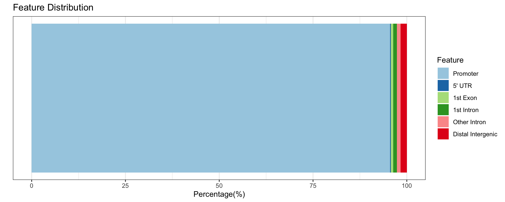

# 01_QC
Qian Hui TAN
2023-07-21

- [<span class="toc-section-number">1</span>
  Introduction](#introduction)
- [<span class="toc-section-number">2</span> Setup](#setup)
  - [<span class="toc-section-number">2.1</span> Load
    libraries](#load-libraries)
  - [<span class="toc-section-number">2.2</span> Load data](#load-data)
  - [<span class="toc-section-number">2.3</span> Load
    functions](#load-functions)
- [<span class="toc-section-number">3</span> Make ensembl_genes (run
  once)](#make-ensembl_genes-run-once)
- [<span class="toc-section-number">4</span> Data
  wrangling](#data-wrangling)
- [<span class="toc-section-number">5</span> ChIPseeker - where does
  Deaf1 bind?](#chipseeker---where-does-deaf1-bind)
  - [<span class="toc-section-number">5.1</span> Overall genome peak
    plot](#overall-genome-peak-plot)
  - [<span class="toc-section-number">5.2</span> Binding around
    TSS](#binding-around-tss)
  - [<span class="toc-section-number">5.3</span> Genomic regions bound
    by Deaf1](#genomic-regions-bound-by-deaf1)
  - [<span class="toc-section-number">5.4</span> How many unique genes
    are bound by 608
    peaks?](#how-many-unique-genes-are-bound-by-608-peaks)
- [<span class="toc-section-number">6</span> IDR plot](#idr-plot)
- [<span class="toc-section-number">7</span> Summary](#summary)
- [<span class="toc-section-number">8</span>
  sessionInfo()](#sessioninfo)

# Introduction

In this notebook, we perform Quality Control (QC) on our Deaf1 ChIP-seq
data from C2C12 mouse myoblasts. We use the ChIPseeker package for this.

# Setup

``` r
if(!dir.exists("./figures")){
    dir.create("./figures")
  }

## If output directory doesn't exist, create it
if(!dir.exists("./output")){
    dir.create("./output")
  }
  
output_dir <- "./output/"
```

## Load libraries

``` r
suppressPackageStartupMessages({
    # Load libraries
    library(dplyr)
    library(ggplot2)
    library(Matrix)
    library(ChIPseeker)
    library(TxDb.Mmusculus.UCSC.mm10.knownGene)
    library(EnsDb.Mmusculus.v79)
    library(clusterProfiler)
    library(AnnotationDbi)
    library(org.Mm.eg.db)
    
})
```

## Load data

``` r
deaf1_filt <- readRDS("../../data/02_data_processed/02_idrmeme/021_idr/deaf1_idr_filt.RDS")
```

``` r
# How many peaks? 
length(deaf1_filt)
```

    [1] 608

## Load functions

``` r
# Takes a character vector of entrez gene IDs as input, runs KEGG enrichment.
# Prints out a kegg dotplot and saves a readable kegg enrichment as a data frame.

enrich_kegg_readable <- function(target_genes_entrez, 
                                 #universe, 
                                 title = "title"){
    
    # Run KEGG enrichment
    ekegg = clusterProfiler::enrichKEGG(target_genes_entrez,
                                       # universe = as.character(universe), 
                                       organism = "mmu",
                                       keyType = "ncbi-geneid")
    
    # Print the kegg dotplot
    print(dotplot(ekegg, title = title))
    
    # Convert entrez to gene symbols
    ekegg = DOSE::setReadable(ekegg, OrgDb = "org.Mm.eg.db", 
                              keyType = "ENTREZID")
    
    # Return the result as a data frame
    return(as.data.frame(ekegg))
    
}
```

# Make ensembl_genes (run once)

``` r
library(biomaRt)
library(GenomicRanges)
library(Biostrings)
library(GenomicFeatures)
library(org.Mm.eg.db)

mm.gtf.db <- makeTxDbFromGFF("../../data/04_annotations/Mus_musculus.GRCm38.102.chr.gtf", format="gtf" )

#ensembl.genes = genes(mm.gtf.db)
ensembl.tx = transcripts(mm.gtf.db)
# Use version 102 (which fits our gtf file)

mouse = useEnsembl(biomart="ENSEMBL_MART_ENSEMBL", 
                   dataset="mmusculus_gene_ensembl", 
                  version = 102)

bm.annotations = getBM(attributes=c("ensembl_gene_id", "entrezgene_id", 
                                    "gene_biotype", "external_gene_name",
                                   "ensembl_transcript_id"),
                       mart=mouse, 
                       filters="ensembl_transcript_id", 
                       values=ensembl.tx$tx_name, uniqueRows=TRUE
                      )

ensembl.tx$gene_biotype = bm.annotations$gene_biotype[match(ensembl.tx$tx_name, bm.annotations$ensembl_transcript_id) ]
ensembl.tx$entrezgene_id = bm.annotations$entrezgene_id[match(ensembl.tx$tx_name, bm.annotations$ensembl_transcript_id) ]
ensembl.tx$external_gene_name = bm.annotations$external_gene_name[match(ensembl.tx$tx_name, bm.annotations$ensembl_transcript_id) ]
ensembl.tx$ensembl_transcript_id =  bm.annotations$ensembl_transcript_id[match(ensembl.tx$tx_name, bm.annotations$ensembl_transcript_id) ]
ensembl.tx$ensembl_gene_id <- bm.annotations$ensembl_gene_id[
    match(ensembl.tx$tx_name, bm.annotations$ensembl_transcript_id)
]

head(ensembl.tx)

# save this as RDS so we don't have to keep running it
saveRDS(bm.annotations, file = "output/bm_annotations_tx.RDS")
saveRDS(ensembl.tx, file = "output/ensembl_tx.RDS")
```

``` r
ensembl.tx <- readRDS("output/ensembl_tx.RDS")
```

``` r
# Also export this as a csv file

df_ens_tx <- as.data.frame(ensembl.tx)

head(df_ens_tx)
```

| seqnames |   start |     end | width | strand | tx_id | tx_name            | gene_biotype         | entrezgene_id | external_gene_name | ensembl_transcript_id | ensembl_gene_id    |
|:---------|--------:|--------:|------:|:-------|------:|:-------------------|:---------------------|--------------:|:-------------------|:----------------------|:-------------------|
| chr1     | 3073253 | 3074322 |  1070 | \+     |     1 | ENSMUST00000193812 | TEC                  |            NA | 4933401J01Rik      | ENSMUST00000193812    | ENSMUSG00000102693 |
| chr1     | 3102016 | 3102125 |   110 | \+     |     2 | ENSMUST00000082908 | snRNA                |            NA | Gm26206            | ENSMUST00000082908    | ENSMUSG00000064842 |
| chr1     | 3252757 | 3253236 |   480 | \+     |     3 | ENSMUST00000192857 | processed_pseudogene |            NA | Gm18956            | ENSMUST00000192857    | ENSMUSG00000102851 |
| chr1     | 3466587 | 3513553 | 46967 | \+     |     4 | ENSMUST00000161581 | antisense            |            NA | Gm1992             | ENSMUST00000161581    | ENSMUSG00000089699 |
| chr1     | 3531795 | 3532720 |   926 | \+     |     5 | ENSMUST00000192183 | processed_pseudogene |            NA | Gm7341             | ENSMUST00000192183    | ENSMUSG00000103147 |
| chr1     | 3680155 | 3681788 |  1634 | \+     |     6 | ENSMUST00000193244 | TEC                  |            NA | Gm10568            | ENSMUST00000193244    | ENSMUSG00000102348 |

``` r
write.csv(df_ens_tx, file = paste0(output_dir, "ensembl_tx.csv"))
```

# Data wrangling

``` r
head(deaf1_filt)
```

    GRanges object with 6 ranges and 11 metadata columns:
          seqnames              ranges strand |    idr_name scaled_idr  idr_strand
             <Rle>           <IRanges>  <Rle> | <character>  <integer> <character>
      [1]     chr1 166378462-166382216      * |           .        845           .
      [2]     chr7 126427901-126429745      * |           .        826           .
      [3]     chr5 143527422-143528800      * |           .        836           .
      [4]    chr15   95790481-95792623      * |           .        808           .
      [5]     chr8     8688634-8691843      * |           .        854           .
      [6]     chr7     4792394-4793284      * |           .        826           .
          local_idr global_idr rep1_chromstart rep1_chromend rep1_signal
          <numeric>  <numeric>       <integer>     <integer>   <numeric>
      [1]      1.99       2.04       166378501     166382203    186.8078
      [2]      1.90       1.99       126428279     126429503    131.4282
      [3]      1.94       2.02       143527539     143528761    119.3424
      [4]      1.82       1.95        95790480      95792531    109.1668
      [5]      2.03       2.06         8689367       8691612    109.1657
      [6]      1.89       1.99         4792415       4793271     96.2429
          rep2_chromstart rep2_chromend rep2_signal
                <integer>     <integer>   <numeric>
      [1]       166378461     166382216     245.758
      [2]       126427900     126429745     164.870
      [3]       143527421     143528800     149.103
      [4]        95790507      95792623     109.693
      [5]         8688633       8691843     144.287
      [6]         4792393       4793284     102.300
      -------
      seqinfo: 24 sequences from an unspecified genome; no seqlengths

Check that peaks have been filtered:

``` r
summary(deaf1_filt$scaled_idr)
```

       Min. 1st Qu.  Median    Mean 3rd Qu.    Max. 
      540.0   631.0   710.5   709.1   787.2   887.0 

# ChIPseeker - where does Deaf1 bind?

Next, we run ChIPseeker to get a general idea of Deaf1 binding sites
across the mouse genome.

## Overall genome peak plot

Where does Deaf1 bind? We look at the big picture - a whole genome
snapshot first:

``` r
covplot(deaf1_filt, weightCol = "scaled_idr")
```

    chr4_GL456216_random dosen't contain signal higher than 1

    chrUn_GL456359 dosen't contain signal higher than 1

    chrUn_JH584304 dosen't contain signal higher than 1

    chrM dosen't contain signal higher than 1


Deaf1 binds to all chromosomes, though there are distinct regions on
Chr15 and 19 that look interesting.

## Binding around TSS

We know that Deaf1 is a transcription factor, so it should be binding
somewhere near the transcription start site. Just to be sure, we make a
profile plot around the TSS:

``` r
txdb <- TxDb.Mmusculus.UCSC.mm10.knownGene
```

``` r
# Check that it's mm10/GRCm38
EnsDb.Mmusculus.v79
```

    EnsDb for Ensembl:
    |Backend: SQLite
    |Db type: EnsDb
    |Type of Gene ID: Ensembl Gene ID
    |Supporting package: ensembldb
    |Db created by: ensembldb package from Bioconductor
    |script_version: 0.3.0
    |Creation time: Thu May 18 13:38:26 2017
    |ensembl_version: 79
    |ensembl_host: localhost
    |Organism: mus_musculus
    |taxonomy_id: 10090
    |genome_build: GRCm38
    |DBSCHEMAVERSION: 2.0
    | No. of genes: 43629.
    | No. of transcripts: 104129.
    |Protein data available.

``` r
# Prepare the promoter regions
promoter <- getPromoters(TxDb = txdb, upstream = 1000, downstream=1000)

tagMatrixList <- getTagMatrix(deaf1_filt, windows = promoter)
```

    >> preparing start_site regions by gene... 2023-07-21 12:14:08
    >> preparing tag matrix...  2023-07-21 12:14:08 

``` r
plotAvgProf(tagMatrixList, xlim = c(-1000, 1000), 
            conf = 0.95,resample = 500, facet = "row") +
    labs(title = "Deaf1 binding sites")
```

    >> plotting figure...            2023-07-21 12:14:11 
    >> Running bootstrapping for tag matrix...       2023-07-21 12:14:11 


This looks right - Deaf1 mostly binds near the TSS. We plot a heatmap to
confirm:

``` r
tagHeatmap(tagMatrixList, 
           palette = "BuPu",
           #xlim=c(-1000, 1000), color="skyblue",
          title = "Deaf1 binding sites") 
```


We can conclude that Deaf1 does bind around the promoter region, as
expected of a transcription factor.

## Genomic regions bound by Deaf1

We know that Deaf1 predominantly binds to the TSS, but does it bind to
other regions (eg enhancers, UTRs etc)?

We annotate regions in the mouse genome, and check where Deaf1 binds to:

``` r
# Retrieve annotations
peakAnnoList <- annotatePeak(deaf1_filt, TxDb=txdb, 
                       tssRegion=c(-1000, 1000), verbose=TRUE)
```

    >> preparing features information...         2023-07-21 12:14:19 
    >> identifying nearest features...       2023-07-21 12:14:19 
    >> calculating distance from peak to TSS...  2023-07-21 12:14:19 
    >> assigning genomic annotation...       2023-07-21 12:14:19 
    >> assigning chromosome lengths          2023-07-21 12:14:27 
    >> done...                   2023-07-21 12:14:27 

``` r
peakAnnoList
```

    Annotated peaks generated by ChIPseeker
    608/608  peaks were annotated
    Genomic Annotation Summary:
                Feature  Frequency
    6          Promoter 95.5592105
    3            5' UTR  0.1644737
    1          1st Exon  0.6578947
    2        1st Intron  0.9868421
    5      Other Intron  0.9868421
    4 Distal Intergenic  1.6447368

As expected, Deaf1 binds to the promoter 95% of the time. It
occasionally binds to other distal intergenic regions (1.6%)

``` r
plotAnnoBar(peakAnnoList)
```



Taking a closer look - how far are the binding loci relative to the TSS
(1kb? 100kb?)

``` r
plotDistToTSS(peakAnnoList, 
              title="Distribution of transcription factor-binding loci \n relative to TSS")
```


Most of them bind within 0-1kb of the TSS.

## How many unique genes are bound by 608 peaks?

``` r
deaf1_annot <- data.frame(peakAnnoList)
head(deaf1_annot)
```

| seqnames |     start |       end | width | strand | idr_name | scaled_idr | idr_strand | local_idr | global_idr | rep1_chromstart | rep1_chromend | rep1_signal | rep2_chromstart | rep2_chromend | rep2_signal | annotation | geneChr | geneStart |   geneEnd | geneLength | geneStrand | geneId    | transcriptId          | distanceToTSS |
|:---------|----------:|----------:|------:|:-------|:---------|-----------:|:-----------|----------:|-----------:|----------------:|--------------:|------------:|----------------:|--------------:|------------:|:-----------|--------:|----------:|----------:|-----------:|-----------:|:----------|:----------------------|--------------:|
| chr1     | 166378462 | 166382216 |  3755 | \*     | .        |        845 | .          |      1.99 |       2.04 |       166378501 |     166382203 |   186.80782 |       166378461 |     166382216 |    245.7580 | Promoter   |       1 | 166379097 | 166393621 |      14525 |          1 | 27878     | ENSMUST00000027846.7  |             0 |
| chr7     | 126427901 | 126429745 |  1845 | \*     | .        |        826 | .          |      1.90 |       1.99 |       126428279 |     126429503 |   131.42822 |       126427900 |     126429745 |    164.8703 | Promoter   |       7 | 126428759 | 126445901 |      17143 |          1 | 70314     | ENSMUST00000151304.7  |             0 |
| chr5     | 143527422 | 143528800 |  1379 | \*     | .        |        836 | .          |      1.94 |       2.02 |       143527539 |     143528761 |   119.34243 |       143527421 |     143528800 |    149.1025 | Promoter   |       5 | 143503634 | 143528036 |      24403 |          2 | 19353     | ENSMUST00000080537.13 |             0 |
| chr15    |  95790481 |  95792623 |  2143 | \*     | .        |        808 | .          |      1.82 |       1.95 |        95790480 |      95792531 |   109.16676 |        95790507 |      95792623 |    109.6928 | Promoter   |      15 |  95790843 |  95974751 |     183909 |          1 | 105722    | ENSMUST00000071874.7  |             0 |
| chr8     |   8688634 |   8691843 |  3210 | \*     | .        |        854 | .          |      2.03 |       2.06 |         8689367 |       8691612 |   109.16571 |         8688633 |       8691843 |    144.2870 | Promoter   |       8 |   8690093 |   8690162 |         70 |          2 | 102465762 | ENSMUST00000185082.1  |             0 |
| chr7     |   4792394 |   4793284 |   891 | \*     | .        |        826 | .          |      1.89 |       1.99 |         4792415 |       4793271 |    96.24286 |         4792393 |       4793284 |    102.2998 | Promoter   |       7 |   4792874 |   4795066 |       2193 |          1 | 19943     | ENSMUST00000032597.11 |             0 |

Distribution of binding annotations:

``` r
deaf1_annot  %>% 
    group_by(annotation) %>% 
    summarize(n = n())  %>% 
    arrange(desc(n))  %>% 
    slice_head(n = 5)
```

| annotation                                           |   n |
|:-----------------------------------------------------|----:|
| Promoter                                             | 581 |
| Distal Intergenic                                    |  10 |
| Intron (ENSMUST00000017086.4/71753, intron 10 of 17) |   2 |
| Intron (ENSMUST00000022550.7/54616, intron 3 of 6)   |   2 |
| 5’ UTR                                               |   1 |

First, we add the ensembl gene ID to the transcript ID:

``` r
deaf1_annot <- deaf1_annot %>% 
    tidyr::separate(transcriptId, 
             into = c("ens_transcript", sep = "."))
```

``` r
deaf1_annot$ens_genes <- ensembl.tx$ensembl_gene_id[
    match(deaf1_annot$ens_transcript, ensembl.tx$ensembl_transcript_id)]
```

``` r
# Check whether any genes are unmapped
sum(is.na(deaf1_annot$ens_genes))
```

    [1] 0

0 genes unmapped; all genes are mapped.

How many unique genes?

``` r
length(unique(deaf1_annot$ens_genes))
```

    [1] 595

How many genes have more than 1 binding site?

``` r
deaf1_annot  %>% 
    group_by(ens_genes) %>% 
    summarize(n = n()) %>% 
    arrange(desc(n))  %>% 
    filter(n > 1)
```

| ens_genes          |   n |
|:-------------------|----:|
| ENSMUSG00000021978 |   3 |
| ENSMUSG00000016942 |   2 |
| ENSMUSG00000021413 |   2 |
| ENSMUSG00000024423 |   2 |
| ENSMUSG00000024847 |   2 |
| ENSMUSG00000024968 |   2 |
| ENSMUSG00000026254 |   2 |
| ENSMUSG00000034613 |   2 |
| ENSMUSG00000038500 |   2 |
| ENSMUSG00000040365 |   2 |
| ENSMUSG00000056493 |   2 |
| ENSMUSG00000093803 |   2 |

12 genes have more than 1 binding site; here they are.

# IDR plot

``` r
df_idr <- as.data.frame(deaf1_filt)

head(df_idr)
```

| seqnames |     start |       end | width | strand | idr_name | scaled_idr | idr_strand | local_idr | global_idr | rep1_chromstart | rep1_chromend | rep1_signal | rep2_chromstart | rep2_chromend | rep2_signal |
|:---------|----------:|----------:|------:|:-------|:---------|-----------:|:-----------|----------:|-----------:|----------------:|--------------:|------------:|----------------:|--------------:|------------:|
| chr1     | 166378462 | 166382216 |  3755 | \*     | .        |        845 | .          |      1.99 |       2.04 |       166378501 |     166382203 |   186.80782 |       166378461 |     166382216 |    245.7580 |
| chr7     | 126427901 | 126429745 |  1845 | \*     | .        |        826 | .          |      1.90 |       1.99 |       126428279 |     126429503 |   131.42822 |       126427900 |     126429745 |    164.8703 |
| chr5     | 143527422 | 143528800 |  1379 | \*     | .        |        836 | .          |      1.94 |       2.02 |       143527539 |     143528761 |   119.34243 |       143527421 |     143528800 |    149.1025 |
| chr15    |  95790481 |  95792623 |  2143 | \*     | .        |        808 | .          |      1.82 |       1.95 |        95790480 |      95792531 |   109.16676 |        95790507 |      95792623 |    109.6928 |
| chr8     |   8688634 |   8691843 |  3210 | \*     | .        |        854 | .          |      2.03 |       2.06 |         8689367 |       8691612 |   109.16571 |         8688633 |       8691843 |    144.2870 |
| chr7     |   4792394 |   4793284 |   891 | \*     | .        |        826 | .          |      1.89 |       1.99 |         4792415 |       4793271 |    96.24286 |         4792393 |       4793284 |    102.2998 |

``` r
ggplot(df_idr, aes(x = rep1_signal, y = rep2_signal,
                  color = scaled_idr)) +
    geom_point() +
    geom_abline(intercept = 0, slope = 1, color = "red") +
    coord_fixed() +
    theme_light() +
    labs(title = "Peak scores for rep 1 and rep 2")
```


As expected, IDR only keeps peaks that have high signal in both
replicates - they mostly cluster along the slope.

# Summary

- 595 unique genes bound by 608 peaks
- Among them, 12 genes have more than 1 Deaf1 binding site; the max is 3
  peaks.
- Deaf1 doesn’t display a clear chromosome specificity (though there are
  regions in Chr12 and 19 that seem to have a lot of peaks
- Deaf1 mostly binds to promoter regions (95% of the time), and it
  typically binds within 0-1bp of the TSS
- IDR plot confirms that we have kept highly confident peaks.

# sessionInfo()

``` r
sessionInfo()
```

    R version 4.2.2 (2022-10-31)
    Platform: aarch64-apple-darwin20 (64-bit)
    Running under: macOS Ventura 13.1

    Matrix products: default
    BLAS:   /Library/Frameworks/R.framework/Versions/4.2-arm64/Resources/lib/libRblas.0.dylib
    LAPACK: /Library/Frameworks/R.framework/Versions/4.2-arm64/Resources/lib/libRlapack.dylib

    locale:
    [1] en_US.UTF-8/en_US.UTF-8/en_US.UTF-8/C/en_US.UTF-8/en_US.UTF-8

    attached base packages:
    [1] stats4    stats     graphics  grDevices utils     datasets  methods  
    [8] base     

    other attached packages:
     [1] org.Mm.eg.db_3.16.0                      
     [2] clusterProfiler_4.7.1.003                
     [3] EnsDb.Mmusculus.v79_2.99.0               
     [4] ensembldb_2.22.0                         
     [5] AnnotationFilter_1.22.0                  
     [6] TxDb.Mmusculus.UCSC.mm10.knownGene_3.10.0
     [7] GenomicFeatures_1.50.4                   
     [8] AnnotationDbi_1.60.2                     
     [9] Biobase_2.58.0                           
    [10] GenomicRanges_1.50.2                     
    [11] GenomeInfoDb_1.34.9                      
    [12] IRanges_2.32.0                           
    [13] S4Vectors_0.36.2                         
    [14] BiocGenerics_0.44.0                      
    [15] ChIPseeker_1.37.0                        
    [16] Matrix_1.5-4.1                           
    [17] ggplot2_3.4.2                            
    [18] dplyr_1.1.2                              

    loaded via a namespace (and not attached):
      [1] shadowtext_0.1.2                       
      [2] fastmatch_1.1-3                        
      [3] BiocFileCache_2.6.1                    
      [4] plyr_1.8.8                             
      [5] igraph_1.5.0                           
      [6] lazyeval_0.2.2                         
      [7] splines_4.2.2                          
      [8] BiocParallel_1.32.6                    
      [9] digest_0.6.33                          
     [10] yulab.utils_0.0.6                      
     [11] htmltools_0.5.4                        
     [12] GOSemSim_2.24.0                        
     [13] viridis_0.6.3                          
     [14] GO.db_3.16.0                           
     [15] fansi_1.0.4                            
     [16] magrittr_2.0.3                         
     [17] memoise_2.0.1                          
     [18] Biostrings_2.66.0                      
     [19] graphlayouts_1.0.0                     
     [20] matrixStats_1.0.0                      
     [21] enrichplot_1.18.4                      
     [22] prettyunits_1.1.1                      
     [23] colorspace_2.1-0                       
     [24] blob_1.2.4                             
     [25] rappdirs_0.3.3                         
     [26] ggrepel_0.9.3                          
     [27] xfun_0.37                              
     [28] crayon_1.5.2                           
     [29] RCurl_1.98-1.12                        
     [30] jsonlite_1.8.7                         
     [31] TxDb.Hsapiens.UCSC.hg19.knownGene_3.2.2
     [32] scatterpie_0.2.1                       
     [33] ape_5.7-1                              
     [34] glue_1.6.2                             
     [35] polyclip_1.10-4                        
     [36] gtable_0.3.3                           
     [37] zlibbioc_1.44.0                        
     [38] XVector_0.38.0                         
     [39] DelayedArray_0.24.0                    
     [40] scales_1.2.1                           
     [41] DOSE_3.24.2                            
     [42] DBI_1.1.3                              
     [43] Rcpp_1.0.11                            
     [44] plotrix_3.8-2                          
     [45] viridisLite_0.4.2                      
     [46] progress_1.2.2                         
     [47] gridGraphics_0.5-1                     
     [48] tidytree_0.4.4                         
     [49] bit_4.0.5                              
     [50] httr_1.4.6                             
     [51] fgsea_1.24.0                           
     [52] gplots_3.1.3                           
     [53] RColorBrewer_1.1-3                     
     [54] pkgconfig_2.0.3                        
     [55] XML_3.99-0.14                          
     [56] farver_2.1.1                           
     [57] dbplyr_2.3.3                           
     [58] utf8_1.2.3                             
     [59] labeling_0.4.2                         
     [60] ggplotify_0.1.1                        
     [61] tidyselect_1.2.0                       
     [62] rlang_1.1.1                            
     [63] reshape2_1.4.4                         
     [64] munsell_0.5.0                          
     [65] tools_4.2.2                            
     [66] cachem_1.0.8                           
     [67] downloader_0.4                         
     [68] cli_3.6.1                              
     [69] generics_0.1.3                         
     [70] RSQLite_2.3.1                          
     [71] gson_0.1.0                             
     [72] evaluate_0.20                          
     [73] stringr_1.5.0                          
     [74] fastmap_1.1.1                          
     [75] yaml_2.3.7                             
     [76] ggtree_3.6.2                           
     [77] knitr_1.42                             
     [78] bit64_4.0.5                            
     [79] tidygraph_1.2.3                        
     [80] caTools_1.18.2                         
     [81] purrr_1.0.1                            
     [82] KEGGREST_1.38.0                        
     [83] ggraph_2.1.0                           
     [84] nlme_3.1-162                           
     [85] aplot_0.1.10                           
     [86] xml2_1.3.5                             
     [87] biomaRt_2.54.1                         
     [88] compiler_4.2.2                         
     [89] rstudioapi_0.14                        
     [90] filelock_1.0.2                         
     [91] curl_5.0.1                             
     [92] png_0.1-8                              
     [93] treeio_1.22.0                          
     [94] tibble_3.2.1                           
     [95] tweenr_2.0.2                           
     [96] stringi_1.7.12                         
     [97] lattice_0.20-45                        
     [98] ProtGenerics_1.30.0                    
     [99] vctrs_0.6.3                            
    [100] pillar_1.9.0                           
    [101] lifecycle_1.0.3                        
    [102] data.table_1.14.8                      
    [103] cowplot_1.1.1                          
    [104] bitops_1.0-7                           
    [105] patchwork_1.1.2                        
    [106] rtracklayer_1.58.0                     
    [107] qvalue_2.30.0                          
    [108] R6_2.5.1                               
    [109] BiocIO_1.8.0                           
    [110] KernSmooth_2.23-20                     
    [111] gridExtra_2.3                          
    [112] codetools_0.2-19                       
    [113] boot_1.3-28.1                          
    [114] MASS_7.3-58.2                          
    [115] gtools_3.9.4                           
    [116] SummarizedExperiment_1.28.0            
    [117] rjson_0.2.21                           
    [118] withr_2.5.0                            
    [119] GenomicAlignments_1.34.1               
    [120] Rsamtools_2.14.0                       
    [121] GenomeInfoDbData_1.2.9                 
    [122] parallel_4.2.2                         
    [123] hms_1.1.3                              
    [124] grid_4.2.2                             
    [125] ggfun_0.1.1                            
    [126] tidyr_1.3.0                            
    [127] HDO.db_0.99.1                          
    [128] rmarkdown_2.20                         
    [129] MatrixGenerics_1.10.0                  
    [130] ggforce_0.4.1                          
    [131] restfulr_0.0.15                        
