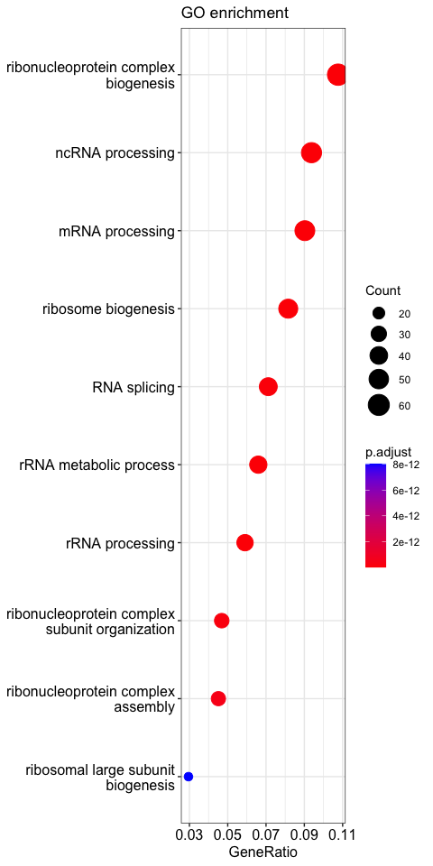
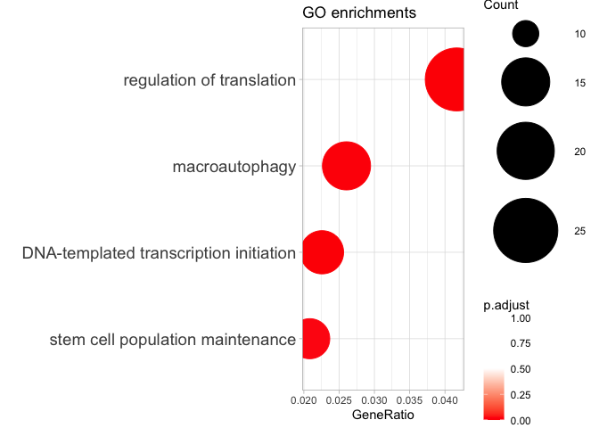
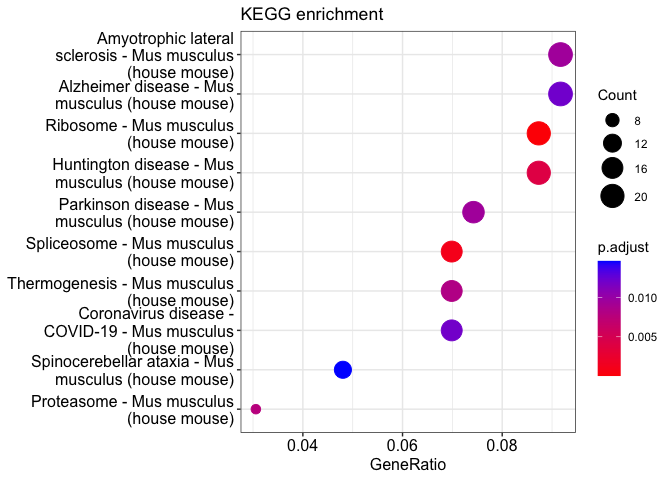

# 02_GO
Qian Hui TAN
2023-07-21

- [<span class="toc-section-number">1</span>
  Introduction](#introduction)
- [<span class="toc-section-number">2</span> Setup](#setup)
  - [<span class="toc-section-number">2.1</span> Load
    libraries](#load-libraries)
  - [<span class="toc-section-number">2.2</span> Read in
    files](#read-in-files)
  - [<span class="toc-section-number">2.3</span> Load
    functions](#load-functions)
- [<span class="toc-section-number">3</span> GO Enrichment
  analysis](#go-enrichment-analysis)
  - [<span class="toc-section-number">3.1</span> Default GO
    plot](#default-go-plot)
  - [<span class="toc-section-number">3.2</span> Custom GO](#custom-go)
- [<span class="toc-section-number">4</span> KEGG
  enrichment](#kegg-enrichment)

# Introduction

In this notebook, we perform Gene Ontology (GO) enrichment for the
Deaf1-bound peaks.

# Setup

``` r
if(!dir.exists("./figures")){
    dir.create("./figures")
  }

## If output directory doesn't exist, create it
if(!dir.exists("./output")){
    dir.create("./output")
  }
  
output_dir <- "./output/"
```

## Load libraries

``` r
suppressPackageStartupMessages({
    # Load libraries
    library(clusterProfiler)
    library(org.Mm.eg.db)
    library(ggplot2)
})
```

## Read in files

``` r
deaf1_annot <- read.csv("../01_QC/output/deaf1_annot.csv")
```

## Load functions

``` r
custom_ego <- function(interesting_pathways, 
                       ego_tibble,
                       title = "title", 
                       font_size = 14) {
  
  # Get relevant columns
  interesting_egos <- ego_tibble%>% 
    dplyr::select("Description", "GeneRatio", "p.adjust", "Count") %>% 
    filter(Description %in% interesting_pathways) %>% 
    # Convert GeneRatio from fraction to decimal
    mutate(GeneRatio = DOSE::parse_ratio(GeneRatio)) %>% 
    arrange(GeneRatio) %>% 
    # Preserve sorted order
    mutate(Description = factor(Description, levels = unique(Description)))
  
  
  # Plot
  df_plot <- ggplot2::ggplot(interesting_egos, 
                    aes(x = GeneRatio, y = Description,
                        color = p.adjust)) +
    geom_point(aes(size = Count)) +
    scale_color_gradient2(low = "red", 
                          mid = "white", 
                          high = "white",
                          midpoint = 0.5, 
                         limits = c(0, 1)) +
    scale_size_continuous(range  = c(10, 25), 
                        limits = c(10, 25), 
                        breaks = c(seq(10, 25, 5))) +
    labs(
      title = title,
      y = "") +
    theme_light() +
    theme(axis.text.y = element_text(size = font_size))
  
  return(df_plot)
  
}
```

``` r
# Takes a character vector of entrez gene IDs as input, runs KEGG enrichment.
# Prints out a kegg dotplot and saves a readable kegg enrichment as a data frame.

enrich_kegg_readable <- function(target_genes_entrez, 
                                 #universe, 
                                 title = "title"){
    
    # Run KEGG enrichment
    ekegg = clusterProfiler::enrichKEGG(target_genes_entrez,
                                       # universe = as.character(universe), 
                                       organism = "mmu",
                                       keyType = "ncbi-geneid")
    
    # Print the kegg dotplot
    print(dotplot(ekegg, title = title))
    
    # Convert entrez to gene symbols
    ekegg = DOSE::setReadable(ekegg, OrgDb = "org.Mm.eg.db", 
                              keyType = "ENTREZID")
    
    # Return the result as a data frame
    return(as.data.frame(ekegg))
    
}
```

# GO Enrichment analysis

``` r
# Run GO enrichment analysis 
ego <- enrichGO(gene = deaf1_annot$geneId, 
                    keyType = "ENTREZID", 
                    OrgDb = org.Mm.eg.db, 
                    ont = "BP", 
                    pAdjustMethod = "BH", 
                    qvalueCutoff = 0.05, 
                    readable = TRUE)
```

``` r
# Output results from GO analysis to a table
df_ego <- data.frame(ego)

dim(df_ego)
```

    [1] 204   9

``` r
head(df_ego)
```

|            | ID         | Description                          | GeneRatio | BgRatio   | pvalue | p.adjust | qvalue | geneID                                                                                                                                                                                                                                                                                                                                                                                 | Count |
|:-----------|:-----------|:-------------------------------------|:----------|:----------|-------:|---------:|-------:|:---------------------------------------------------------------------------------------------------------------------------------------------------------------------------------------------------------------------------------------------------------------------------------------------------------------------------------------------------------------------------------------|------:|
| GO:0022613 | GO:0022613 | ribonucleoprotein complex biogenesis | 62/576    | 418/28943 |      0 |        0 |      0 | Snrpc/Nip7/Gar1/Snrnp200/Rps14/Nifk/Rps21/Nol6/Rsl24d1/Nol10/Rsl1d1/Abt1/Rpl27/Rps7/Nufip1/Mdn1/Exosc4/Snrpe/Exosc3/Mettl17/Slu7/Noc4l/Ppan/Zfp622/Wdr74/Rpf1/Ddx56/Rps5/Ddx27/Ngrn/Fam207a/Ddx18/Rpl6/Sf3a3/Mrpl20/Rrs1/Krr1/Khdc4/Prpf31/Rps19/Srfbp1/Riok3/Utp23/Gtpbp4/Prpf6/Pwp2/Smn1/Drosha/Nom1/Nsun5/Nop53/Aar2/Utp11/Las1l/Pak1ip1/Gemin4/C1qbp/Lsm2/Utp20/Cpsf7/Ruvbl2/Rrp36 |    62 |
| GO:0034470 | GO:0034470 | ncRNA processing                     | 54/576    | 398/28943 |      0 |        0 |      0 | Tsen34/Trmt12/Urm1/Mettl6/Dus1l/Gon7/Gar1/Rps14/Nifk/Nup155/Rps21/Tut1/Nol6/Zc3h10/Nol10/Rsl1d1/Abt1/Rpl27/Rps7/Mdn1/Exosc4/Mettl3/Exosc3/Trmt44/Ppan/Wdr74/Rpf1/Ddx56/Ddx27/Ctu2/Alkbh1/Fam207a/Thumpd3/Ddx18/Ankrd16/Rrs1/Krr1/Rps19/Srfbp1/Riok3/Utp23/Gtpbp4/Snip1/Pwp2/Drosha/Nsun5/Nop53/Trmt10a/Utp11/Las1l/Elac2/Thumpd1/Utp20/Rrp36                                           |    54 |
| GO:0042254 | GO:0042254 | ribosome biogenesis                  | 47/576    | 299/28943 |      0 |        0 |      0 | Nip7/Gar1/Rps14/Nifk/Rps21/Nol6/Rsl24d1/Nol10/Rsl1d1/Abt1/Rpl27/Rps7/Mdn1/Exosc4/Exosc3/Mettl17/Noc4l/Ppan/Zfp622/Wdr74/Rpf1/Ddx56/Rps5/Ddx27/Ngrn/Fam207a/Ddx18/Rpl6/Mrpl20/Rrs1/Krr1/Rps19/Srfbp1/Riok3/Utp23/Gtpbp4/Pwp2/Drosha/Nom1/Nsun5/Nop53/Utp11/Las1l/Pak1ip1/C1qbp/Utp20/Rrp36                                                                                              |    47 |
| GO:0006397 | GO:0006397 | mRNA processing                      | 52/576    | 476/28943 |      0 |        0 |      0 | Rbfox2/Tsen34/Cir1/Snrpc/Tfip11/Eif4a3/Cwc25/Supt4a/Rnf20/Snrnp27/Cstf2t/Snrnp200/Tut1/Zc3h10/Ccnt1/Cd2bp2/Smndc1/Rprd1b/Jmjd6/Snrpe/Mettl14/Mettl3/Slu7/Scaf1/Txnl4b/Zc3h13/Nono/Prpf4b/Tbrg4/Sf3a3/Khdc4/Prpf31/Rnf40/Prpf6/Snip1/Smu1/Sf3b6/Smn1/Aar2/Cpsf3/Sf3b4/Prkrip1/Gemin4/Snrpb2/Ccar2/C1qbp/Lsm2/Tent2/BC005624/Dhx36/Cpsf7/Cwc15                                           |    52 |
| GO:0016072 | GO:0016072 | rRNA metabolic process               | 38/576    | 254/28943 |      0 |        0 |      0 | Gar1/Rps14/Nifk/Mrpl44/Rps21/Nol6/Nol10/Rsl1d1/Abt1/Rpl27/Rps7/Mdn1/Exosc4/Exosc3/Ppan/Wdr74/Rpf1/Ddx56/Ddx27/Fam207a/Ddx18/Rrs1/Krr1/Mtor/Rps19/Srfbp1/Riok3/Ercc3/Utp23/Gtpbp4/Pwp2/Drosha/Nsun5/Nop53/Utp11/Las1l/Utp20/Rrp36                                                                                                                                                       |    38 |
| GO:0006364 | GO:0006364 | rRNA processing                      | 34/576    | 215/28943 |      0 |        0 |      0 | Gar1/Rps14/Nifk/Rps21/Nol6/Nol10/Rsl1d1/Abt1/Rpl27/Rps7/Mdn1/Exosc4/Exosc3/Ppan/Wdr74/Rpf1/Ddx56/Ddx27/Fam207a/Ddx18/Rrs1/Krr1/Rps19/Srfbp1/Riok3/Utp23/Gtpbp4/Pwp2/Nsun5/Nop53/Utp11/Las1l/Utp20/Rrp36                                                                                                                                                                                |    34 |

``` r
write.csv(df_ego, "output/deaf1_ego_all.csv")
```

## Default GO plot

``` r
# Dotplot visualization
ego_plot <- dotplot(ego, showCategory=10,
                    title = "GO enrichment")

ego_plot
```



## Custom GO

``` r
interesting_pathways <- c("DNA-templated transcription initiation", 
                          "regulation of translation", 
                          "macroautophagy", 
                          "stem cell population maintenance")

custom_ego(interesting_pathways, 
           df_ego, 
           title = "GO enrichments")
```



``` r
df_ego %>% 
  filter(Description %in% interesting_pathways)
```

|            | ID         | Description                            | GeneRatio | BgRatio   |    pvalue |  p.adjust |    qvalue | geneID                                                                                                                                                   | Count |
|:-----------|:-----------|:---------------------------------------|:----------|:----------|----------:|----------:|----------:|:---------------------------------------------------------------------------------------------------------------------------------------------------------|------:|
| GO:0006352 | GO:0006352 | DNA-templated transcription initiation | 13/576    | 125/28943 | 0.0000013 | 0.0001179 | 0.0001035 | Med12/Bdp1/Taf7/Med6/Med23/Tbp/Tbpl1/Brf2/Ercc3/Ttf1/Brf1/Med17/Dhx36                                                                                    |    13 |
| GO:0006417 | GO:0006417 | regulation of translation              | 24/576    | 394/28943 | 0.0000015 | 0.0001281 | 0.0001124 | Eif4a3/Gle1/Pum3/Impact/Dcp1a/Secisbp2/Mettl14/Mettl3/Exosc3/Eif2ak1/Eif4g3/Eif4e2/Alkbh1/Ngrn/Taco1/Larp4b/Mtor/Mief1/Rack1/Aco1/C1qbp/Dhx36/Dapk3/Rara |    24 |
| GO:0016236 | GO:0016236 | macroautophagy                         | 15/576    | 249/28943 | 0.0001555 | 0.0055044 | 0.0048308 | Wac/Phb2/Usp30/Pik3c3/Wdr24/Plaa/Tmem41b/Atg16l1/Mtor/Ift88/Sptlc1/Rab7/Sec22b/Wdr45b/Rnf31                                                              |    15 |
| GO:0019827 | GO:0019827 | stem cell population maintenance       | 12/576    | 208/28943 | 0.0010056 | 0.0229069 | 0.0201036 | Bmpr1a/Med12/Med6/Mettl14/Mettl3/Brd9/Zc3h13/Klf10/Fancd2/Ski/Med17/Actl6a                                                                               |    12 |

# KEGG enrichment

``` r
ekegg <- enrich_kegg_readable(deaf1_annot$geneId, title = "KEGG enrichment")
```

    Reading KEGG annotation online: "https://rest.kegg.jp/link/mmu/pathway"...

    Reading KEGG annotation online: "https://rest.kegg.jp/list/pathway/mmu"...

    Reading KEGG annotation online: "https://rest.kegg.jp/conv/ncbi-geneid/mmu"...



``` r
dim(ekegg)
```

    [1] 14  9

``` r
ekegg
```

|          | ID       | Description                                                 | GeneRatio | BgRatio  |    pvalue |  p.adjust |    qvalue | geneID                                                                                                                                    | Count |
|:---------|:---------|:------------------------------------------------------------|:----------|:---------|----------:|----------:|----------:|:------------------------------------------------------------------------------------------------------------------------------------------|------:|
| mmu03010 | mmu03010 | Ribosome - Mus musculus (house mouse)                       | 20/229    | 177/9325 | 0.0000000 | 0.0000026 | 0.0000024 | Rpl28/Rpl37/Rps14/Rps21/Rsl24d1/Rpl8/Rpl27/Rps7/Rps5/Mrpl3/Rpl34/Rpl23/Mrps18a/Rpl6/Mrpl20/Rps19/Mrpl2/Rpl37a/Rpl18/Mrpl30                |    20 |
| mmu03040 | mmu03040 | Spliceosome - Mus musculus (house mouse)                    | 16/229    | 180/9325 | 0.0000085 | 0.0009892 | 0.0009072 | Snrpc/Eif4a3/Snrnp27/Snrnp200/Smndc1/Snrpe/Slu7/Sf3a3/Prpf31/Prpf6/Sf3b6/Sf3b4/Snrpb2/Ppih/Lsm2/Cwc15                                     |    16 |
| mmu05016 | mmu05016 | Huntington disease - Mus musculus (house mouse)             | 20/229    | 302/9325 | 0.0000516 | 0.0040071 | 0.0036749 | Polr2k/Ndufb9/Psma6/Pik3c3/Ndufa12/Tbp/Cox8a/Ndufb5/Tbpl1/Cox7a2/Psmd7/Mtor/Psmc2/Atp5j/Psmc1/Polr2j/Cox5b/Ap2b1/Uqcrfs1/Psmb2            |    20 |
| mmu03050 | mmu03050 | Proteasome - Mus musculus (house mouse)                     | 7/229     | 47/9325  | 0.0001338 | 0.0077960 | 0.0071497 | Psma6/Pomp/Psmd7/Psmc2/Psmf1/Psmc1/Psmb2                                                                                                  |     7 |
| mmu04714 | mmu04714 | Thermogenesis - Mus musculus (house mouse)                  | 16/229    | 231/9325 | 0.0001768 | 0.0082373 | 0.0075545 | Ndufb9/Prkag1/Ndufa12/Smarcc2/Cox16/Cox8a/Ndufb5/Ndufaf1/Cox7a2/Mtor/Coa6/Atp5j/Cox5b/Nras/Uqcrfs1/Actl6a                                 |    16 |
| mmu05012 | mmu05012 | Parkinson disease - Mus musculus (house mouse)              | 17/229    | 264/9325 | 0.0002662 | 0.0094886 | 0.0087020 | Ndufb9/Psma6/Ube2j2/Ndufa12/Slc39a13/Cox8a/Ndufb5/Cox7a2/Psmd7/Psmc2/Atp5j/Txn2/Psmc1/Cox5b/Slc39a9/Uqcrfs1/Psmb2                         |    17 |
| mmu05014 | mmu05014 | Amyotrophic lateral sclerosis - Mus musculus (house mouse)  | 21/229    | 369/9325 | 0.0002851 | 0.0094886 | 0.0087020 | Rac1/Nup133/Nup214/Ndufb9/Gle1/Psma6/Nup155/Pik3c3/Ndufa12/Nup153/Cox8a/Ndufb5/Cox7a2/Psmd7/Mtor/Psmc2/Atp5j/Psmc1/Cox5b/Uqcrfs1/Psmb2    |    21 |
| mmu05171 | mmu05171 | Coronavirus disease - COVID-19 - Mus musculus (house mouse) | 16/229    | 249/9325 | 0.0004128 | 0.0120240 | 0.0110272 | Rpl28/Rpl37/Rps14/Rps21/Rsl24d1/Rpl8/Rpl27/Rps7/Rps5/Rpl34/Rpl23/Rpl6/Rps19/Pik3r2/Rpl37a/Rpl18                                           |    16 |
| mmu05010 | mmu05010 | Alzheimer disease - Mus musculus (house mouse)              | 21/229    | 383/9325 | 0.0004690 | 0.0121416 | 0.0111351 | Ndufb9/Psma6/Pik3c3/Ppid/Ndufa12/Slc39a13/Cox8a/Ndufb5/Cox7a2/Psmd7/Mtor/Psmc2/Pik3r2/Atp5j/Psmc1/Cox5b/Slc39a9/Csnk2b/Nras/Uqcrfs1/Psmb2 |    21 |
| mmu05017 | mmu05017 | Spinocerebellar ataxia - Mus musculus (house mouse)         | 11/229    | 141/9325 | 0.0006870 | 0.0146988 | 0.0134802 | Twnk/Psma6/Pik3c3/Tbp/Tbpl1/Psmd7/Mtor/Psmc2/Pik3r2/Psmc1/Psmb2                                                                           |    11 |
| mmu03250 | mmu03250 | Viral life cycle - HIV-1 - Mus musculus (house mouse)       | 7/229     | 61/9325  | 0.0006939 | 0.0146988 | 0.0134802 | Supt4a/Ccnt1/Nup153/Nelfa/Tnpo3/Cpsf7/Tsg101                                                                                              |     7 |
| mmu05020 | mmu05020 | Prion disease - Mus musculus (house mouse)                  | 16/229    | 267/9325 | 0.0008822 | 0.0171286 | 0.0157086 | Rac1/Ndufb9/Psma6/Ndufa12/Cox8a/Ndufb5/Cox7a2/Psmd7/Psmc2/Pik3r2/Atp5j/Psmc1/Cox5b/Csnk2b/Uqcrfs1/Psmb2                                   |    16 |
| mmu05415 | mmu05415 | Diabetic cardiomyopathy - Mus musculus (house mouse)        | 13/229    | 211/9325 | 0.0020790 | 0.0372622 | 0.0341731 | Rac1/Ndufb9/Ndufa12/Prkcz/Cox8a/Ndufb5/Cox7a2/Mtor/Pik3r2/Atp5j/Cox5b/Mpc2/Uqcrfs1                                                        |    13 |
| mmu03013 | mmu03013 | Nucleocytoplasmic transport - Mus musculus (house mouse)    | 9/229     | 117/9325 | 0.0023009 | 0.0382934 | 0.0351188 | Nup133/Nup214/Eif4a3/Gle1/Nup155/Nup153/Ddx19a/Senp2/Tnpo3                                                                                |     9 |

``` r
write.csv(ekegg, file = paste0(output_dir, "deaf1_kegg_all.csv"))
```

``` r
sessionInfo()
```

    R version 4.2.2 (2022-10-31)
    Platform: aarch64-apple-darwin20 (64-bit)
    Running under: macOS Ventura 13.1

    Matrix products: default
    BLAS:   /Library/Frameworks/R.framework/Versions/4.2-arm64/Resources/lib/libRblas.0.dylib
    LAPACK: /Library/Frameworks/R.framework/Versions/4.2-arm64/Resources/lib/libRlapack.dylib

    locale:
    [1] en_US.UTF-8/en_US.UTF-8/en_US.UTF-8/C/en_US.UTF-8/en_US.UTF-8

    attached base packages:
    [1] stats4    stats     graphics  grDevices utils     datasets  methods  
    [8] base     

    other attached packages:
    [1] ggplot2_3.4.2             org.Mm.eg.db_3.16.0      
    [3] AnnotationDbi_1.60.2      IRanges_2.32.0           
    [5] S4Vectors_0.36.2          Biobase_2.58.0           
    [7] BiocGenerics_0.44.0       clusterProfiler_4.7.1.003

    loaded via a namespace (and not attached):
      [1] nlme_3.1-162           bitops_1.0-7           ggtree_3.6.2          
      [4] enrichplot_1.18.4      bit64_4.0.5            HDO.db_0.99.1         
      [7] RColorBrewer_1.1-3     httr_1.4.6             GenomeInfoDb_1.34.9   
     [10] tools_4.2.2            utf8_1.2.3             R6_2.5.1              
     [13] lazyeval_0.2.2         DBI_1.1.3              colorspace_2.1-0      
     [16] withr_2.5.0            tidyselect_1.2.0       gridExtra_2.3         
     [19] bit_4.0.5              compiler_4.2.2         cli_3.6.1             
     [22] scatterpie_0.2.1       labeling_0.4.2         shadowtext_0.1.2      
     [25] scales_1.2.1           yulab.utils_0.0.6      stringr_1.5.0         
     [28] digest_0.6.33          gson_0.1.0             rmarkdown_2.20        
     [31] DOSE_3.24.2            XVector_0.38.0         pkgconfig_2.0.3       
     [34] htmltools_0.5.4        fastmap_1.1.1          rlang_1.1.1           
     [37] rstudioapi_0.14        RSQLite_2.3.1          gridGraphics_0.5-1    
     [40] generics_0.1.3         farver_2.1.1           jsonlite_1.8.7        
     [43] BiocParallel_1.32.6    GOSemSim_2.24.0        dplyr_1.1.2           
     [46] RCurl_1.98-1.12        magrittr_2.0.3         ggplotify_0.1.1       
     [49] GO.db_3.16.0           GenomeInfoDbData_1.2.9 patchwork_1.1.2       
     [52] Matrix_1.5-4.1         Rcpp_1.0.11            munsell_0.5.0         
     [55] fansi_1.0.4            ape_5.7-1              viridis_0.6.3         
     [58] lifecycle_1.0.3        stringi_1.7.12         yaml_2.3.7            
     [61] ggraph_2.1.0           MASS_7.3-58.2          zlibbioc_1.44.0       
     [64] plyr_1.8.8             qvalue_2.30.0          grid_4.2.2            
     [67] blob_1.2.4             parallel_4.2.2         ggrepel_0.9.3         
     [70] crayon_1.5.2           lattice_0.20-45        graphlayouts_1.0.0    
     [73] Biostrings_2.66.0      cowplot_1.1.1          splines_4.2.2         
     [76] KEGGREST_1.38.0        knitr_1.42             pillar_1.9.0          
     [79] fgsea_1.24.0           igraph_1.5.0           reshape2_1.4.4        
     [82] codetools_0.2-19       fastmatch_1.1-3        glue_1.6.2            
     [85] evaluate_0.20          ggfun_0.1.1            downloader_0.4        
     [88] data.table_1.14.8      treeio_1.22.0          png_0.1-8             
     [91] vctrs_0.6.3            tweenr_2.0.2           gtable_0.3.3          
     [94] purrr_1.0.1            polyclip_1.10-4        tidyr_1.3.0           
     [97] cachem_1.0.8           xfun_0.37              ggforce_0.4.1         
    [100] tidygraph_1.2.3        tidytree_0.4.4         viridisLite_0.4.2     
    [103] tibble_3.2.1           aplot_0.1.10           memoise_2.0.1         
