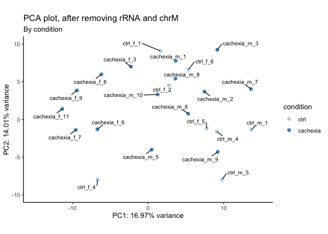

# 01_QC
Qian Hui TAN
2023-06-14

- [<span class="toc-section-number">1</span> 01_QC](#qc)
- [<span class="toc-section-number">2</span> Setup](#setup)
- [<span class="toc-section-number">3</span> Preparing objects for
  DESeq](#preparing-objects-for-deseq)
  - [<span class="toc-section-number">3.0.1</span> Read in
    files](#read-in-files)
  - [<span class="toc-section-number">3.1</span> Creating the data
    matrix](#creating-the-data-matrix)
  - [<span class="toc-section-number">3.2</span> Checking the sex of
    organisms:](#checking-the-sex-of-organisms)
    - [<span class="toc-section-number">3.2.1</span> Get
      XIST](#get-xist)
    - [<span class="toc-section-number">3.2.2</span> Get chrY
      genes](#get-chry-genes)
  - [<span class="toc-section-number">3.3</span> Create DESeq
    object](#create-deseq-object)
  - [<span class="toc-section-number">3.4</span> How many non-zero
    rows?](#how-many-non-zero-rows)
- [<span class="toc-section-number">4</span> DESeq QC](#deseq-qc)
  - [<span class="toc-section-number">4.1</span> Dispersion
    estimates](#dispersion-estimates)
  - [<span class="toc-section-number">4.2</span> QC - number of detected
    genes](#qc---number-of-detected-genes)
  - [<span class="toc-section-number">4.3</span> QC -
    clustering](#qc---clustering)
- [<span class="toc-section-number">5</span> Remove rRNA and
  mitochondrial genome](#remove-rrna-and-mitochondrial-genome)
  - [<span class="toc-section-number">5.1</span> Check rRNA
    removed](#check-rrna-removed)
  - [<span class="toc-section-number">5.2</span> QC - number of
    genes](#qc---number-of-genes)
  - [<span class="toc-section-number">5.3</span> QC-
    clustering](#qc--clustering)
- [<span class="toc-section-number">6</span> Check Deaf1
  levels](#check-deaf1-levels)
  - [<span class="toc-section-number">6.1</span> Normalized
    counts](#normalized-counts)
  - [<span class="toc-section-number">6.2</span> Boxplot - by
    condition](#boxplot---by-condition)
    - [<span class="toc-section-number">6.2.1</span> Wald
      test](#wald-test)
- [<span class="toc-section-number">7</span> Save
  outputs](#save-outputs)
- [<span class="toc-section-number">8</span> Summary](#summary)
- [<span class="toc-section-number">9</span> Sessioninfo](#sessioninfo)

# 01_QC

In this notebook, we perform quality control on our dataset.

# Setup

``` r
## If output directory doesn't exist, create it
if(!dir.exists("../output")){
    dir.create("../output")
  }
  
if(!dir.exists("../output/01_QC")){
    dir.create("../output/01_QC")
  }
  
output_dir <- "../output/01_QC/"
```

``` r
suppressPackageStartupMessages({
    library(dplyr)
    library(readr)
    library(tidyr)
    library(ggplot2)
    library(janitor)
    library(GEOquery)
    library(DESeq2)
    library(reshape2) # melt function
    library(biomaRt)
    library(GenomicFeatures)
    library(scales)
    library(ggrepel)
    library(pheatmap)
    library(viridis)
    library(lubridate)
    library(DT)
})

source("../../scripts/R/functions.R")
```

``` r
# Generic theme
th <- theme(
         plot.title = element_text(size = 20),
         plot.subtitle = element_text(size = 15),
         axis.title.x = element_blank(),
         axis.title.y = element_blank())

# PCA theme
pca_th <- theme(plot.title = element_text(size = 20),
         axis.title.x = element_text(size = 15), 
         axis.title.y = element_text(size = 15),
         axis.text.x = element_text(size = 15),
         axis.text.y = element_text(size = 15))
```

We first create gene-level annotations:

    ### --- Get gene-level annotations (run once) --- ###

    hs.gtf.db <- GenomicFeatures::makeTxDbFromGFF("../../annotation/Homo_sapiens.GRCh38.109.chr.gtf.gz", format="gtf" )

    ensembl.genes = genes(hs.gtf.db)

    human = useEnsembl(biomart="ENSEMBL_MART_ENSEMBL", 
                          dataset="hsapiens_gene_ensembl", mirror = "useast")
    bm.annotations = getBM(attributes = c("ensembl_gene_id", "entrezgene_id", 
                                          "gene_biotype", "external_gene_name"), 
                           mart = human, 
                           filters = "ensembl_gene_id", 
                           values = ensembl.genes$gene_id, uniqueRows=TRUE)
    ensembl.genes$gene_biotype = bm.annotations$gene_biotype[match(ensembl.genes$gene_id, bm.annotations$ensembl_gene_id) ]
    ensembl.genes$entrezgene_id = bm.annotations$entrezgene_id[match(ensembl.genes$gene_id, bm.annotations$ensembl_gene_id) ]
    ensembl.genes$external_gene_name = bm.annotations$external_gene_name[match(ensembl.genes$gene_id, bm.annotations$ensembl_gene_id) ]


    # save this as RDS so we don't have to keep running it
    saveRDS(bm.annotations, file = "../output/bm_annotations.RDS")
    saveRDS(ensembl.genes, file = "../output/ensembl.genes.RDS")
    saveRDS(ensembl.genes, file = "../../annotation/hg38_109_ensembl_genes.RDS")

``` r
ensembl.genes <- readRDS("../output/ensembl.genes.RDS")
```

# Preparing objects for DESeq

We get the metadata from the SRA selector:

``` r
sra_md <- read.csv("../data/metadata/srr_metadata.txt") %>% 
  janitor::clean_names()

sra_md <- sra_md %>% 
  dplyr::select(run, source_name, sex, diagnosis, geo_accession_exp, library_layout, platform)

# Add cachexia and control
sra_md$condition <- ifelse(sra_md$diagnosis == "Pancreatic ductal adenocarcinoma", 
                                      "cachexia", "ctrl")

sra_md$sex <- ifelse(sra_md$sex == "male", "m", "f")


# Change GSE00001 to cachexia_m_1, number it according to group
experimental_metadata <- sra_md %>% 
  group_by(condition, sex) %>% 
  arrange(condition, sex) %>% 
  mutate(sample_no = 1:n()) %>% 
  unite("sample_id", c(condition, sex, sample_no), 
        sep = "_", remove = FALSE)

head(experimental_metadata)
```

| run        | source_name | sample_id    | sex | diagnosis                        | geo_accession_exp | library_layout | platform    | condition | sample_no |
|:-----------|:------------|:-------------|:----|:---------------------------------|:------------------|:---------------|:------------|:----------|----------:|
| SRR9655381 | PDAC muscle | cachexia_f_1 | f   | Pancreatic ductal adenocarcinoma | GSM3931596        | SINGLE         | ION_TORRENT | cachexia  |         1 |
| SRR9655382 | PDAC muscle | cachexia_f_2 | f   | Pancreatic ductal adenocarcinoma | GSM3931597        | SINGLE         | ION_TORRENT | cachexia  |         2 |
| SRR9655384 | PDAC muscle | cachexia_f_3 | f   | Pancreatic ductal adenocarcinoma | GSM3931599        | SINGLE         | ION_TORRENT | cachexia  |         3 |
| SRR9655385 | PDAC muscle | cachexia_f_4 | f   | Pancreatic ductal adenocarcinoma | GSM3931600        | SINGLE         | ION_TORRENT | cachexia  |         4 |
| SRR9655386 | PDAC muscle | cachexia_f_5 | f   | Pancreatic ductal adenocarcinoma | GSM3931601        | SINGLE         | ION_TORRENT | cachexia  |         5 |
| SRR9655387 | PDAC muscle | cachexia_f_6 | f   | Pancreatic ductal adenocarcinoma | GSM3931602        | SINGLE         | ION_TORRENT | cachexia  |         6 |

### Read in files

``` r
bm.annotations <- readRDS("../output/bm_annotations.RDS")
ensembl.genes <- readRDS("../output/ensembl.genes.RDS")

human_muscle_md <- read_delim(file = "../data/metadata/human_muscle_geo_md.txt")
```

    Rows: 68 Columns: 50
    ── Column specification ────────────────────────────────────────────────────────
    Delimiter: " "
    chr (46): title, geo_accession, status, submission_date, last_update_date, t...
    dbl  (4): channel_count, taxid_ch1, contact_zip_postal_code, data_row_count

    ℹ Use `spec()` to retrieve the full column specification for this data.
    ℹ Specify the column types or set `show_col_types = FALSE` to quiet this message.

Fix sample order:

``` r
# Specifying which group is the control group to make appropriate contrasts downstream
experimental_metadata$condition <- factor(experimental_metadata$condition)
experimental_metadata$condition <- relevel(experimental_metadata$condition, ref = "ctrl")

experimental_metadata$sex = factor(experimental_metadata$sex)
```

## Creating the data matrix

``` r
# Create a matrix of the data (nrow can be obtained by calling wc -l *.genes.results in terminal; note -1 for header)
data = matrix(0, ncol = length(experimental_metadata$run), 
              nrow = 62656) 
colnames(data) = experimental_metadata$run

for (i in experimental_metadata$run){
 data[ ,i] = read.table(paste("../data/02_aligned/02_RSEM/", i, ".genes.results",
                              sep = ""),
                         header = TRUE)$expected_count
  row.names(data) = read.table(paste("../data/02_aligned/02_RSEM/", i, ".genes.results",sep=""), header=TRUE)$gene_id
}


# DESeq needs read counts to be integers
data_mat = apply(round(data), c(1,2), as.integer)

# Rename columns
colnames(data_mat) <- experimental_metadata$sample_id[match(colnames(data_mat), experimental_metadata$run)]

#head(data_mat)
```

``` r
data_mat_nonzero = data_mat[rowSums(data_mat) > 0, ] # Remove non-zero rows
```

## Checking the sex of organisms:

### Get XIST

``` r
xist <- "ENSG00000229807"

df_xist <- data_mat[xist, ] %>% melt()
colnames(df_xist) <- c("xist_raw_counts")

df_xist$sample_id = rownames(df_xist)

head(df_xist)
```

|              | xist_raw_counts | sample_id    |
|:-------------|----------------:|:-------------|
| cachexia_f_1 |            1267 | cachexia_f_1 |
| cachexia_f_2 |             629 | cachexia_f_2 |
| cachexia_f_3 |            1224 | cachexia_f_3 |
| cachexia_f_4 |             672 | cachexia_f_4 |
| cachexia_f_5 |            1202 | cachexia_f_5 |
| cachexia_f_6 |            1571 | cachexia_f_6 |

### Get chrY genes

``` r
chr_y <- ensembl.genes[seqnames(ensembl.genes) == "Y", ]
y_genes <- chr_y$gene_id

df_y <- colSums(data_mat[rownames(data_mat) %in% y_genes, ]) %>% 
  melt(value.name = "chrY_sum")

df_y$sample_id = rownames(df_y)

head(df_y)
```

|              | chrY_sum | sample_id    |
|:-------------|---------:|:-------------|
| cachexia_f_1 |        4 | cachexia_f_1 |
| cachexia_f_2 |        4 | cachexia_f_2 |
| cachexia_f_3 |        5 | cachexia_f_3 |
| cachexia_f_4 |        6 | cachexia_f_4 |
| cachexia_f_5 |        2 | cachexia_f_5 |
| cachexia_f_6 |        1 | cachexia_f_6 |

Plot them

``` r
df_plot <- inner_join(df_xist, df_y)
```

    Joining with `by = join_by(sample_id)`

``` r
df_plot <- df_plot %>% 
  separate(sample_id, into = c("condition", "sex", "rep"), 
           remove = FALSE)

ggplot(df_plot, aes(x = chrY_sum, y = xist_raw_counts,
                    color = sex)) +
  geom_point() +
  expand_limits(x = 0, y = 0) +
  labs(title = "Xist vs chrY") +
  theme_classic()
```


Samples are labelled correctly - males have high chrY and low Xist,
while females have high Xist and low chrY.

## Create DESeq object

``` r
# Create DESeq object
dds = DESeqDataSetFromMatrix(data_mat_nonzero, experimental_metadata, 
                             ~ sex + condition)
colnames(dds) = colnames(data_mat_nonzero)

# Make ctrl the reference
colData(dds)$condition <- factor(colData(dds)$condition)
colData(dds)$condition <- relevel(colData(dds)$condition, ref = "ctrl")


#Estimates the size factors using the "median ratio method" described by Equation 5 in Anders and Huber (2010)
dds <- estimateSizeFactors(dds) 
#This function obtains dispersion estimates for a count data set
dds <- estimateDispersions(dds)
```

    gene-wise dispersion estimates

    mean-dispersion relationship

    final dispersion estimates

``` r
# Removing lowly expressed genes, only to be done once at the start of the differential expression step
filter = apply(counts(dds, normalized = TRUE), 1, function(x){ mean(x) >= 10 })
dds = dds[filter, ]

#This function transforms the count data to the log2 scale in a way which minimizes differences between samples for rows with small counts
vst <- vst(dds, blind = TRUE) # use blind = TRUE for QC
```

## How many non-zero rows?

How many genes are there in the human genome?

``` r
nrow(data_mat)
```

    [1] 62656

How many genes are expressed (at least 1 read in at least 1 sample)?

``` r
nrow(data_mat_nonzero)
```

    [1] 22745

What percentage is this?

``` r
nrow(data_mat_nonzero)/nrow(data_mat) * 100
```

    [1] 36.30139

36% of all rows are nonzero.

# DESeq QC

## Dispersion estimates

``` r
## Plot dispersion estimates
plotDispEsts(dds, main = "Dispersion estimates, before filtering")
```


## QC - number of detected genes

Examining our dataset:

``` r
dds
```

    class: DESeqDataSet 
    dim: 11220 34 
    metadata(1): version
    assays(2): counts mu
    rownames(11220): ENSG00000000003 ENSG00000000005 ... ENSG00000291266
      ENSG00000291283
    rowData names(10): baseMean baseVar ... dispOutlier dispMAP
    colnames(34): cachexia_f_1 cachexia_f_2 ... ctrl_m_4 ctrl_m_5
    colData names(11): run source_name ... sample_no sizeFactor

We plot a few key metrics to check our data quality:

``` r
plt_title = "Before Filtering"
```

<div class="panel-tabset">

### Read counts per sample

``` r
total_counts <- as.data.frame(colSums(counts(dds)))
colnames(total_counts) <- "total_counts"
total_counts$name = rownames(total_counts)
```

``` r
# Plot
ggplot(total_counts, aes(x = name, y = total_counts)) +
    geom_bar(stat = "identity") +
    scale_y_continuous("Read counts", 
                       limits = c(0, 1e7),
                       expand = c(0, 0),
                       breaks = seq(0, 1e7, 1e6)) +
    geom_hline(yintercept = 2.5e7, color = "blue", linetype = "dashed") +
    labs(title = "Read counts per sample",
         x = element_blank()) +
    theme_minimal() +
    coord_flip()
```

    Warning: Removed 1 rows containing missing values (`geom_hline()`).


### Number of genes detected per sample

``` r
detected = apply(counts(dds), 2, function(col) sum(col > 0 ))
detected = as.data.frame(detected)
detected$name = row.names(detected)
                 
ggplot(detected, aes(x=name, y=detected)) + 
                 geom_bar(stat="identity") + 
                 theme_minimal() + 
                 coord_flip() + 
                 scale_y_continuous("Number of Genes detected", expand=c(0,0),
                                    limits = c(0, 15000)
                                    ) + 
                 scale_x_discrete("Sample") +
                 labs(title = "# of genes detected", 
                     subtitle = plt_title) +
                 geom_hline(yintercept = 10000, color = "blue", linetype = "dashed") 
```


### Size factors

``` r
df = data.frame(sample_id = names(sizeFactors(dds)), 
                sizeFactors = sizeFactors(dds))

ggplot(df, aes(x = sample_id, y=sizeFactors)) + 
    geom_bar(stat="identity") + 
    scale_y_continuous(limits=c(0,2), expand=c(0,0)) + 
    labs(title = "Size factors for each sample",
         subtitle = plt_title, 
         x = element_blank()) +
    theme_minimal() + 
    theme(axis.text.x = element_text(angle = 90, hjust=1, 
                                     colour="black", size= 12))
```


### Normalized counts (boxplot)

``` r
nc = counts(dds, normalized=TRUE)
nc.melt = melt(nc)

ggplot(nc.melt, aes(x=Var2, y=value)) + 
    geom_boxplot() + 
    theme_classic() + 
    theme(axis.text.x = element_text(angle = 90, colour="black", hjust = 1,
                                     size = 12)) + 
    scale_x_discrete("Sample") + 
    scale_y_continuous("Normalised counts") +
    labs(title = "Normalized counts",
        subtitle = plt_title)
```


``` r
nc.threshold = 2e5
test = apply(nc, 1, function(x){ any(x > nc.threshold) })
```

The genes with normalized counts greater than 2^{5} are:

``` r
above_threshold <- as.data.frame(ensembl.genes[names(test[test])])

above_threshold[ ,colnames(above_threshold) %in% 
                   c("gene_id", "gene_biotype", "external_gene_name")]
```

|                 | gene_id         | gene_biotype   | external_gene_name |
|:----------------|:----------------|:---------------|:-------------------|
| ENSG00000104879 | ENSG00000104879 | protein_coding | CKM                |
| ENSG00000125414 | ENSG00000125414 | protein_coding | MYH2               |
| ENSG00000143632 | ENSG00000143632 | protein_coding | ACTA1              |

These are all protein-coding genes.

Plotting the rRNA graph:

``` r
rrna.genes = names(ensembl.genes[ensembl.genes$gene_biotype %in% c("Mt_rRNA", "rRNA")])
percentage.of.rrna = (colSums(counts(dds[ rownames(counts(dds)) %in% rrna.genes])) / colSums(counts(dds))) * 100

percentage.of.rrna = as.data.frame(percentage.of.rrna)
percentage.of.rrna$name = row.names(percentage.of.rrna)
#percentage.of.rrna$name = factor(percentage.of.rrna$name,rev(experimental_metadata$sample_id))
ggplot(percentage.of.rrna, 
       aes(x=name, y=percentage.of.rrna)) + 
        geom_hline(yintercept = 5, color = "blue", linetype = "dashed") +
        geom_bar(stat="identity") + 
        theme_classic() + 
        coord_flip() + 
        scale_y_continuous("% rRNA", expand=c(0,0), limits = c(0, 30)) +
        labs(title = "% rRNA") 
```


Checking summary statistics for rRNA:

``` r
summary(percentage.of.rrna$percentage.of.rrna)
```

        Min.  1st Qu.   Median     Mean  3rd Qu.     Max. 
    0.005042 0.006841 0.008086 0.008404 0.009087 0.012807 

There’s a tiny amount of rRNA (\< 0.02%). This is good - our samples
don’t show large amounts of rRNA present.

### Proportions of gene biotypes

``` r
pc = ensembl.genes$gene_id[ensembl.genes$gene_biotype == "protein_coding"]
pg = ensembl.genes$gene_id[ensembl.genes$gene_biotype %in% unique(ensembl.genes$gene_biotype)[grep("pseudogene", unique(ensembl.genes$gene_biotype))]]
lc = ensembl.genes$gene_id[ensembl.genes$gene_biotype == "lincRNA"]

totalcounts.pc = colSums(counts(dds)[rownames(counts(dds)) %in% pc,])
totalcounts.pg = colSums(counts(dds)[rownames(counts(dds)) %in% pg,])
totalcounts.lc = colSums(counts(dds)[rownames(counts(dds)) %in% lc,])

totalcounts.other = colSums(counts(dds)[!(rownames(counts(dds)) %in% c(lc,pc,pg)),])

counts.by.biotype = data.frame(name = names(totalcounts.pc),
                         protein_coding = totalcounts.pc,
                         pseudogene = totalcounts.pg,
                         lincRNA = totalcounts.lc,
                         other = totalcounts.other
                         
                         )

#counts.by.biotype$name = factor(counts.by.biotype$name, experimental_metadata$sample_id)

counts.by.biotype = as.data.frame(t(apply(counts.by.biotype[,2:5], 1, function(x){ 100 * (x / sum(x)) }) ))
counts.by.biotype$name = names(totalcounts.pc)
#counts.by.biotype$name = factor(counts.by.biotype$name, #experimental_metadata$sample_id)

counts.by.biotype.melt = melt(counts.by.biotype)
```

    Using name as id variables

``` r
ggplot(counts.by.biotype.melt, aes(x=name, y=value, fill=variable)) +  
    geom_bar(stat="identity") + 
    theme_classic() + 
    scale_y_continuous("% reads", labels = dollar_format(suffix = "%", prefix = ""),  
                       expand=c(0,0)) + scale_x_discrete("Sample") + 
    theme(axis.text.x = element_text(angle = 90, colour="black", #family="Arial", 
                                     hjust = 1, size=12)) +
    labs(title = "Proportions of gene biotypes", 
        subtitle = plt_title) 
```


Most genes are protein-coding, as expected.

</div>

Read counts are rather low.

## QC - clustering

We perform 3 types of Quality Control to assess our DESeq dataset:

- Correlation matrix heatmap
- Hierarchical clustering
- PCA

<div class="panel-tabset">

### Correlation matrix heatmap

``` r
### Extract the vst matrix from the object
vst_mat <- assay(vst)  
### Compute pairwise correlation values
vst_cor <- cor(vst_mat)
### Plot heatmap
pheatmap(vst_cor, main = "Correlation heatmap, before filtering")
```


### Hierarchical clustering

``` r
sampleDists <- dist(t(assay(vst)))
plot(hclust(sampleDists), main = paste0("Cluster Dendrogram, ", plt_title))
```


### PCA

``` r
make_pca(vst, intgroup = "condition",
         title = "PCA, before filtering")
```

    Warning: Removed 11 rows containing missing values (`geom_point()`).


### PCA, labelled

``` r
make_pca(vst, intgroup = "condition", label = TRUE,
         title = "PCA, before filtering")
```

    Warning: Removed 11 rows containing missing values (`geom_point()`).

    Warning: Removed 11 rows containing missing values (`geom_text_repel()`).


### PCA, by sex

``` r
make_pca(vst, intgroup = "sex",
         title = "PCA plot, before filtering") +
  scale_color_brewer(palette = "Set1")
```

    Scale for colour is already present.
    Adding another scale for colour, which will replace the existing scale.

    Warning: Removed 11 rows containing missing values (`geom_point()`).


PC1 separates by sex.

### PCA, by size factor

``` r
make_pca(vst, intgroup = "sizeFactor",
         title = "PCA plot, before filtering") +
  scale_color_viridis(option = "A")
```

    Warning: Removed 11 rows containing missing values (`geom_point()`).


</div>

# Remove rRNA and mitochondrial genome

We remove all genes that map to rRNA, as well as the mitochondrial
chromosome before we proceed with downstream analysis.

``` r
plt_title = "after removing rRNA and mitochondrial genome"
```

Checking MT chromosome intact:

``` r
in_dds = ensembl.genes[na.omit(match(rownames(counts(dds)), ensembl.genes$gene_id)), ]
table(seqnames(in_dds))
```


       1    2    3    4    5    6    7    8    9   10   11   12   13   14   15   16 
    1141  762  659  413  525  581  571  364  470  451  651  584  192  378  369  507 
      17   18   19   20   21   22    X    Y   MT 
     679  158  733  305  109  257  352    7    2 

Remove MT chromosome, rerun DESeq:

``` r
# Remove mitochondrial genome
mit_genes <- ensembl.genes[seqnames(ensembl.genes) %in% "chrM", ]$gene_id
dds_rm_mit <- dds[!rownames(counts(dds)) %in% mit_genes, ]

# Remove rRNA
dds_filt = dds_rm_mit[!(row.names(counts(dds_rm_mit)) %in% 
                   ensembl.genes$gene_id[ensembl.genes$gene_biotype %in% 
                                           c("rRNA", "snoRNA", "snRNA", "Mt_rRNA")]), ]
dds_filt = dds_filt[rowSums(counts(dds_filt)) > 0, ]

# Re-estimate dispersions
dds_filt <- estimateSizeFactors(dds_filt) 
dds_filt <- estimateDispersions(dds_filt)
```

    found already estimated dispersions, replacing these

    gene-wise dispersion estimates

    mean-dispersion relationship

    final dispersion estimates

``` r
vst_filt <- vst(dds, blind = TRUE) # use blind = TRUE for QC
```

Check that mitochondrial genome has been removed:

``` r
in_dds = ensembl.genes[na.omit(match(rownames(counts(dds_filt)), ensembl.genes$gene_id)), ]
table(seqnames(in_dds))
```


       1    2    3    4    5    6    7    8    9   10   11   12   13   14   15   16 
    1134  756  653  412  521  579  567  364  467  449  644  577  190  376  368  502 
      17   18   19   20   21   22    X    Y   MT 
     676  158  732  300  105  256  351    7    0 

## Check rRNA removed

``` r
rrna.genes = names(ensembl.genes[ensembl.genes$gene_biotype %in% c("Mt_rRNA", "rRNA", 
                                                                   "snoRNA", "snRNA")])

percentage.of.rrna = (colSums(counts(dds_filt[rownames(counts(dds_filt)) %in% rrna.genes])) / colSums(counts(dds_filt))) * 100
percentage.of.rrna = as.data.frame(percentage.of.rrna)
percentage.of.rrna$name = row.names(percentage.of.rrna)
#percentage.of.rrna$name = factor(percentage.of.rrna$name, rev(experimental_metadata$sample_id))


ggplot(percentage.of.rrna, aes(x=name, y=percentage.of.rrna)) +
  geom_bar(stat="identity") + theme_classic() + coord_flip() + scale_y_continuous("% rRNA", expand=c(0,0)) +
  scale_x_discrete("Sample") +
  ggtitle(paste0("% rRNA, ", plt_title))
```


Checking that rRNA percentage is now zero:

``` r
summary(percentage.of.rrna$percentage.of.rrna)
```

       Min. 1st Qu.  Median    Mean 3rd Qu.    Max. 
          0       0       0       0       0       0 

## QC - number of genes

<div class="panel-tabset">

### Size Factors after rRNA removal

``` r
df = data.frame(sample_id = names(sizeFactors(dds_filt)), sizeFactors = sizeFactors(dds_filt))

ggplot(df, aes(x = sample_id, y=sizeFactors)) + 
  geom_bar(stat="identity") + 
  scale_y_continuous(limits=c(0,2), expand=c(0,0)) + 
  theme_classic() + 
  theme(axis.text.x = element_text(angle = 90, hjust=1, colour="black", size=12)) +
  geom_hline(yintercept = 1, color = "blue", linetype = "dashed") +
  ggtitle(paste0("Size Factors, ", plt_title))
```


Summary of size factors:

``` r
summary(sizeFactors(dds_filt))
```

       Min. 1st Qu.  Median    Mean 3rd Qu.    Max. 
     0.7345  0.8876  1.0048  1.0253  1.1630  1.3494 

Size factors for each sample:

``` r
print(sizeFactors(dds_filt))
```

     cachexia_f_1  cachexia_f_2  cachexia_f_3  cachexia_f_4  cachexia_f_5 
        1.1672302     1.2659620     0.8842401     1.2634309     0.7370659 
     cachexia_f_6  cachexia_f_7  cachexia_f_8  cachexia_f_9 cachexia_f_10 
        1.2633484     0.7345334     1.1438475     1.0430562     0.7610181 
    cachexia_f_11  cachexia_m_1  cachexia_m_2  cachexia_m_3  cachexia_m_4 
        0.9883245     1.3233107     0.8978527     0.8427762     1.1159886 
     cachexia_m_5  cachexia_m_6  cachexia_m_7  cachexia_m_8  cachexia_m_9 
        1.1697825     0.9720004     0.9579436     1.2421839     0.9791508 
    cachexia_m_10 cachexia_m_11 cachexia_m_12      ctrl_f_1      ctrl_f_2 
        1.1503638     0.7647037     1.3494187     0.9412764     0.8659865 
         ctrl_f_3      ctrl_f_4      ctrl_f_5      ctrl_f_6      ctrl_m_1 
        1.1406865     1.0212851     0.8443406     0.9193131     0.8358307 
         ctrl_m_2      ctrl_m_3      ctrl_m_4      ctrl_m_5 
        1.2847259     1.0386557     0.9111773     1.0395539 

### Read counts per sample after rRNA and chrM removal

``` r
total_counts <- as.data.frame(colSums(counts(dds_filt)))
colnames(total_counts) <- "total_counts"
total_counts$name = rownames(total_counts)
```

``` r
# Plot
ggplot(total_counts, aes(x = name, y = total_counts)) +
    geom_bar(stat = "identity") +
    scale_y_continuous("Read counts", 
                       limits = c(0, 1e7),
                       expand = c(0, 0),
                       breaks = seq(0, 1e7, 1e6)) +
    geom_hline(yintercept = 2.5e7, color = "blue", linetype = "dashed") +
    labs(title = "Read counts per sample",
         subtitle = "after removing chrM and rRNA",
         x = element_blank()) +
    theme_minimal() +
    coord_flip()
```

    Warning: Removed 1 rows containing missing values (`geom_hline()`).


### Number of genes detected per sample after rRNA and chrM removal

``` r
detected = apply(counts(dds_filt), 2, function(col) sum(col > 0 ))
detected = as.data.frame(detected)
detected$name = row.names(detected)
#detected$name = factor(detected$name, rev(experimental_metadata$sample_id))
                 
ggplot(detected, aes(x=name, y=detected)) + 
                 geom_bar(stat="identity") + 
                 theme_minimal() + 
                 coord_flip() + 
                 scale_y_continuous("Number of Genes detected", expand=c(0,0),
                                    limits = c(0, 30000)) + 
                 scale_x_discrete("Sample") +
                 labs(title = "# of genes detected", 
                     subtitle = plt_title) +
                 geom_hline(yintercept = 20000, color = "blue", linetype = "dashed") 
```


</div>

## QC- clustering

<div class="panel-tabset">

### Heatmap after rRNA removal

``` r
### Extract the vst matrix from the object
vst_mat <- assay(vst_filt)  

### Compute pairwise correlation values
vst_cor <- cor(vst_mat)

### Plot heatmap
pheatmap(vst_cor, main = "Correlation heatmap, after rRNA removal")
```


### Clustering after rRNA removal

``` r
sampleDists <- dist(t(assay(vst_filt)))
plot(hclust(sampleDists), main = paste0("Cluster Dendrogram, ", plt_title))
```


### PCA after rRNA removal

``` r
make_pca(vst_filt, intgroup = "condition",
         title = "PCA plot, after removing rRNA and chrM") 
```

    Warning: Removed 11 rows containing missing values (`geom_point()`).


### PCA, labelled

``` r
make_pca(vst_filt, intgroup = "condition", label = TRUE, 
         title = "PCA plot, after removing rRNA and chrM") 
```

    Warning: Removed 11 rows containing missing values (`geom_point()`).

    Warning: Removed 11 rows containing missing values (`geom_text_repel()`).



### PCA, by sex

``` r
make_pca(vst_filt, intgroup = "sex",
         title = "PCA plot, after removing rRNA and chrM") +
  scale_color_brewer(palette = "Set1")
```

    Scale for colour is already present.
    Adding another scale for colour, which will replace the existing scale.

    Warning: Removed 11 rows containing missing values (`geom_point()`).


Wow. PC1 separates by sex.

### PCA, by size factor

``` r
make_pca(vst_filt, intgroup = "sizeFactor", 
         title = "PCA plot, after removing rRNA and chrM") +
  scale_color_viridis(option = "A")
```

    Scale for colour is already present.
    Adding another scale for colour, which will replace the existing scale.

    Warning: Removed 11 rows containing missing values (`geom_point()`).


</div>

# Check Deaf1 levels

``` r
# Check that design is sex + condition
design(dds_filt)
```

    ~sex + condition

## Normalized counts

We plot the normalized counts of deaf1 in each sample:

``` r
deaf1_gene <- "ENSG00000177030"

# The normalized counts
deaf1_norm <- as.data.frame(counts(dds_filt, normalized = TRUE)[deaf1_gene, ])

deaf1_norm$sample <- rownames(deaf1_norm)
colnames(deaf1_norm) <- c("norm_counts", "sample")

deaf1_norm <- deaf1_norm %>% 
  separate(sample, 
           into = c("condition", "sex", "sample_no"),
           remove = FALSE)
head(deaf1_norm)
```

|              | norm_counts | sample       | condition | sex | sample_no |
|:-------------|------------:|:-------------|:----------|:----|:----------|
| cachexia_f_1 |    55.68739 | cachexia_f_1 | cachexia  | f   | 1         |
| cachexia_f_2 |    68.72244 | cachexia_f_2 | cachexia  | f   | 2         |
| cachexia_f_3 |    58.80755 | cachexia_f_3 | cachexia  | f   | 3         |
| cachexia_f_4 |    58.57067 | cachexia_f_4 | cachexia  | f   | 4         |
| cachexia_f_5 |    78.69038 | cachexia_f_5 | cachexia  | f   | 5         |
| cachexia_f_6 |    77.57164 | cachexia_f_6 | cachexia  | f   | 6         |

``` r
# save this
write.csv(deaf1_norm, file = paste0(output_dir, "pdac_deaf1_norm.csv"))
```

``` r
ggplot(deaf1_norm, aes(x = sample, y = norm_counts)) +
  geom_col() +
  labs(title = "Deaf1 counts, normalized") +
  theme_minimal() +
  theme(axis.text.x = element_text(angle = 90)) 
```


## Boxplot - by condition

``` r
dat <- deaf1_norm 

ggplot(dat, aes(x = condition, y = norm_counts)) +
  geom_boxplot() +
  geom_point() +
  theme_classic() + 
  labs(title = "Deaf1 counts, normalized")
```


### Wald test

``` r
dds_wald <- dds_filt
design(dds_wald) <- ~ condition + sex

dds_wald <- DESeq(dds_wald, parallel = TRUE)
```

    using pre-existing size factors

    estimating dispersions

    gene-wise dispersion estimates: 6 workers

    mean-dispersion relationship

    final dispersion estimates, fitting model and testing: 6 workers

    -- replacing outliers and refitting for 27 genes
    -- DESeq argument 'minReplicatesForReplace' = 7 
    -- original counts are preserved in counts(dds)

    estimating dispersions

    fitting model and testing

``` r
dds_wald <- nbinomWaldTest(dds_wald)
```

    found results columns, replacing these

``` r
resultsNames(dds_wald)
```

    [1] "Intercept"                  "condition_cachexia_vs_ctrl"
    [3] "sex_m_vs_f"                

``` r
res <- results(dds_wald, name = "condition_cachexia_vs_ctrl")
```

``` r
deaf1_res <- res[deaf1_gene, ]

deaf1_res
```

    log2 fold change (MLE): condition cachexia vs ctrl 
    Wald test p-value: condition cachexia vs ctrl 
    DataFrame with 1 row and 6 columns
                     baseMean log2FoldChange     lfcSE      stat    pvalue
                    <numeric>      <numeric> <numeric> <numeric> <numeric>
    ENSG00000177030   78.3903      -0.259641  0.125073  -2.07592 0.0379012
                         padj
                    <numeric>
    ENSG00000177030  0.252716

``` r
#save this
deaf1_res_export <- as.data.frame(deaf1_res)

# Add log2fc and pvalue info
deaf1_res_export$log2fc_info <- deaf1_res@elementMetadata@listData$description[2]

deaf1_res_export$pval_info <- deaf1_res@elementMetadata@listData$description[5]

deaf1_res_export
```

|                 | baseMean | log2FoldChange |     lfcSE |      stat |    pvalue |      padj | log2fc_info                                        | pval_info                                     |
|:----------------|---------:|---------------:|----------:|----------:|----------:|----------:|:---------------------------------------------------|:----------------------------------------------|
| ENSG00000177030 | 78.39035 |     -0.2596411 | 0.1250727 | -2.075921 | 0.0379012 | 0.2527157 | log2 fold change (MLE): condition cachexia vs ctrl | Wald test p-value: condition cachexia vs ctrl |

``` r
write.csv(deaf1_res_export, file = paste0(output_dir, "pdac_deaf1_stats.csv"))
```

:::

# Save outputs

``` r
saveRDS(dds_filt, file = paste0(output_dir, "dds_filt.RDS"))
```

# Summary

- Deaf1 decreases significantly.

# Sessioninfo

``` r
sessionInfo()
```

    R version 4.2.2 (2022-10-31)
    Platform: aarch64-apple-darwin20 (64-bit)
    Running under: macOS Ventura 13.1

    Matrix products: default
    BLAS:   /Library/Frameworks/R.framework/Versions/4.2-arm64/Resources/lib/libRblas.0.dylib
    LAPACK: /Library/Frameworks/R.framework/Versions/4.2-arm64/Resources/lib/libRlapack.dylib

    locale:
    [1] en_US.UTF-8/en_US.UTF-8/en_US.UTF-8/C/en_US.UTF-8/en_US.UTF-8

    attached base packages:
    [1] stats4    stats     graphics  grDevices utils     datasets  methods  
    [8] base     

    other attached packages:
     [1] DT_0.27                     lubridate_1.9.1            
     [3] viridis_0.6.2               viridisLite_0.4.1          
     [5] pheatmap_1.0.12             ggrepel_0.9.3              
     [7] scales_1.2.1                GenomicFeatures_1.50.4     
     [9] AnnotationDbi_1.60.2        biomaRt_2.54.0             
    [11] reshape2_1.4.4              DESeq2_1.38.3              
    [13] SummarizedExperiment_1.28.0 MatrixGenerics_1.10.0      
    [15] matrixStats_0.63.0          GenomicRanges_1.50.2       
    [17] GenomeInfoDb_1.34.9         IRanges_2.32.0             
    [19] S4Vectors_0.36.2            GEOquery_2.66.0            
    [21] Biobase_2.58.0              BiocGenerics_0.44.0        
    [23] janitor_2.2.0               ggplot2_3.4.2              
    [25] tidyr_1.3.0                 readr_2.1.3                
    [27] dplyr_1.1.1                

    loaded via a namespace (and not attached):
     [1] colorspace_2.1-0         rjson_0.2.21             ellipsis_0.3.2          
     [4] snakecase_0.11.0         XVector_0.38.0           rstudioapi_0.14         
     [7] farver_2.1.1             bit64_4.0.5              fansi_1.0.4             
    [10] xml2_1.3.3               codetools_0.2-19         cachem_1.0.7            
    [13] geneplotter_1.76.0       knitr_1.42               jsonlite_1.8.4          
    [16] Rsamtools_2.14.0         annotate_1.76.0          dbplyr_2.3.0            
    [19] png_0.1-8                compiler_4.2.2           httr_1.4.5              
    [22] assertthat_0.2.1         Matrix_1.5-3             fastmap_1.1.1           
    [25] limma_3.54.1             cli_3.6.1                htmltools_0.5.4         
    [28] prettyunits_1.1.1        tools_4.2.2              gtable_0.3.3            
    [31] glue_1.6.2               GenomeInfoDbData_1.2.9   rappdirs_0.3.3          
    [34] Rcpp_1.0.10              vctrs_0.6.1              Biostrings_2.66.0       
    [37] rtracklayer_1.58.0       xfun_0.37                stringr_1.5.0           
    [40] timechange_0.2.0         lifecycle_1.0.3          restfulr_0.0.15         
    [43] XML_3.99-0.13            zlibbioc_1.44.0          vroom_1.6.1             
    [46] hms_1.1.2                parallel_4.2.2           RColorBrewer_1.1-3      
    [49] yaml_2.3.7               curl_5.0.0               memoise_2.0.1           
    [52] gridExtra_2.3            stringi_1.7.12           RSQLite_2.3.1           
    [55] BiocIO_1.8.0             filelock_1.0.2           BiocParallel_1.32.6     
    [58] rlang_1.1.0              pkgconfig_2.0.3          bitops_1.0-7            
    [61] evaluate_0.20            lattice_0.20-45          purrr_1.0.1             
    [64] labeling_0.4.2           htmlwidgets_1.6.1        GenomicAlignments_1.34.0
    [67] bit_4.0.5                tidyselect_1.2.0         plyr_1.8.8              
    [70] magrittr_2.0.3           R6_2.5.1                 generics_0.1.3          
    [73] DelayedArray_0.24.0      DBI_1.1.3                pillar_1.9.0            
    [76] withr_2.5.0              KEGGREST_1.38.0          RCurl_1.98-1.12         
    [79] tibble_3.2.1             crayon_1.5.2             utf8_1.2.3              
    [82] BiocFileCache_2.6.0      tzdb_0.3.0               rmarkdown_2.20          
    [85] progress_1.2.2           locfit_1.5-9.7           grid_4.2.2              
    [88] data.table_1.14.8        blob_1.2.4               digest_0.6.31           
    [91] xtable_1.8-4             munsell_0.5.0           
