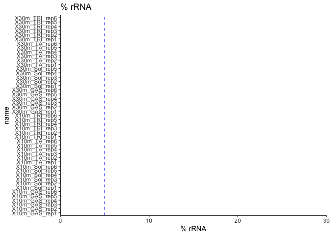
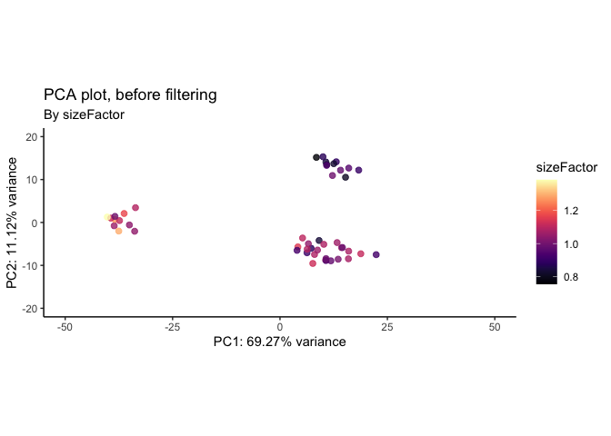
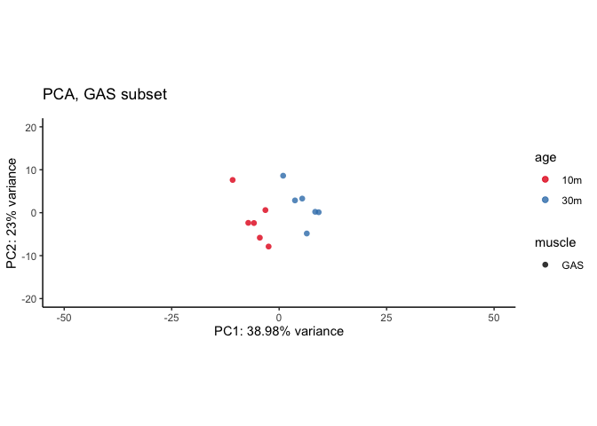

# 01_QC
Qian Hui TAN
2023-06-14

- [<span class="toc-section-number">1</span> 01_QC](#qc)
- [<span class="toc-section-number">2</span> Setup](#setup)
- [<span class="toc-section-number">3</span> Preparing objects for
  DESeq](#preparing-objects-for-deseq)
  - [<span class="toc-section-number">3.1</span> Creating the data
    matrix](#creating-the-data-matrix)
  - [<span class="toc-section-number">3.2</span> Which genome
    build?](#which-genome-build)
    - [<span class="toc-section-number">3.2.1</span> Get metadata from
      series matrix file](#get-metadata-from-series-matrix-file)
  - [<span class="toc-section-number">3.3</span> Create
    metadata](#create-metadata)
    - [<span class="toc-section-number">3.3.1</span> Read in
      files](#read-in-files)
  - [<span class="toc-section-number">3.4</span> Checking the sex of
    organisms:](#checking-the-sex-of-organisms)
    - [<span class="toc-section-number">3.4.1</span> Get
      XIST](#get-xist)
    - [<span class="toc-section-number">3.4.2</span> Get chrY
      genes](#get-chry-genes)
  - [<span class="toc-section-number">3.5</span> Is Deaf1
    expressed?](#is-deaf1-expressed)
  - [<span class="toc-section-number">3.6</span> Creating the
    datamatrix](#creating-the-datamatrix)
  - [<span class="toc-section-number">3.7</span> Create DESeq
    object](#create-deseq-object)
  - [<span class="toc-section-number">3.8</span> How many non-zero
    rows?](#how-many-non-zero-rows)
- [<span class="toc-section-number">4</span> DESeq QC](#deseq-qc)
  - [<span class="toc-section-number">4.1</span> Dispersion
    estimates](#dispersion-estimates)
  - [<span class="toc-section-number">4.2</span> QC - number of detected
    genes](#qc---number-of-detected-genes)
  - [<span class="toc-section-number">4.3</span> QC -
    clustering](#qc---clustering)
- [<span class="toc-section-number">5</span> Remove rRNA and
  mitochondrial genome](#remove-rrna-and-mitochondrial-genome)
  - [<span class="toc-section-number">5.1</span> Check rRNA
    removed](#check-rrna-removed)
  - [<span class="toc-section-number">5.2</span> QC - number of
    genes](#qc---number-of-genes)
  - [<span class="toc-section-number">5.3</span> QC-
    clustering](#qc--clustering)
- [<span class="toc-section-number">6</span> Split the
  dataset](#split-the-dataset)
  - [<span class="toc-section-number">6.1</span> Subset -
    sol](#subset---sol)
  - [<span class="toc-section-number">6.2</span> Subset -
    GAS](#subset---gas)
  - [<span class="toc-section-number">6.3</span> Subset -
    TRI](#subset---tri)
  - [<span class="toc-section-number">6.4</span> Subset -
    TA](#subset---ta)
- [<span class="toc-section-number">7</span> Check Deaf1
  levels](#check-deaf1-levels)
  - [<span class="toc-section-number">7.1</span> Remove 10m_TA_rep5 from
    dds_filt](#remove-10m_ta_rep5-from-dds_filt)
  - [<span class="toc-section-number">7.2</span> Normalized
    counts](#normalized-counts)
  - [<span class="toc-section-number">7.3</span> Boxplot - all
    conditions](#boxplot---all-conditions)
- [<span class="toc-section-number">8</span> Deaf1 Wald tests for
  individual conditions](#deaf1-wald-tests-for-individual-conditions)
- [<span class="toc-section-number">9</span> Summary](#summary)
- [<span class="toc-section-number">10</span> Sessioninfo](#sessioninfo)

# 01_QC

In this notebook, we perform quality control on our dataset.

# Setup

``` r
## If output directory doesn't exist, create it
if(!dir.exists("../output")){
    dir.create("../output/")
  }
  
if(!dir.exists("../output/01_QC")){
    dir.create("../output/01_QC")
  }
  
output_dir <- "../output/01_QC/"
```

``` r
suppressPackageStartupMessages({
    library(dplyr)
    library(readr)
    library(tidyr)
    library(ggplot2)
    library(janitor)
    library(GEOquery)
    library(DESeq2)
    library(reshape2) # melt function
    library(biomaRt)
    library(GenomicFeatures)
    library(scales)
    library(ggrepel)
    library(pheatmap)
    library(viridis)
    library(lubridate)
    library(DT)
})

source("../../scripts/R/functions.R")
```

``` r
# PCA theme
pca_th <- theme(plot.title = element_text(size = 20),
         axis.title.x = element_text(size = 15), 
         axis.title.y = element_text(size = 15),
         axis.text.x = element_text(size = 15),
         axis.text.y = element_text(size = 15))
```

# Preparing objects for DESeq

## Creating the data matrix

``` r
df_counts <- read.delim(
    file = "../data/GSE139204_aging_rm_counts.txt.gz")

# Add gene_id to rownames
rownames(df_counts) <- df_counts$gene_id

# Remove non-numeric columns
df_counts <- df_counts[ ,!colnames(df_counts) %in% c("gene_id", "gene_name")]

head(df_counts)
```

|                    | X10m_Sol_rep1 | X10m_Sol_rep2 | X10m_Sol_rep3 | X10m_Sol_rep4 | X10m_Sol_rep5 | X10m_Sol_rep6 | X30m_Sol_rep1 | X30m_Sol_rep2 | X30m_Sol_rep3 | X30m_Sol_rep4 | X30m_Sol_rep5 | X30m_Sol_RM_rep1 | X30m_Sol_RM_rep2 | X30m_Sol_RM_rep3 | X30m_Sol_RM_rep4 | X30m_Sol_RM_rep5 | X30m_Sol_RM_rep6 | X10m_TA_rep1 | X10m_TA_rep2 | X10m_TA_rep3 | X10m_TA_rep4 | X10m_TA_rep5 | X10m_TA_rep6 | X30m_TA_rep1 | X30m_TA_rep2 | X30m_TA_rep3 | X30m_TA_rep4 | X30m_TA_rep5 | X30m_TA_rep6 | X30m_TA_RM_rep1 | X30m_TA_RM_rep2 | X30m_TA_RM_rep3 | X30m_TA_RM_rep4 | X30m_TA_RM_rep5 | X30m_TA_RM_rep6 | X10m_TRI_rep1 | X10m_TRI_rep2 | X10m_TRI_rep3 | X10m_TRI_rep4 | X10m_TRI_rep5 | X10m_TRI_rep6 | X30m_TRI_rep1 | X30m_TRI_rep2 | X30m_TRI_rep3 | X30m_TRI_rep4 | X30m_TRI_rep5 | X30m_TRI_rep6 | X30m_TRI_RM_rep1 | X30m_TRI_RM_rep2 | X30m_TRI_RM_rep3 | X30m_TRI_RM_rep4 | X30m_TRI_RM_rep5 | X30m_TRI_RM_rep6 | X10m_GAS_rep1 | X10m_GAS_rep2 | X10m_GAS_rep3 | X10m_GAS_rep4 | X10m_GAS_rep5 | X10m_GAS_rep6 | X30m_GAS_rep1 | X30m_GAS_rep2 | X30m_GAS_rep3 | X30m_GAS_rep4 | X30m_GAS_rep5 | X30m_GAS_rep6 | X30m_GAS_RM_rep1 | X30m_GAS_RM_rep2 | X30m_GAS_RM_rep3 | X30m_GAS_RM_rep4 | X30m_GAS_RM_rep5 | X30m_GAS_RM_rep6 |
|:-------------------|--------------:|--------------:|--------------:|--------------:|--------------:|--------------:|--------------:|--------------:|--------------:|--------------:|--------------:|-----------------:|-----------------:|-----------------:|-----------------:|-----------------:|-----------------:|-------------:|-------------:|-------------:|-------------:|-------------:|-------------:|-------------:|-------------:|-------------:|-------------:|-------------:|-------------:|----------------:|----------------:|----------------:|----------------:|----------------:|----------------:|--------------:|--------------:|--------------:|--------------:|--------------:|--------------:|--------------:|--------------:|--------------:|--------------:|--------------:|--------------:|-----------------:|-----------------:|-----------------:|-----------------:|-----------------:|-----------------:|--------------:|--------------:|--------------:|--------------:|--------------:|--------------:|--------------:|--------------:|--------------:|--------------:|--------------:|--------------:|-----------------:|-----------------:|-----------------:|-----------------:|-----------------:|-----------------:|
| ENSMUSG00000000001 |           386 |           356 |           457 |           347 |           428 |           355 |           492 |           576 |           374 |           418 |           353 |              435 |              441 |              537 |              407 |              365 |              410 |          224 |          278 |          294 |          242 |          327 |          346 |          276 |          291 |          336 |          292 |          328 |          312 |             332 |             231 |             254 |             277 |             390 |             305 |           291 |           343 |           399 |           369 |           298 |           376 |           384 |           404 |           460 |           367 |           494 |           347 |              454 |              286 |              436 |              463 |              385 |              413 |           374 |           415 |           380 |           349 |           343 |           403 |           354 |           416 |           390 |           436 |           457 |           456 |              446 |              492 |              436 |              547 |              486 |              442 |
| ENSMUSG00000000003 |             0 |             0 |             0 |             0 |             0 |             0 |             0 |             0 |             0 |             0 |             0 |                0 |                1 |                0 |                0 |                0 |                0 |            0 |            0 |            0 |            0 |            0 |            0 |            0 |            0 |            0 |            0 |            0 |            0 |               0 |               0 |               0 |               0 |               0 |               0 |             0 |             0 |             0 |             0 |             0 |             0 |             0 |             0 |             0 |             0 |             0 |             0 |                0 |                0 |                0 |                0 |                0 |                0 |             0 |             1 |             0 |             0 |             0 |             0 |             0 |             0 |             0 |             0 |             0 |             0 |                0 |                0 |                0 |                0 |                0 |                0 |
| ENSMUSG00000000028 |            56 |            44 |            59 |            56 |            51 |            54 |            68 |            65 |            41 |            58 |            41 |               39 |               32 |               31 |               42 |               38 |               40 |           48 |           49 |           46 |           34 |           35 |           48 |           54 |           41 |           60 |           68 |           52 |           47 |              52 |              51 |              48 |              37 |              52 |              37 |            48 |            59 |            63 |            62 |            50 |            53 |            57 |            57 |            66 |            56 |            56 |            70 |               62 |               50 |               72 |               62 |               57 |               49 |            60 |            53 |            50 |            36 |            54 |            51 |            60 |            52 |            54 |            64 |            68 |            55 |               37 |               63 |               54 |               60 |               67 |               60 |
| ENSMUSG00000000031 |         34747 |         24928 |         34425 |         20368 |         33524 |         26607 |         36236 |         42912 |         25551 |         17723 |         18633 |            15708 |            23524 |            22383 |            22616 |            17854 |            19436 |         4168 |         4776 |         2649 |         2744 |         3737 |         3189 |         2963 |         5442 |         6975 |         4608 |         2541 |         3463 |            3271 |            3405 |            3299 |            6044 |            5259 |            6215 |          9484 |          7822 |          6449 |         11627 |          6877 |          8234 |          8076 |          7816 |         14765 |          8948 |          7968 |          7660 |            12079 |            11982 |            12717 |            14162 |             8230 |            10196 |          5643 |          7277 |          3293 |          5058 |          7065 |          6792 |          6537 |          8312 |          6463 |          7098 |          5256 |          4661 |             7352 |             9124 |             7141 |             4966 |             7015 |             8287 |
| ENSMUSG00000000037 |             3 |             3 |             7 |             4 |             2 |             3 |             2 |             2 |             7 |             2 |             4 |                4 |                4 |                7 |                3 |                4 |                5 |            0 |            0 |            1 |            0 |            2 |            2 |            1 |            0 |            2 |            1 |            1 |            0 |               1 |               1 |               0 |               0 |               3 |               2 |             3 |             5 |             3 |             7 |             3 |             3 |             1 |             2 |             2 |             6 |             5 |             2 |                3 |                2 |                1 |                2 |                2 |                3 |             2 |             7 |             4 |             2 |             2 |             5 |             0 |             0 |             4 |             1 |             1 |             4 |                1 |                5 |                5 |                2 |                3 |                6 |
| ENSMUSG00000000049 |             5 |            10 |            11 |             4 |             8 |             6 |             2 |            14 |             6 |             4 |             5 |               12 |               17 |               11 |                7 |               11 |                9 |           10 |            8 |            6 |           20 |           11 |            8 |            8 |           16 |           13 |           10 |           18 |            9 |              21 |              15 |              14 |              15 |              13 |               8 |             9 |             8 |            13 |            10 |             9 |            27 |           124 |             7 |            22 |            11 |            15 |            17 |                7 |               15 |                9 |               13 |                7 |                5 |             3 |             7 |             5 |             6 |             5 |            11 |             9 |            10 |            16 |             4 |             6 |             8 |                4 |               13 |               10 |                3 |                6 |               13 |

## Which genome build?

### Get metadata from series matrix file

    #| eval: FALSE
    ### -- Get metadata (run once) --- ###  

    #Get series matrix files that contain the metadata
    geo_file <- GEOquery::getGEO(filename = "../data/GSE139204_series_matrix.txt")

    # Extract the metadata
    geo_md <- pData(phenoData(geo_file)) %>% clean_names()
    write_delim(geo_md, file = "../data/gse139204_metadata.txt")

Which genome build were these aligned to?

``` r
geo_md <- read_delim("../data/gse139204_metadata.txt",
                     show_col_types = FALSE)

unique(geo_md$data_processing_5)
```

    [1] "Genome_build: As the reference mouse transcriptome, we considered sequences of protein coding transcripts with the support level 1-3 based on genome assembly GRCm38 (release 92) and transcript annotations from Ensembl database (see Hubbard et al., Nucleic Acids Research, 2002).\r"

This was aligned to GRCm38.92.

``` r
# Keep only metadata columns of interest
keep <- c("title", "tissue_ch1", "treatment_ch1", "age_ch1")

shorter_md <- geo_md %>% 
  dplyr::select(all_of(keep))

write_delim(shorter_md, file = "../data/gse139204_shorter_metadata.txt")

rm(geo_md) # Remove unneeded files

head(shorter_md)
```

| title        | tissue_ch1    | treatment_ch1 | age_ch1             |
|:-------------|:--------------|:--------------|:--------------------|
| 10m_Sol_rep1 | Soleus muscle | vehicle       | post natal month 10 |
| 10m_Sol_rep2 | Soleus muscle | vehicle       | post natal month 10 |
| 10m_Sol_rep3 | Soleus muscle | vehicle       | post natal month 10 |
| 10m_Sol_rep4 | Soleus muscle | vehicle       | post natal month 10 |
| 10m_Sol_rep5 | Soleus muscle | vehicle       | post natal month 10 |
| 10m_Sol_rep6 | Soleus muscle | vehicle       | post natal month 10 |

RM means rapamycin-treated. We remove the RM samples since we aren’t
interested in them.

This dataset aligned to `GRCm38.92`. The `gtf` file for `38.92` isn’t
available in the Ensembl Archive, so we use `GRCm38.94` for now.

Create gene-level annotations:

    # eval: FALSE
    ### --- Get gene-level annotations (run once) --- ###

    mm.gtf.db <- makeTxDbFromGFF("../../data/annotation/Mus_musculus.GRCm38.94.chr.gtf.gz", 
                                 format = "gtf" )

    ensembl.genes = genes(mm.gtf.db)
    mouse = useEnsembl(biomart = "ENSEMBL_MART_ENSEMBL", 
                       dataset = "mmusculus_gene_ensembl", mirror = "useast")
    bm.annotations = getBM(attributes=c("ensembl_gene_id", "entrezgene_id", "gene_biotype", "external_gene_name"), 
                           mart = mouse, 
                           filters="ensembl_gene_id", 
                           values=ensembl.genes$gene_id, uniqueRows=TRUE)
    ensembl.genes$gene_biotype = bm.annotations$gene_biotype[match(ensembl.genes$gene_id, bm.annotations$ensembl_gene_id) ]
    ensembl.genes$entrezgene_id = bm.annotations$entrezgene_id[match(ensembl.genes$gene_id, bm.annotations$ensembl_gene_id) ]
    ensembl.genes$external_gene_name = bm.annotations$external_gene_name[match(ensembl.genes$gene_id, bm.annotations$ensembl_gene_id) ]

    # save this as RDS so we don't have to keep running it
    saveRDS(bm.annotations, file = "../output/mm10_94_bm_annotations.RDS")
    saveRDS(ensembl.genes, file = "../../data/annotation/mm10_94_ensembl_genes.RDS")

## Create metadata

Conveniently, the names contain the metadata - we just have to split
them:

``` r
experimental_metadata <- tibble(sample_id = colnames(df_counts))

# Keep only rows without RM (non-rapamycin treated rows)
experimental_metadata <- experimental_metadata [grep("RM", experimental_metadata$sample_id, invert = TRUE), ] %>% 
  separate(sample_id, into = c("age", "muscle", "rep"),
           remove = FALSE)

# Convert to factor
experimental_metadata$age <- gsub("X", "", experimental_metadata$age)
experimental_metadata$age <- factor(experimental_metadata$age, 
                                    levels = c("10m", "30m"))
experimental_metadata$muscle <- factor(experimental_metadata$muscle)

experimental_metadata <- experimental_metadata %>% 
  unite(age_muscle, age:muscle, remove = FALSE)

head(experimental_metadata)
```

| sample_id     | age_muscle | age | muscle | rep  |
|:--------------|:-----------|:----|:-------|:-----|
| X10m_Sol_rep1 | 10m_Sol    | 10m | Sol    | rep1 |
| X10m_Sol_rep2 | 10m_Sol    | 10m | Sol    | rep2 |
| X10m_Sol_rep3 | 10m_Sol    | 10m | Sol    | rep3 |
| X10m_Sol_rep4 | 10m_Sol    | 10m | Sol    | rep4 |
| X10m_Sol_rep5 | 10m_Sol    | 10m | Sol    | rep5 |
| X10m_Sol_rep6 | 10m_Sol    | 10m | Sol    | rep6 |

``` r
# Remove RAPA columns from df_counts as well
df_counts <- df_counts[ ,colnames(df_counts) %in% experimental_metadata$sample_id]

colnames(df_counts)
```

     [1] "X10m_Sol_rep1" "X10m_Sol_rep2" "X10m_Sol_rep3" "X10m_Sol_rep4"
     [5] "X10m_Sol_rep5" "X10m_Sol_rep6" "X30m_Sol_rep1" "X30m_Sol_rep2"
     [9] "X30m_Sol_rep3" "X30m_Sol_rep4" "X30m_Sol_rep5" "X10m_TA_rep1" 
    [13] "X10m_TA_rep2"  "X10m_TA_rep3"  "X10m_TA_rep4"  "X10m_TA_rep5" 
    [17] "X10m_TA_rep6"  "X30m_TA_rep1"  "X30m_TA_rep2"  "X30m_TA_rep3" 
    [21] "X30m_TA_rep4"  "X30m_TA_rep5"  "X30m_TA_rep6"  "X10m_TRI_rep1"
    [25] "X10m_TRI_rep2" "X10m_TRI_rep3" "X10m_TRI_rep4" "X10m_TRI_rep5"
    [29] "X10m_TRI_rep6" "X30m_TRI_rep1" "X30m_TRI_rep2" "X30m_TRI_rep3"
    [33] "X30m_TRI_rep4" "X30m_TRI_rep5" "X30m_TRI_rep6" "X10m_GAS_rep1"
    [37] "X10m_GAS_rep2" "X10m_GAS_rep3" "X10m_GAS_rep4" "X10m_GAS_rep5"
    [41] "X10m_GAS_rep6" "X30m_GAS_rep1" "X30m_GAS_rep2" "X30m_GAS_rep3"
    [45] "X30m_GAS_rep4" "X30m_GAS_rep5" "X30m_GAS_rep6"

### Read in files

``` r
ensembl.genes <- readRDS("../../annotation/mm10_94_ensembl_genes.RDS")
```

## Checking the sex of organisms:

### Get XIST

``` r
xist <- "ENSMUSG00000086503"

df_xist <- df_counts[xist, ] %>% melt()
```

    No id variables; using all as measure variables

``` r
colnames(df_xist) <- c("sample_id", "xist_raw_counts")

#head(df_xist)
```

### Get chrY genes

``` r
chr_y <- ensembl.genes[seqnames(ensembl.genes) == "Y", ]
y_genes <- chr_y$gene_id

df_y <- colSums(df_counts[rownames(df_counts) %in% y_genes, ]) %>% 
  melt(value.name = "chrY_sum")

df_y$sample_id = rownames(df_y)

#head(df_y)
```

Plot them

``` r
df_plot <- inner_join(df_xist, df_y)
```

    Joining with `by = join_by(sample_id)`

``` r
ggplot(df_plot, aes(x = chrY_sum, y = xist_raw_counts)) +
  geom_point() +
  expand_limits(x = 0, y = 0) +
  scale_y_continuous(limits = c(0, 100)) +
  labs(title = "Xist vs chrY") +
  theme_classic()
```


All samples are male - they have low Xist expression and high chrY
expression.

## Is Deaf1 expressed?

``` r
deaf1_gene <- "ENSMUSG00000058886"

df_counts[grep(deaf1_gene, rownames(df_counts), ignore.case = TRUE), ]
```

|                    | X10m_Sol_rep1 | X10m_Sol_rep2 | X10m_Sol_rep3 | X10m_Sol_rep4 | X10m_Sol_rep5 | X10m_Sol_rep6 | X30m_Sol_rep1 | X30m_Sol_rep2 | X30m_Sol_rep3 | X30m_Sol_rep4 | X30m_Sol_rep5 | X10m_TA_rep1 | X10m_TA_rep2 | X10m_TA_rep3 | X10m_TA_rep4 | X10m_TA_rep5 | X10m_TA_rep6 | X30m_TA_rep1 | X30m_TA_rep2 | X30m_TA_rep3 | X30m_TA_rep4 | X30m_TA_rep5 | X30m_TA_rep6 | X10m_TRI_rep1 | X10m_TRI_rep2 | X10m_TRI_rep3 | X10m_TRI_rep4 | X10m_TRI_rep5 | X10m_TRI_rep6 | X30m_TRI_rep1 | X30m_TRI_rep2 | X30m_TRI_rep3 | X30m_TRI_rep4 | X30m_TRI_rep5 | X30m_TRI_rep6 | X10m_GAS_rep1 | X10m_GAS_rep2 | X10m_GAS_rep3 | X10m_GAS_rep4 | X10m_GAS_rep5 | X10m_GAS_rep6 | X30m_GAS_rep1 | X30m_GAS_rep2 | X30m_GAS_rep3 | X30m_GAS_rep4 | X30m_GAS_rep5 | X30m_GAS_rep6 |
|:-------------------|--------------:|--------------:|--------------:|--------------:|--------------:|--------------:|--------------:|--------------:|--------------:|--------------:|--------------:|-------------:|-------------:|-------------:|-------------:|-------------:|-------------:|-------------:|-------------:|-------------:|-------------:|-------------:|-------------:|--------------:|--------------:|--------------:|--------------:|--------------:|--------------:|--------------:|--------------:|--------------:|--------------:|--------------:|--------------:|--------------:|--------------:|--------------:|--------------:|--------------:|--------------:|--------------:|--------------:|--------------:|--------------:|--------------:|--------------:|
| ENSMUSG00000058886 |           138 |           112 |           142 |           124 |           121 |           117 |           172 |           170 |           129 |           139 |           107 |          164 |          188 |          166 |          162 |          109 |          154 |          122 |          108 |          138 |          151 |          135 |          128 |           137 |           168 |           167 |           175 |           132 |           188 |           162 |           157 |           157 |           172 |           179 |           170 |           196 |           185 |           199 |           183 |           164 |           213 |           146 |           186 |           164 |           199 |           172 |           200 |

Yes, it is.

## Creating the datamatrix

``` r
data_mat = as.matrix(df_counts)
rownames(data_mat) = rownames(df_counts)

data_mat = apply(round(data_mat), c(1,2), as.integer) # Round to integer
data_mat_nonzero = data_mat[rowSums(data_mat) > 0, ] # Rm non-zero rows

sum(duplicated(rownames(data_mat_nonzero)))# Check that we have no duplicates
```

    [1] 0

## Create DESeq object

``` r
# Create DESeq object
dds = DESeqDataSetFromMatrix(data_mat_nonzero, experimental_metadata, 
                             ~ muscle + age)
colnames(dds) = colnames(data_mat)

#Estimates the size factors using the "median ratio method" described by Equation 5 in Anders and Huber (2010)
dds <- estimateSizeFactors(dds) 
#This function obtains dispersion estimates for a count data set
dds <- estimateDispersions(dds)
```

    gene-wise dispersion estimates

    mean-dispersion relationship

    final dispersion estimates

``` r
#This function transforms the count data to the log2 scale in a way which minimizes differences between samples for rows with small counts
vst <- vst(dds, blind = TRUE) # use blind = TRUE for QC
```

## How many non-zero rows?

How many genes are there in the mouse genome?

``` r
nrow(data_mat)
```

    [1] 23880

How many genes are expressed (at least 1 read in at least 1 sample)?

``` r
nrow(data_mat_nonzero)
```

    [1] 22680

What percentage is this?

``` r
nrow(data_mat_nonzero)/nrow(data_mat) * 100
```

    [1] 94.97487

94% of all rows are nonzero.

# DESeq QC

## Dispersion estimates

``` r
## Plot dispersion estimates
plotDispEsts(dds, main = "Dispersion estimates, before filtering")
```


## QC - number of detected genes

``` r
dds
```

    class: DESeqDataSet 
    dim: 22680 47 
    metadata(1): version
    assays(2): counts mu
    rownames(22680): ENSMUSG00000000001 ENSMUSG00000000003 ...
      ENSMUSG00000116378 ENSMUSG00000116461
    rowData names(10): baseMean baseVar ... dispOutlier dispMAP
    colnames(47): X10m_Sol_rep1 X10m_Sol_rep2 ... X30m_GAS_rep5
      X30m_GAS_rep6
    colData names(6): sample_id age_muscle ... rep sizeFactor

Plotting key metrics for data quality:

``` r
plt_title = "Before Filtering"
```

<div class="panel-tabset">

### Read counts per sample

``` r
total_counts <- as.data.frame(colSums(counts(dds)))
colnames(total_counts) <- "total_counts"
total_counts$name = rownames(total_counts)
```

``` r
# Plot
ggplot(total_counts, aes(x = name, y = total_counts)) +
    geom_bar(stat = "identity") +
    scale_y_continuous("Read counts", 
                       limits = c(0, 4e7),
                       expand = c(0, 0),
                       breaks = seq(0, 4e7, 1e7)) +
    geom_hline(yintercept = 2e7, color = "blue", linetype = "dashed") +
    labs(title = "Read counts per sample",
         x = element_blank()) +
    theme_minimal() +
    coord_flip()
```


### Number of genes detected per sample

``` r
detected = apply(counts(dds), 2, function(col) sum(col > 0 ))
detected = as.data.frame(detected)
detected$name = row.names(detected)
                 
ggplot(detected, aes(x=name, y=detected)) + 
                 geom_bar(stat="identity") + 
                 theme_minimal() + 
                 coord_flip() + 
                 scale_y_continuous("Number of Genes detected", expand=c(0,0),
                                    limits = c(0, 20000)
                                    ) + 
                 scale_x_discrete("Sample") +
                 labs(title = "# of genes detected", 
                     subtitle = plt_title) +
                 geom_hline(yintercept = 17000, color = "blue", linetype = "dashed") 
```


### Size factors

``` r
df = data.frame(sample_id = names(sizeFactors(dds)), 
                sizeFactors = sizeFactors(dds))

ggplot(df, aes(x = sample_id, y=sizeFactors)) + 
    geom_bar(stat="identity") + 
    scale_y_continuous(limits=c(0,2), expand=c(0,0)) + 
    labs(title = "Size factors for each sample",
         subtitle = plt_title, 
         x = element_blank()) +
    theme_minimal() + 
    theme(axis.text.x = element_text(angle = 90, hjust=1, 
                                     colour="black", size= 10))
```


### Normalized counts (boxplot)

``` r
nc = counts(dds, normalized=TRUE)
nc.melt = melt(nc)

ggplot(nc.melt, aes(x=Var2, y=value)) + 
    geom_boxplot() + 
    theme_classic() + 
    theme(axis.text.x = element_text(angle = 90, colour="black", hjust = 1,
                                     size = 12)) + 
    scale_x_discrete("Sample") + 
    scale_y_continuous("Normalised counts") +
    labs(title = "Normalized counts",
        subtitle = plt_title) 
```


``` r
nc.threshold = 500000
test = apply(nc, 1, function(x){ any(x > nc.threshold) })
```

The genes with normalized counts greater than 5^{5} are:

``` r
highly_expressed <- ensembl.genes[test, c("gene_biotype", "external_gene_name")]

unique(highly_expressed$gene_biotype)
```

    [1] "protein_coding"       "snRNA"                "lncRNA"              
    [4] "miRNA"                "processed_pseudogene"

``` r
highly_expressed
```

    GRanges object with 8 ranges and 2 metadata columns:
                         seqnames              ranges strand |         gene_biotype
                            <Rle>           <IRanges>  <Rle> |          <character>
      ENSMUSG00000030177        6 120324323-120364374      - |       protein_coding
      ENSMUSG00000031450        8   13405081-13421951      + |       protein_coding
      ENSMUSG00000050435        X 114905012-114905941      + |       protein_coding
      ENSMUSG00000089369       10 127404284-127404392      - |                snRNA
      ENSMUSG00000090330        7   25228687-25230263      + |               lncRNA
      ENSMUSG00000099149        6   19555342-19555461      + |                miRNA
      ENSMUSG00000115589       15   31730899-31733638      - | processed_pseudogene
      ENSMUSG00000116600       16   90314872-90331061      + |               lncRNA
                         external_gene_name
                                <character>
      ENSMUSG00000030177             Ccdc77
      ENSMUSG00000031450               Grk1
      ENSMUSG00000050435           Ube2dnl1
      ENSMUSG00000089369            Gm23819
      ENSMUSG00000090330      9130221H12Rik
      ENSMUSG00000099149            Mir6370
      ENSMUSG00000115589            Gm18003
      ENSMUSG00000116600            Gm49707
      -------
      seqinfo: 22 sequences (1 circular) from an unspecified genome; no seqlengths

Some pseudogenes, lncRNA and protein-coding genes.

Plotting the rRNA graph:

``` r
rrna.genes = ensembl.genes$external_gene_name[ensembl.genes$gene_biotype %in% c("Mt_rRNA", "rRNA")]

percentage.of.rrna = (colSums(counts(dds[ rownames(counts(dds)) %in% rrna.genes])) / colSums(counts(dds))) * 100

percentage.of.rrna = as.data.frame(percentage.of.rrna)
percentage.of.rrna$name = row.names(percentage.of.rrna)
#percentage.of.rrna$name = factor(percentage.of.rrna$name,rev(experimental_metadata$sample_id))
ggplot(percentage.of.rrna, 
       aes(x=name, y=percentage.of.rrna)) + 
        geom_hline(yintercept = 5, color = "blue", linetype = "dashed") +
        geom_bar(stat="identity") + 
        theme_classic() + 
        coord_flip() + 
        scale_y_continuous("% rRNA", expand=c(0,0), limits = c(0, 30)) +
        labs(title = "% rRNA") 
```



Checking summary statistics for rRNA:

``` r
summary(percentage.of.rrna$percentage.of.rrna)
```

       Min. 1st Qu.  Median    Mean 3rd Qu.    Max. 
          0       0       0       0       0       0 

No rRNA present.

### Proportions of gene biotypes

``` r
pc = ensembl.genes$gene_id[ensembl.genes$gene_biotype == "protein_coding"]
pg = ensembl.genes$gene_id[ensembl.genes$gene_biotype %in% unique(ensembl.genes$gene_biotype)[grep("pseudogene", unique(ensembl.genes$gene_biotype))]]
lc = ensembl.genes$gene_id[ensembl.genes$gene_biotype == "lncRNA"]

totalcounts.pc = colSums(counts(dds)[rownames(counts(dds)) %in% pc,])
totalcounts.pg = colSums(counts(dds)[rownames(counts(dds)) %in% pg,])
totalcounts.lc = colSums(counts(dds)[rownames(counts(dds)) %in% lc,])

totalcounts.other = colSums(counts(dds)[!(rownames(counts(dds)) %in% c(lc,pc,pg)),])

counts.by.biotype = data.frame(name = names(totalcounts.pc),
                         protein_coding = totalcounts.pc,
                         pseudogene = totalcounts.pg,
                         lincRNA = totalcounts.lc,
                         other = totalcounts.other
                         
                         )

#counts.by.biotype$name = factor(counts.by.biotype$name, experimental_metadata$sample_id)

counts.by.biotype = as.data.frame(t(apply(counts.by.biotype[,2:5], 1, function(x){ 100 * (x / sum(x)) }) ))
counts.by.biotype$name = names(totalcounts.pc)
#counts.by.biotype$name = factor(counts.by.biotype$name, #experimental_metadata$sample_id)

counts.by.biotype.melt = melt(counts.by.biotype)
```

    Using name as id variables

``` r
ggplot(counts.by.biotype.melt, aes(x=name, y=value, fill=variable)) +  
    geom_bar(stat="identity") + 
    theme_classic() + 
    scale_y_continuous("% reads", labels = dollar_format(suffix = "%", prefix = ""),  
                       expand=c(0,0)) + scale_x_discrete("Sample") + 
    theme(axis.text.x = element_text(angle = 90, colour="black", #family="Arial", 
                                     hjust = 1, size = 12)) +
    labs(title = "Proportions of gene biotypes", 
        subtitle = plt_title) 
```


Most genes are protein-coding, as expected.

</div>

## QC - clustering

We perform 3 types of Quality Control to assess our DESeq dataset:

- Correlation matrix heatmap
- Hierarchical clustering
- PCA

<div class="panel-tabset">

### Correlation matrix heatmap

``` r
### Extract the vst matrix from the object
vst_mat <- assay(vst)  
### Compute pairwise correlation values
vst_cor <- cor(vst_mat)
### Plot heatmap
pheatmap(vst_cor, main = "Correlation heatmap, before filtering")
```


### Hierarchical clustering

``` r
sampleDists <- dist(t(assay(vst)))
plot(hclust(sampleDists), main = paste0("Cluster Dendrogram, ", plt_title))
```


### PCA, by condition

``` r
pca_xlim <- c(-50, 50)
pca_ylim <- c(-20, 20)

make_pca(vst, intgroup = "muscle",
         title = "PCA, before filtering", 
         xlimits = pca_xlim,
         ylimits = pca_ylim)
```


### PCA, by age

``` r
make_pca(vst, intgroup = "age",
         title = "PCA, before filtering", 
         xlimits = pca_xlim,
         ylimits = pca_ylim) +
  scale_color_brewer(palette = "Set1")
```

    Scale for colour is already present.
    Adding another scale for colour, which will replace the existing scale.


### PCA, by age and condition

``` r
make_pca_shape(vst, color_by = "muscle", 
               shape_by = "age",
               title = "PCA plot",
               subtitle = "Before removing chrM and rRNA",
               xlimits = pca_xlim, 
               ylimits = pca_ylim)
```


### PCA, by size factor

``` r
make_pca(vst, intgroup = "sizeFactor",
         title = "PCA plot, before filtering",
          xlimits = pca_xlim,
         ylimits = pca_ylim) +
  scale_color_viridis(option = "A")
```



</div>

PCA separates by muscle.

# Remove rRNA and mitochondrial genome

We remove all genes that map to rRNA, as well as the mitochondrial
chromosome before we proceed with downstream analysis.

``` r
plt_title = "after removing rRNA and mitochondrial genome"
```

Checking MT chromosome intact:

``` r
in_dds = ensembl.genes[na.omit(match(rownames(counts(dds)), ensembl.genes$gene_id)), ]
table(seqnames(in_dds))
```


       1    2    3    4    5    6    7    8    9   10   11   12   13   14   15   16 
    1454 1810 1192 1409 1443 1249 1822 1181 1337 1140 1760  840  836  771  796  639 
      17   18   19    X    Y   MT 
     985  501  661  778   51    0 

Remove MT chromosome, rerun DESeq:

``` r
# Remove mitochondrial genome
mit_genes <- ensembl.genes[seqnames(ensembl.genes) %in% "MT", ]$gene_id
dds_rm_mit <- dds[!rownames(counts(dds)) %in% mit_genes, ]

# Remove rRNA
dds_filt = dds_rm_mit[!(row.names(counts(dds_rm_mit)) %in% 
                   ensembl.genes$gene_id[ensembl.genes$gene_biotype %in% 
                                           c("rRNA", "snoRNA", "snRNA", "Mt_rRNA")]), ]
dds_filt = dds_filt[rowSums(counts(dds_filt)) > 0, ]

# Re-estimate dispersions
dds_filt <- estimateSizeFactors(dds_filt) 
dds_filt <- estimateDispersions(dds_filt)
```

    found already estimated dispersions, replacing these

    gene-wise dispersion estimates

    mean-dispersion relationship

    final dispersion estimates

``` r
vst_filt <- vst(dds, blind = TRUE) # use blind = TRUE for QC
```

Check that mitochondrial genome has been removed:

``` r
in_dds = ensembl.genes[na.omit(match(rownames(counts(dds_filt)), 
                                     ensembl.genes$gene_id)), ]
table(seqnames(in_dds))
```


       1    2    3    4    5    6    7    8    9   10   11   12   13   14   15   16 
    1454 1810 1192 1409 1443 1249 1822 1181 1337 1140 1760  840  836  771  796  639 
      17   18   19    X    Y   MT 
     985  501  661  778   51    0 

## Check rRNA removed

``` r
rrna.genes = names(ensembl.genes[ensembl.genes$gene_biotype %in% c("Mt_rRNA", "rRNA", 
                                                                   "snoRNA", "snRNA")])

percentage.of.rrna = (colSums(counts(dds_filt[rownames(counts(dds_filt)) %in% rrna.genes])) / colSums(counts(dds_filt))) * 100
percentage.of.rrna = as.data.frame(percentage.of.rrna)
percentage.of.rrna$name = row.names(percentage.of.rrna)
#percentage.of.rrna$name = factor(percentage.of.rrna$name, rev(experimental_metadata$sample_id))


ggplot(percentage.of.rrna, aes(x=name, y=percentage.of.rrna)) +
  geom_bar(stat="identity") + theme_classic() + coord_flip() + scale_y_continuous("% rRNA", expand=c(0,0)) +
  scale_x_discrete("Sample") +
  ggtitle(paste0("% rRNA, ", plt_title))
```


Checking that rRNA percentage is now zero:

``` r
summary(percentage.of.rrna$percentage.of.rrna)
```

       Min. 1st Qu.  Median    Mean 3rd Qu.    Max. 
          0       0       0       0       0       0 

## QC - number of genes

<div class="panel-tabset">

### Size Factors after rRNA removal

``` r
df = data.frame(sample_id = names(sizeFactors(dds_filt)), sizeFactors = sizeFactors(dds_filt))

ggplot(df, aes(x = sample_id, y=sizeFactors)) + 
  geom_bar(stat="identity") + 
  scale_y_continuous(limits=c(0,2), expand=c(0,0)) + 
  theme_classic() + 
  theme(axis.text.x = element_text(angle = 90, hjust=1, colour="black", size=12)) +
  geom_hline(yintercept = 1, color = "blue", linetype = "dashed") +
  ggtitle(paste0("Size Factors, ", plt_title))
```


Summary of size factors:

``` r
summary(sizeFactors(dds_filt))
```

       Min. 1st Qu.  Median    Mean 3rd Qu.    Max. 
     0.7551  0.9229  1.0363  1.0149  1.0887  1.3854 

Size factors for each sample:

``` r
print(sizeFactors(dds_filt))
```

    X10m_Sol_rep1 X10m_Sol_rep2 X10m_Sol_rep3 X10m_Sol_rep4 X10m_Sol_rep5 
        1.1707912     1.0569074     1.2703600     1.0412426     1.1241696 
    X10m_Sol_rep6 X30m_Sol_rep1 X30m_Sol_rep2 X30m_Sol_rep3 X30m_Sol_rep4 
        1.1034212     1.2968454     1.3854388     1.0363319     1.0888759 
    X30m_Sol_rep5  X10m_TA_rep1  X10m_TA_rep2  X10m_TA_rep3  X10m_TA_rep4 
        0.9924368     0.8836799     0.9919266     0.8969051     0.8120835 
     X10m_TA_rep5  X10m_TA_rep6  X30m_TA_rep1  X30m_TA_rep2  X30m_TA_rep3 
        0.7551313     0.9530104     0.7900843     0.8419432     0.9389595 
     X30m_TA_rep4  X30m_TA_rep5  X30m_TA_rep6 X10m_TRI_rep1 X10m_TRI_rep2 
        0.9696957     0.8729597     0.8256814     0.8772504     1.0760207 
    X10m_TRI_rep3 X10m_TRI_rep4 X10m_TRI_rep5 X10m_TRI_rep6 X30m_TRI_rep1 
        1.1111617     1.0826169     0.8371102     1.0576640     0.9778975 
    X30m_TRI_rep2 X30m_TRI_rep3 X30m_TRI_rep4 X30m_TRI_rep5 X30m_TRI_rep6 
        1.0621449     1.1477583     1.0812940     1.1013213     0.9849459 
    X10m_GAS_rep1 X10m_GAS_rep2 X10m_GAS_rep3 X10m_GAS_rep4 X10m_GAS_rep5 
        1.0090492     1.1422625     0.9203053     0.9314166     0.9056703 
    X10m_GAS_rep6 X30m_GAS_rep1 X30m_GAS_rep2 X30m_GAS_rep3 X30m_GAS_rep4 
        1.0564041     0.9254455     1.0428191     0.9847848     1.1242413 
    X30m_GAS_rep5 X30m_GAS_rep6 
        1.0885437     1.0736263 

### Read counts per sample after rRNA and chrM removal

``` r
total_counts <- as.data.frame(colSums(counts(dds_filt)))
colnames(total_counts) <- "total_counts"
total_counts$name = rownames(total_counts)
```

``` r
# Plot
ggplot(total_counts, aes(x = name, y = total_counts)) +
    geom_bar(stat = "identity") +
    scale_y_continuous("Read counts", 
                       limits = c(0, 4e7),
                       expand = c(0, 0),
                       breaks = seq(0, 4e7, 1e7)) +
    geom_hline(yintercept = 2.5e7, color = "blue", linetype = "dashed") +
    labs(title = "Read counts per sample",
         subtitle = "after removing chrM and rRNA",
         x = element_blank()) +
    theme_minimal() +
    coord_flip()
```


### Number of genes detected per sample after rRNA and chrM removal

``` r
detected = apply(counts(dds_filt), 2, function(col) sum(col > 0 ))
detected = as.data.frame(detected)
detected$name = row.names(detected)
#detected$name = factor(detected$name, rev(experimental_metadata$sample_id))
                 
ggplot(detected, aes(x=name, y=detected)) + 
                 geom_bar(stat="identity") + 
                 theme_minimal() + 
                 coord_flip() + 
                 scale_y_continuous("Number of Genes detected", expand=c(0,0),
                                    limits = c(0, 30000)) + 
                 scale_x_discrete("Sample") +
                 labs(title = "# of genes detected", 
                     subtitle = plt_title) +
                 geom_hline(yintercept = 20000, color = "blue", linetype = "dashed") 
```


</div>

## QC- clustering

<div class="panel-tabset">

### Heatmap after rRNA removal

``` r
### Extract the vst matrix from the object
vst_mat <- assay(vst_filt)  

### Compute pairwise correlation values
vst_cor <- cor(vst_mat)

### Plot heatmap
pheatmap(vst_cor, main = "Correlation heatmap, after rRNA removal")
```


### Clustering after rRNA removal

``` r
sampleDists <- dist(t(assay(vst_filt)))
plot(hclust(sampleDists), main = paste0("Cluster Dendrogram, ", plt_title))
```


### PCA by condition

``` r
make_pca(vst_filt, intgroup = "muscle",
         title = "PCA plot, after removing rRNA and chrM",
         xlimits = pca_xlim,
         ylimits = pca_ylim) 
```


### PCA labelled

``` r
make_pca(vst_filt, intgroup = "muscle",
         title = "PCA plot, after removing rRNA and chrM",
         label = TRUE, 
         xlimits = c(-100, 100),
         ylimits = c(-50, 50)) 
```


### PCA by age

``` r
make_pca(vst_filt, intgroup = "age",
         title = "PCA plot, after removing rRNA and chrM",
         xlimits = pca_xlim,
         ylimits = pca_ylim) 
```


### PCA, by age and condition

``` r
make_pca_shape(vst_filt, color_by = "muscle", 
               shape_by = "age",
               title = "PCA plot",
               subtitle = "After removing chrM and rRNA",
               xlimits = pca_xlim, 
               ylimits = pca_ylim)
```


</div>

# Split the dataset

Here, we split the dataset in 4 and check each PCA for outliers. - Sol -
GAS - TA - Tri

## Subset - sol

We keep only the `sol` samples, rerun DESeq, and plot the PCA:

<div class="panel-tabset">

### Subset

``` r
# Subset sol
sol_samples <- colnames(dds_filt)[grep("sol", colnames(dds_filt), ignore.case = TRUE)]
dds_sol <- dds_filt[ ,colnames(dds_filt) %in% sol_samples]
colnames(dds_sol)
```

     [1] "X10m_Sol_rep1" "X10m_Sol_rep2" "X10m_Sol_rep3" "X10m_Sol_rep4"
     [5] "X10m_Sol_rep5" "X10m_Sol_rep6" "X30m_Sol_rep1" "X30m_Sol_rep2"
     [9] "X30m_Sol_rep3" "X30m_Sol_rep4" "X30m_Sol_rep5"

``` r
design(dds_sol) <- ~age
# Removing lowly expressed genes, only to be done once at the start of the differential expression step
filter = apply(counts(dds_sol, normalized = TRUE), 1, function(x){ mean(x) >= 10 })
dds_sol = dds_sol[filter, ]

dds_sol <- DESeq(dds_sol, parallel = TRUE)
```

    using pre-existing size factors

    estimating dispersions

    gene-wise dispersion estimates: 6 workers

    mean-dispersion relationship

    final dispersion estimates, fitting model and testing: 6 workers

``` r
vst_sol <- vst(dds_sol, blind = TRUE)
```

### PCA

``` r
make_pca_shape(vst_sol, color_by = "age", shape_by = "muscle",
               title = "PCA, SOL subset",
               xlimits = pca_xlim, 
               ylimits = pca_ylim)
```


</div>

## Subset - GAS

<div class="panel-tabset">

### Subset

``` r
# Subset
gas_samples <- colnames(dds)[grep("GAS", colnames(dds), ignore.case = TRUE)]
dds_gas <- dds[ ,colnames(dds) %in% gas_samples]
colnames(dds_gas)
```

     [1] "X10m_GAS_rep1" "X10m_GAS_rep2" "X10m_GAS_rep3" "X10m_GAS_rep4"
     [5] "X10m_GAS_rep5" "X10m_GAS_rep6" "X30m_GAS_rep1" "X30m_GAS_rep2"
     [9] "X30m_GAS_rep3" "X30m_GAS_rep4" "X30m_GAS_rep5" "X30m_GAS_rep6"

``` r
# Remove lowly expressed genes
design(dds_gas) <- ~age
# Removing lowly expressed genes, only to be done once at the start of the differential expression step
filter = apply(counts(dds_gas, normalized = TRUE), 1, function(x){ mean(x) >= 10 })
dds_gas = dds_gas[filter, ]

dds_gas <- DESeq(dds_gas, parallel = TRUE)
```

    using pre-existing size factors

    estimating dispersions

    gene-wise dispersion estimates: 6 workers

    mean-dispersion relationship

    final dispersion estimates, fitting model and testing: 6 workers

``` r
vst_gas <- vst(dds_gas, blind = TRUE)
```

### PCA

``` r
make_pca_shape(vst_gas, color_by = "age", shape_by = "muscle",
               title = "PCA, GAS subset",
               xlimits = pca_xlim, 
               ylimits = pca_ylim)
```



</div>

## Subset - TRI

<div class="panel-tabset">

### Subset

``` r
# Subset
tri_samples <- colnames(dds)[grep("tri", colnames(dds), ignore.case = TRUE)]
dds_tri <- dds[ ,colnames(dds) %in% tri_samples]
colnames(dds_tri)
```

     [1] "X10m_TRI_rep1" "X10m_TRI_rep2" "X10m_TRI_rep3" "X10m_TRI_rep4"
     [5] "X10m_TRI_rep5" "X10m_TRI_rep6" "X30m_TRI_rep1" "X30m_TRI_rep2"
     [9] "X30m_TRI_rep3" "X30m_TRI_rep4" "X30m_TRI_rep5" "X30m_TRI_rep6"

``` r
# Remove lowly expressed genes
design(dds_tri) <- ~age
# Removing lowly expressed genes, only to be done once at the start of the differential expression step
filter = apply(counts(dds_tri, normalized = TRUE), 1, function(x){ mean(x) >= 10 })
dds_tri = dds_tri[filter, ]

dds_tri <- DESeq(dds_tri, parallel = TRUE)
```

    using pre-existing size factors

    estimating dispersions

    gene-wise dispersion estimates: 6 workers

    mean-dispersion relationship

    final dispersion estimates, fitting model and testing: 6 workers

``` r
vst_tri <- vst(dds_tri, blind = TRUE)
```

### PCA

``` r
make_pca_shape(vst_tri, color_by = "age", shape_by = "muscle",
               title = "PCA, TRI subset",
               xlimits = pca_xlim, 
               ylimits = pca_ylim)
```


</div>

## Subset - TA

<div class="panel-tabset">

### Subset

``` r
# Subset
ta_samples <- colnames(dds)[grep("ta", colnames(dds), ignore.case = TRUE)]
dds_ta <- dds[ ,colnames(dds) %in% ta_samples]
colnames(dds_ta)
```

     [1] "X10m_TA_rep1" "X10m_TA_rep2" "X10m_TA_rep3" "X10m_TA_rep4" "X10m_TA_rep5"
     [6] "X10m_TA_rep6" "X30m_TA_rep1" "X30m_TA_rep2" "X30m_TA_rep3" "X30m_TA_rep4"
    [11] "X30m_TA_rep5" "X30m_TA_rep6"

``` r
# Remove lowly expressed genes
design(dds_ta) <- ~age
# Removing lowly expressed genes, only to be done once at the start of the differential expression step
filter = apply(counts(dds_ta, normalized = TRUE), 1, function(x){ mean(x) >= 10 })
dds_ta = dds_ta[filter, ]

dds_ta <- DESeq(dds_ta, parallel = TRUE)
```

    using pre-existing size factors

    estimating dispersions

    gene-wise dispersion estimates: 6 workers

    mean-dispersion relationship

    final dispersion estimates, fitting model and testing: 6 workers

``` r
vst_ta <- vst(dds_ta, blind = FALSE)
```

### PCA

``` r
make_pca_shape(vst_ta, color_by = "age", shape_by = "muscle",
               title = "PCA, TA subset",
               xlimits = pca_xlim, 
               ylimits = pca_ylim)
```


What’s that outlier?

``` r
make_pca(vst_ta, intgroup = "age", label = TRUE, 
         xlimits = pca_xlim, 
         ylimits = pca_ylim)
```


10month rep 5 is separating along PC2. Wow. Let’s check the correlation
heatmap:

``` r
### Extract the vst matrix from the object
vst_mat <- assay(vst_ta)  

### Compute pairwise correlation values
vst_cor <- cor(vst_mat)

### Plot heatmap
pheatmap(vst_cor, main = "Correlation heatmap, TA samples")
```


10m_TA_Rrep5 is it’s own outlier. Let’s remove it:

``` r
remove <- c("X10m_TA_rep5")

dds_ta_filt<- dds_ta[ ,!colnames(dds_ta) %in% remove]
colnames(dds_ta_filt)
```

     [1] "X10m_TA_rep1" "X10m_TA_rep2" "X10m_TA_rep3" "X10m_TA_rep4" "X10m_TA_rep6"
     [6] "X30m_TA_rep1" "X30m_TA_rep2" "X30m_TA_rep3" "X30m_TA_rep4" "X30m_TA_rep5"
    [11] "X30m_TA_rep6"

``` r
# Remove lowly expressed genes
design(dds_ta) <- ~age
# Removing lowly expressed genes, only to be done once at the start of the differential expression step
filter = apply(counts(dds_ta_filt, normalized = TRUE), 1, function(x){ mean(x) >= 10 })
dds_ta_filt = dds_ta_filt[filter, ]

dds_ta_filt <- DESeq(dds_ta_filt, parallel = TRUE)
```

    using pre-existing size factors

    estimating dispersions

    gene-wise dispersion estimates: 6 workers

    mean-dispersion relationship

    final dispersion estimates, fitting model and testing: 6 workers

``` r
vst_ta_filt <- vst(dds_ta_filt, blind = FALSE)
```

</div>

# Check Deaf1 levels

:::{.panel-tabset}

## Remove 10m_TA_rep5 from dds_filt

``` r
remove <- "X10m_TA_rep5"
dds_filt <- dds_filt[ ,!colnames(dds_filt) %in% remove]
colnames(dds_filt)
```

     [1] "X10m_Sol_rep1" "X10m_Sol_rep2" "X10m_Sol_rep3" "X10m_Sol_rep4"
     [5] "X10m_Sol_rep5" "X10m_Sol_rep6" "X30m_Sol_rep1" "X30m_Sol_rep2"
     [9] "X30m_Sol_rep3" "X30m_Sol_rep4" "X30m_Sol_rep5" "X10m_TA_rep1" 
    [13] "X10m_TA_rep2"  "X10m_TA_rep3"  "X10m_TA_rep4"  "X10m_TA_rep6" 
    [17] "X30m_TA_rep1"  "X30m_TA_rep2"  "X30m_TA_rep3"  "X30m_TA_rep4" 
    [21] "X30m_TA_rep5"  "X30m_TA_rep6"  "X10m_TRI_rep1" "X10m_TRI_rep2"
    [25] "X10m_TRI_rep3" "X10m_TRI_rep4" "X10m_TRI_rep5" "X10m_TRI_rep6"
    [29] "X30m_TRI_rep1" "X30m_TRI_rep2" "X30m_TRI_rep3" "X30m_TRI_rep4"
    [33] "X30m_TRI_rep5" "X30m_TRI_rep6" "X10m_GAS_rep1" "X10m_GAS_rep2"
    [37] "X10m_GAS_rep3" "X10m_GAS_rep4" "X10m_GAS_rep5" "X10m_GAS_rep6"
    [41] "X30m_GAS_rep1" "X30m_GAS_rep2" "X30m_GAS_rep3" "X30m_GAS_rep4"
    [45] "X30m_GAS_rep5" "X30m_GAS_rep6"

``` r
# Removing lowly expressed genes, only to be done once at the start of the differential expression step
filter = apply(counts(dds_filt, normalized = TRUE), 1, function(x){ mean(x) >= 10 })
dds_filt = dds_filt[filter, ]

dds_filt <- DESeq(dds_filt, parallel = TRUE)
```

    using pre-existing size factors

    estimating dispersions

    gene-wise dispersion estimates: 6 workers

    mean-dispersion relationship

    final dispersion estimates, fitting model and testing: 6 workers

``` r
vst_filt <- vst(dds_filt, blind = FALSE)
```

## Normalized counts

``` r
# check design 
design(dds_filt)
```

    ~muscle + age

``` r
deaf1_norm <- as.data.frame(counts(dds_filt, normalized = TRUE)[deaf1_gene, ])

deaf1_norm$sample <- rownames(deaf1_norm)
colnames(deaf1_norm) <- c("counts", "sample_id")

ggplot(deaf1_norm, aes(x = sample_id, y = counts)) +
  geom_col() +
  labs(title = "Deaf1 counts, normalized") +
  theme_minimal() +
  theme(axis.text.x = element_text(angle = 90)) 
```


## Boxplot - all conditions

``` r
deaf1_all <- deaf1_norm %>% 
  separate(sample_id, into = c("age", "muscle", "rep"), remove = FALSE)

deaf1_sol <- deaf1_all[deaf1_all$muscle == "Sol", ]
deaf1_gas <- deaf1_all[deaf1_all$muscle == "GAS", ]
deaf1_tri <- deaf1_all[deaf1_all$muscle == "TRI", ]
deaf1_ta <- deaf1_all[deaf1_all$muscle == "TA", ]
```

Export this:

``` r
write.csv(deaf1_all, file = paste0(output_dir, 
                                    "sarcoatlas_agingcrrm_deaf1_normcounts.csv"))
```

``` r
deaf1_cs <- deaf1_all %>% 
  unite(age_muscle, age:muscle, remove = FALSE)

ggplot(deaf1_cs, aes(x = age, y = counts, color = age)) +
  geom_boxplot() +
  geom_point() +
  scale_color_brewer(palette = "Set1") +
  expand_limits(y = 0) +
  facet_wrap(~muscle, nrow = 1) +
  labs(title = "Deaf1 counts, normalized",
       subtitle = "Sarcoatlas, aging_cr_rm",
       y = "Normalized counts") +
  theme_classic()
```


Is Deaf1 significant?

``` r
dds_wald = dds_filt

design(dds_wald) <- ~muscle + age

dds_wald <- DESeq(dds_wald, parallel = TRUE)
```

    using pre-existing size factors

    estimating dispersions

    gene-wise dispersion estimates: 6 workers

    mean-dispersion relationship

    final dispersion estimates, fitting model and testing: 6 workers

``` r
resultsNames(dds_wald) # check results names
```

    [1] "Intercept"         "muscle_Sol_vs_GAS" "muscle_TA_vs_GAS" 
    [4] "muscle_TRI_vs_GAS" "age_30m_vs_10m"   

``` r
res <- results(dds_wald, name = "age_30m_vs_10m")
res[deaf1_gene, ]
```

    log2 fold change (MLE): age 30m vs 10m 
    Wald test p-value: age 30m vs 10m 
    DataFrame with 1 row and 6 columns
                        baseMean log2FoldChange     lfcSE      stat    pvalue
                       <numeric>      <numeric> <numeric> <numeric> <numeric>
    ENSMUSG00000058886    156.08       -0.09176 0.0439075  -2.08985 0.0366315
                            padj
                       <numeric>
    ENSMUSG00000058886 0.0800909

# Deaf1 Wald tests for individual conditions

``` r
unique(colData(dds_filt)$age_muscle)
```

    [1] "10m_Sol" "30m_Sol" "10m_TA"  "30m_TA"  "10m_TRI" "30m_TRI" "10m_GAS"
    [8] "30m_GAS"

<div class="panel-tabset">

## Sol - Wald

``` r
dds_wald <- dds_filt
ref_level <- "10m_Sol"

# Reset reference level
colData(dds_wald)$age_muscle <- relevel(factor(colData(dds_wald)$age_muscle), 
                                      ref = ref_level)
# Rerun DESeq
design(dds_wald) <- ~age_muscle
dds_wald <- DESeq(dds_wald, parallel = TRUE)
```

    using pre-existing size factors

    estimating dispersions

    gene-wise dispersion estimates: 6 workers

    mean-dispersion relationship

    final dispersion estimates, fitting model and testing: 6 workers

``` r
resultsNames(dds_wald) # check comparisons
```

    [1] "Intercept"                     "age_muscle_10m_GAS_vs_10m_Sol"
    [3] "age_muscle_10m_TA_vs_10m_Sol"  "age_muscle_10m_TRI_vs_10m_Sol"
    [5] "age_muscle_30m_GAS_vs_10m_Sol" "age_muscle_30m_Sol_vs_10m_Sol"
    [7] "age_muscle_30m_TA_vs_10m_Sol"  "age_muscle_30m_TRI_vs_10m_Sol"

``` r
# Extract the result of interest
res <- results(dds_wald, name = "age_muscle_30m_Sol_vs_10m_Sol")

# save this as sol
deaf1_res_sol <- res[deaf1_gene, ]
deaf1_res_sol <- add_res_info(deaf1_res_sol)
deaf1_res_sol$condition <- "SOL"

deaf1_res_sol
```

| gene_name          | baseMean | log2FoldChange |    lfcSE |     stat |    pvalue |      padj | log2fc_info                                           | pval_info                                        | condition |
|:-------------------|---------:|---------------:|---------:|---------:|----------:|----------:|:------------------------------------------------------|:-------------------------------------------------|:----------|
| ENSMUSG00000058886 | 156.0804 |      0.1481337 | 0.089024 | 1.663975 | 0.0961174 | 0.2931693 | log2 fold change (MLE): age muscle 30m Sol vs 10m Sol | Wald test p-value: age muscle 30m Sol vs 10m Sol | SOL       |

## GAS - Wald

``` r
dds_wald <- dds_filt
ref_level <- "10m_GAS"

# Reset reference level
colData(dds_wald)$age_muscle <- relevel(factor(colData(dds_wald)$age_muscle), 
                                      ref = ref_level)
# Rerun DESeq
design(dds_wald) <- ~age_muscle
dds_wald <- DESeq(dds_wald, parallel = TRUE)
```

    using pre-existing size factors

    estimating dispersions

    gene-wise dispersion estimates: 6 workers

    mean-dispersion relationship

    final dispersion estimates, fitting model and testing: 6 workers

``` r
resultsNames(dds_wald)
```

    [1] "Intercept"                     "age_muscle_10m_Sol_vs_10m_GAS"
    [3] "age_muscle_10m_TA_vs_10m_GAS"  "age_muscle_10m_TRI_vs_10m_GAS"
    [5] "age_muscle_30m_GAS_vs_10m_GAS" "age_muscle_30m_Sol_vs_10m_GAS"
    [7] "age_muscle_30m_TA_vs_10m_GAS"  "age_muscle_30m_TRI_vs_10m_GAS"

``` r
# Extract the result of interest
res <- results(dds_wald, name = "age_muscle_30m_GAS_vs_10m_GAS")

# save this 
deaf1_res_gas <- res[deaf1_gene, ]
deaf1_res_gas <- add_res_info(deaf1_res_gas)
deaf1_res_gas$condition <- "GAS"

deaf1_res_gas
```

| gene_name          | baseMean | log2FoldChange |     lfcSE |      stat |    pvalue |     padj | log2fc_info                                           | pval_info                                        | condition |
|:-------------------|---------:|---------------:|----------:|----------:|----------:|---------:|:------------------------------------------------------|:-------------------------------------------------|:----------|
| ENSMUSG00000058886 | 156.0804 |     -0.1636821 | 0.0762776 | -2.145874 | 0.0318831 | 0.129161 | log2 fold change (MLE): age muscle 30m GAS vs 10m GAS | Wald test p-value: age muscle 30m GAS vs 10m GAS | GAS       |

## TRI

``` r
dds_wald <- dds_filt
ref_level <- "10m_TRI"

# Reset reference level
colData(dds_wald)$age_muscle <- relevel(factor(colData(dds_wald)$age_muscle), 
                                      ref = ref_level)
# Rerun DESeq
design(dds_wald) <- ~age_muscle
dds_wald <- DESeq(dds_wald, parallel = TRUE)
```

    using pre-existing size factors

    estimating dispersions

    gene-wise dispersion estimates: 6 workers

    mean-dispersion relationship

    final dispersion estimates, fitting model and testing: 6 workers

``` r
resultsNames(dds_wald)
```

    [1] "Intercept"                     "age_muscle_10m_GAS_vs_10m_TRI"
    [3] "age_muscle_10m_Sol_vs_10m_TRI" "age_muscle_10m_TA_vs_10m_TRI" 
    [5] "age_muscle_30m_GAS_vs_10m_TRI" "age_muscle_30m_Sol_vs_10m_TRI"
    [7] "age_muscle_30m_TA_vs_10m_TRI"  "age_muscle_30m_TRI_vs_10m_TRI"

``` r
# Extract the result of interest
res <- results(dds_wald, name = "age_muscle_30m_TRI_vs_10m_TRI")

# save this as sol
deaf1_res_tri <- res[deaf1_gene, ]
deaf1_res_tri <- add_res_info(deaf1_res_tri)
deaf1_res_tri$condition <- "TRI"

deaf1_res_tri
```

| gene_name          | baseMean | log2FoldChange |     lfcSE |       stat |    pvalue |      padj | log2fc_info                                           | pval_info                                        | condition |
|:-------------------|---------:|---------------:|----------:|-----------:|----------:|----------:|:------------------------------------------------------|:-------------------------------------------------|:----------|
| ENSMUSG00000058886 | 156.0804 |     -0.0270616 | 0.0792748 | -0.3413643 | 0.7328294 | 0.8700728 | log2 fold change (MLE): age muscle 30m TRI vs 10m TRI | Wald test p-value: age muscle 30m TRI vs 10m TRI | TRI       |

## TA

``` r
dds_wald <- dds_filt
ref_level <- "10m_TA"

# Reset reference level
colData(dds_wald)$age_muscle <- relevel(factor(colData(dds_wald)$age_muscle), 
                                      ref = ref_level)
# Rerun DESeq
design(dds_wald) <- ~age_muscle
dds_wald <- DESeq(dds_wald, parallel = TRUE)
```

    using pre-existing size factors

    estimating dispersions

    gene-wise dispersion estimates: 6 workers

    mean-dispersion relationship

    final dispersion estimates, fitting model and testing: 6 workers

``` r
resultsNames(dds_wald)
```

    [1] "Intercept"                    "age_muscle_10m_GAS_vs_10m_TA"
    [3] "age_muscle_10m_Sol_vs_10m_TA" "age_muscle_10m_TRI_vs_10m_TA"
    [5] "age_muscle_30m_GAS_vs_10m_TA" "age_muscle_30m_Sol_vs_10m_TA"
    [7] "age_muscle_30m_TA_vs_10m_TA"  "age_muscle_30m_TRI_vs_10m_TA"

``` r
# Extract the result of interest
res <- results(dds_wald, name = "age_muscle_30m_TA_vs_10m_TA")

# save this as sol
deaf1_res_ta <- res[deaf1_gene, ]
deaf1_res_ta <- add_res_info(deaf1_res_ta)

deaf1_res_ta$condition <- "TA"

deaf1_res_ta
```

| gene_name          | baseMean | log2FoldChange |     lfcSE |      stat |    pvalue |      padj | log2fc_info                                         | pval_info                                      | condition |
|:-------------------|---------:|---------------:|----------:|----------:|----------:|----------:|:----------------------------------------------------|:-----------------------------------------------|:----------|
| ENSMUSG00000058886 | 156.0804 |     -0.3017016 | 0.0860409 | -3.506492 | 0.0004541 | 0.0069165 | log2 fold change (MLE): age muscle 30m TA vs 10m TA | Wald test p-value: age muscle 30m TA vs 10m TA | TA        |

## Export and combine

``` r
deaf1_res_export <- rbind(deaf1_res_sol, deaf1_res_gas, 
                          deaf1_res_tri, deaf1_res_ta)
deaf1_res_export
```

| gene_name          | baseMean | log2FoldChange |     lfcSE |       stat |    pvalue |      padj | log2fc_info                                           | pval_info                                        | condition |
|:-------------------|---------:|---------------:|----------:|-----------:|----------:|----------:|:------------------------------------------------------|:-------------------------------------------------|:----------|
| ENSMUSG00000058886 | 156.0804 |      0.1481337 | 0.0890240 |  1.6639751 | 0.0961174 | 0.2931693 | log2 fold change (MLE): age muscle 30m Sol vs 10m Sol | Wald test p-value: age muscle 30m Sol vs 10m Sol | SOL       |
| ENSMUSG00000058886 | 156.0804 |     -0.1636821 | 0.0762776 | -2.1458736 | 0.0318831 | 0.1291610 | log2 fold change (MLE): age muscle 30m GAS vs 10m GAS | Wald test p-value: age muscle 30m GAS vs 10m GAS | GAS       |
| ENSMUSG00000058886 | 156.0804 |     -0.0270616 | 0.0792748 | -0.3413643 | 0.7328294 | 0.8700728 | log2 fold change (MLE): age muscle 30m TRI vs 10m TRI | Wald test p-value: age muscle 30m TRI vs 10m TRI | TRI       |
| ENSMUSG00000058886 | 156.0804 |     -0.3017016 | 0.0860409 | -3.5064919 | 0.0004541 | 0.0069165 | log2 fold change (MLE): age muscle 30m TA vs 10m TA   | Wald test p-value: age muscle 30m TA vs 10m TA   | TA        |

``` r
write.csv(deaf1_res_export, file = paste0(output_dir, "sarcoatlas_agingcrrm_deaf1_stats.csv"))
```

</div>

# Summary

- Deaf1 decreases in the TA subset after we remove 10m_rep5 (an
  outlier).
- Deaf1 decreases in the GAS subset.

# Sessioninfo

``` r
sessionInfo()
```

    R version 4.2.2 (2022-10-31)
    Platform: aarch64-apple-darwin20 (64-bit)
    Running under: macOS Ventura 13.1

    Matrix products: default
    BLAS:   /Library/Frameworks/R.framework/Versions/4.2-arm64/Resources/lib/libRblas.0.dylib
    LAPACK: /Library/Frameworks/R.framework/Versions/4.2-arm64/Resources/lib/libRlapack.dylib

    locale:
    [1] en_US.UTF-8/en_US.UTF-8/en_US.UTF-8/C/en_US.UTF-8/en_US.UTF-8

    attached base packages:
    [1] stats4    stats     graphics  grDevices utils     datasets  methods  
    [8] base     

    other attached packages:
     [1] DT_0.27                     lubridate_1.9.1            
     [3] viridis_0.6.2               viridisLite_0.4.1          
     [5] pheatmap_1.0.12             ggrepel_0.9.3              
     [7] scales_1.2.1                GenomicFeatures_1.50.4     
     [9] AnnotationDbi_1.60.2        biomaRt_2.54.0             
    [11] reshape2_1.4.4              DESeq2_1.38.3              
    [13] SummarizedExperiment_1.28.0 MatrixGenerics_1.10.0      
    [15] matrixStats_0.63.0          GenomicRanges_1.50.2       
    [17] GenomeInfoDb_1.34.9         IRanges_2.32.0             
    [19] S4Vectors_0.36.2            GEOquery_2.66.0            
    [21] Biobase_2.58.0              BiocGenerics_0.44.0        
    [23] janitor_2.2.0               ggplot2_3.4.2              
    [25] tidyr_1.3.0                 readr_2.1.3                
    [27] dplyr_1.1.1                

    loaded via a namespace (and not attached):
     [1] colorspace_2.1-0         rjson_0.2.21             ellipsis_0.3.2          
     [4] snakecase_0.11.0         XVector_0.38.0           rstudioapi_0.14         
     [7] farver_2.1.1             bit64_4.0.5              fansi_1.0.4             
    [10] xml2_1.3.3               codetools_0.2-19         cachem_1.0.7            
    [13] geneplotter_1.76.0       knitr_1.42               jsonlite_1.8.4          
    [16] Rsamtools_2.14.0         annotate_1.76.0          dbplyr_2.3.0            
    [19] png_0.1-8                compiler_4.2.2           httr_1.4.5              
    [22] assertthat_0.2.1         Matrix_1.5-3             fastmap_1.1.1           
    [25] limma_3.54.1             cli_3.6.1                htmltools_0.5.4         
    [28] prettyunits_1.1.1        tools_4.2.2              gtable_0.3.3            
    [31] glue_1.6.2               GenomeInfoDbData_1.2.9   rappdirs_0.3.3          
    [34] Rcpp_1.0.10              vctrs_0.6.1              Biostrings_2.66.0       
    [37] rtracklayer_1.58.0       xfun_0.37                stringr_1.5.0           
    [40] timechange_0.2.0         lifecycle_1.0.3          restfulr_0.0.15         
    [43] XML_3.99-0.13            zlibbioc_1.44.0          vroom_1.6.1             
    [46] hms_1.1.2                parallel_4.2.2           RColorBrewer_1.1-3      
    [49] yaml_2.3.7               curl_5.0.0               memoise_2.0.1           
    [52] gridExtra_2.3            stringi_1.7.12           RSQLite_2.3.1           
    [55] BiocIO_1.8.0             filelock_1.0.2           BiocParallel_1.32.6     
    [58] rlang_1.1.0              pkgconfig_2.0.3          bitops_1.0-7            
    [61] evaluate_0.20            lattice_0.20-45          purrr_1.0.1             
    [64] labeling_0.4.2           htmlwidgets_1.6.1        GenomicAlignments_1.34.0
    [67] bit_4.0.5                tidyselect_1.2.0         plyr_1.8.8              
    [70] magrittr_2.0.3           R6_2.5.1                 generics_0.1.3          
    [73] DelayedArray_0.24.0      DBI_1.1.3                pillar_1.9.0            
    [76] withr_2.5.0              KEGGREST_1.38.0          RCurl_1.98-1.12         
    [79] tibble_3.2.1             crayon_1.5.2             utf8_1.2.3              
    [82] BiocFileCache_2.6.0      tzdb_0.3.0               rmarkdown_2.20          
    [85] progress_1.2.2           locfit_1.5-9.7           grid_4.2.2              
    [88] data.table_1.14.8        blob_1.2.4               digest_0.6.31           
    [91] xtable_1.8-4             munsell_0.5.0           
