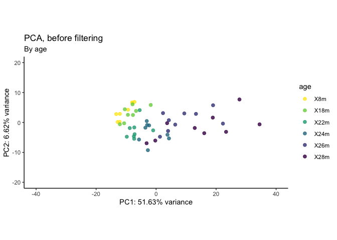

# 01_QC
Qian Hui TAN
2023-06-14

- [<span class="toc-section-number">1</span> 01_QC](#qc)
- [<span class="toc-section-number">2</span> Setup](#setup)
- [<span class="toc-section-number">3</span> Preparing objects for
  DESeq](#preparing-objects-for-deseq)
  - [<span class="toc-section-number">3.1</span> Creating the data
    matrix](#creating-the-data-matrix)
  - [<span class="toc-section-number">3.2</span> Create
    metadata](#create-metadata)
  - [<span class="toc-section-number">3.3</span> Metadata](#metadata)
    - [<span class="toc-section-number">3.3.1</span> Get
      metadata](#get-metadata)
    - [<span class="toc-section-number">3.3.2</span> Read in
      files](#read-in-files)
  - [<span class="toc-section-number">3.4</span> Checking the sex of
    organisms:](#checking-the-sex-of-organisms)
    - [<span class="toc-section-number">3.4.1</span> Get
      XIST](#get-xist)
    - [<span class="toc-section-number">3.4.2</span> Get chrY
      genes](#get-chry-genes)
    - [<span class="toc-section-number">3.4.3</span> Creating the
      datamatrix](#creating-the-datamatrix)
  - [<span class="toc-section-number">3.5</span> Create DESeq
    object](#create-deseq-object)
  - [<span class="toc-section-number">3.6</span> How many non-zero
    rows?](#how-many-non-zero-rows)
- [<span class="toc-section-number">4</span> DESeq QC](#deseq-qc)
  - [<span class="toc-section-number">4.1</span> Dispersion
    estimates](#dispersion-estimates)
  - [<span class="toc-section-number">4.2</span> QC - number of detected
    genes](#qc---number-of-detected-genes)
  - [<span class="toc-section-number">4.3</span> QC -
    clustering](#qc---clustering)
- [<span class="toc-section-number">5</span> Remove rRNA and
  mitochondrial genome](#remove-rrna-and-mitochondrial-genome)
  - [<span class="toc-section-number">5.1</span> Check rRNA
    removed](#check-rrna-removed)
  - [<span class="toc-section-number">5.2</span> QC - number of
    genes](#qc---number-of-genes)
  - [<span class="toc-section-number">5.3</span> QC-
    clustering](#qc--clustering)
- [<span class="toc-section-number">6</span> Check Deaf1
  levels](#check-deaf1-levels)
  - [<span class="toc-section-number">6.1</span> Normalized
    counts](#normalized-counts)
  - [<span class="toc-section-number">6.2</span> Boxplot across
    ages](#boxplot-across-ages)
  - [<span class="toc-section-number">6.3</span>
    nbinomWaldTest](#nbinomwaldtest)
  - [<span class="toc-section-number">6.4</span> nbinomLRT](#nbinomlrt)
- [<span class="toc-section-number">7</span> Summary](#summary)
- [<span class="toc-section-number">8</span> Sessioninfo](#sessioninfo)

# 01_QC

In this notebook, we perform quality control on our dataset.

# Setup

``` r
## If output directory doesn't exist, create it
if(!dir.exists("../output")){
    dir.create("../output/")
  }
  
if(!dir.exists("../output/01_QC")){
    dir.create("../output/01_QC")
  }
  
output_dir <- "../output/01_QC/"
```

``` r
suppressPackageStartupMessages({
    library(dplyr)
    library(readr)
    library(tidyr)
    library(ggplot2)
    library(janitor)
    library(GEOquery)
    library(DESeq2)
    library(reshape2) # melt function
    library(biomaRt)
    library(GenomicFeatures)
    library(scales)
    library(ggrepel)
    library(pheatmap)
    library(viridis)
    library(lubridate)
    library(DT)
})

source("../../scripts/R/functions.R")
```

# Preparing objects for DESeq

## Creating the data matrix

``` r
df_counts <- read.delim(
    file = "../data/GSE145480_counts_mouse_aging_timecourse.txt.gz")

# Add gene_id to rownames
rownames(df_counts) <- df_counts$ensembl_id

# Remove non-numeric columns
df_counts <- df_counts[ ,!colnames(df_counts) %in% c("ensembl_id", "gene_symbol")]

head(df_counts)
```

|                    | X8m_GAS_rep1 | X8m_GAS_rep2 | X8m_GAS_rep3 | X8m_GAS_rep4 | X8m_GAS_rep5 | X8m_GAS_rep6 | X8m_GAS_rep7 | X8m_GAS_rep8 | X18m_GAS_rep1 | X18m_GAS_rep2 | X18m_GAS_rep3 | X18m_GAS_rep4 | X18m_GAS_rep5 | X18m_GAS_rep6 | X18m_GAS_rep7 | X18m_GAS_rep8 | X22m_GAS_rep1 | X22m_GAS_rep2 | X22m_GAS_rep3 | X22m_GAS_rep4 | X22m_GAS_rep5 | X22m_GAS_rep6 | X22m_GAS_rep7 | X22m_GAS_rep8 | X24m_GAS_rep1 | X24m_GAS_rep2 | X24m_GAS_rep3 | X24m_GAS_rep4 | X24m_GAS_rep5 | X24m_GAS_rep6 | X24m_GAS_rep7 | X24m_GAS_rep8 | X26m_GAS_rep1 | X26m_GAS_rep2 | X26m_GAS_rep3 | X26m_GAS_rep4 | X26m_GAS_rep5 | X26m_GAS_rep6 | X26m_GAS_rep7 | X26m_GAS_rep8 | X26m_GAS_rep9 | X28m_GAS_rep1 | X28m_GAS_rep2 | X28m_GAS_rep3 | X28m_GAS_rep4 | X28m_GAS_rep5 | X28m_GAS_rep6 | X28m_GAS_rep7 | X28m_GAS_rep8 | X28m_GAS_rep9 |
|:-------------------|-------------:|-------------:|-------------:|-------------:|-------------:|-------------:|-------------:|-------------:|--------------:|--------------:|--------------:|--------------:|--------------:|--------------:|--------------:|--------------:|--------------:|--------------:|--------------:|--------------:|--------------:|--------------:|--------------:|--------------:|--------------:|--------------:|--------------:|--------------:|--------------:|--------------:|--------------:|--------------:|--------------:|--------------:|--------------:|--------------:|--------------:|--------------:|--------------:|--------------:|--------------:|--------------:|--------------:|--------------:|--------------:|--------------:|--------------:|--------------:|--------------:|--------------:|
| ENSMUSG00000000001 |          358 |          414 |          465 |          346 |          393 |          409 |          441 |          481 |           357 |           262 |           389 |           360 |           258 |           300 |           431 |           348 |           366 |           402 |           344 |           353 |           382 |           377 |           291 |           356 |           488 |           403 |           420 |           310 |           330 |           293 |           317 |           338 |           541 |           328 |           415 |           320 |           346 |           403 |           428 |           409 |           378 |           445 |           751 |           308 |           400 |           537 |           378 |           390 |           478 |           433 |
| ENSMUSG00000000003 |            0 |            0 |            0 |            0 |            0 |            0 |            0 |            0 |             0 |             0 |             0 |             0 |             0 |             0 |             0 |             0 |             0 |             0 |             0 |             0 |             0 |             0 |             0 |             0 |             0 |             0 |             0 |             0 |             0 |             0 |             0 |             0 |             0 |             0 |             0 |             0 |             0 |             0 |             0 |             0 |             0 |             0 |             0 |             0 |             0 |             0 |             0 |             0 |             0 |             0 |
| ENSMUSG00000000028 |           47 |           48 |           52 |           40 |           43 |           67 |           61 |           56 |            47 |            60 |            38 |            43 |            35 |            36 |            67 |            42 |            56 |            43 |            52 |            53 |            44 |            72 |            50 |            46 |            48 |            57 |            48 |            47 |            48 |            52 |            50 |            33 |            50 |            58 |            59 |            40 |            30 |            27 |            43 |            43 |            63 |            50 |            64 |            50 |            42 |            69 |            43 |            52 |            48 |            48 |
| ENSMUSG00000000031 |         4863 |         7409 |        10917 |         4155 |         4667 |         7144 |         3830 |         6282 |          6450 |          3827 |          7303 |          4197 |          6196 |          5794 |         12459 |          4568 |          5576 |          6809 |          3143 |          5375 |          7181 |          6760 |          4250 |          4829 |          5944 |          7858 |          6488 |          6597 |          4865 |          3648 |          4768 |          4226 |          3953 |          4255 |          7334 |          6254 |          5333 |          5677 |          4513 |          3925 |          5318 |          5167 |          7652 |          6272 |          3912 |          4074 |          4672 |          3931 |          4970 |          5895 |
| ENSMUSG00000000037 |            2 |            6 |            3 |            5 |            2 |            1 |            5 |            2 |             1 |             0 |             4 |             1 |             3 |             2 |             1 |             1 |             0 |             4 |             4 |             5 |             1 |             3 |             3 |             2 |             0 |             2 |             1 |             1 |             0 |             0 |             3 |             1 |             2 |             2 |             1 |             0 |             1 |             0 |             1 |             3 |             0 |             0 |             1 |             5 |             1 |             2 |             0 |             0 |             1 |             3 |
| ENSMUSG00000000049 |            8 |            5 |           13 |            9 |            8 |            9 |            7 |            4 |             9 |             4 |             4 |             6 |             7 |             6 |             6 |             4 |             6 |             9 |             4 |             8 |             3 |             7 |             5 |             6 |             3 |             3 |             8 |             2 |             4 |             4 |             1 |             2 |             8 |             4 |             5 |             6 |             1 |             3 |             7 |             6 |             5 |             4 |             3 |             7 |             4 |             8 |             4 |             5 |            11 |             1 |

## Create metadata

Conveniently, the names contain the metadata - we just have to split
them:

``` r
experimental_metadata <- tibble(sample_id = colnames(df_counts))

# Keep only rows without RAPA
experimental_metadata <- experimental_metadata %>% 
  separate(sample_id, into = c("age", "muscle", "rep"),
           remove = FALSE)


# Convert to factor
experimental_metadata$age <- factor(experimental_metadata$age, 
                                    levels = c("X8m", "X18m", "X22m", "X24m", 
                                               "X26m", "X28m"))

experimental_metadata$muscle <- factor(experimental_metadata$muscle)
experimental_metadata$rep <- as.numeric(gsub("rep", "", experimental_metadata$rep))

head(experimental_metadata)
```

| sample_id    | age | muscle | rep |
|:-------------|:----|:-------|----:|
| X8m_GAS_rep1 | X8m | GAS    |   1 |
| X8m_GAS_rep2 | X8m | GAS    |   2 |
| X8m_GAS_rep3 | X8m | GAS    |   3 |
| X8m_GAS_rep4 | X8m | GAS    |   4 |
| X8m_GAS_rep5 | X8m | GAS    |   5 |
| X8m_GAS_rep6 | X8m | GAS    |   6 |

We remove these RAPA columns from df_counts as well:

``` r
# Remove RAPA columns from df_counts as well
df_counts <- df_counts[ ,colnames(df_counts) %in% experimental_metadata$sample_id]

colnames(df_counts)
```

     [1] "X8m_GAS_rep1"  "X8m_GAS_rep2"  "X8m_GAS_rep3"  "X8m_GAS_rep4" 
     [5] "X8m_GAS_rep5"  "X8m_GAS_rep6"  "X8m_GAS_rep7"  "X8m_GAS_rep8" 
     [9] "X18m_GAS_rep1" "X18m_GAS_rep2" "X18m_GAS_rep3" "X18m_GAS_rep4"
    [13] "X18m_GAS_rep5" "X18m_GAS_rep6" "X18m_GAS_rep7" "X18m_GAS_rep8"
    [17] "X22m_GAS_rep1" "X22m_GAS_rep2" "X22m_GAS_rep3" "X22m_GAS_rep4"
    [21] "X22m_GAS_rep5" "X22m_GAS_rep6" "X22m_GAS_rep7" "X22m_GAS_rep8"
    [25] "X24m_GAS_rep1" "X24m_GAS_rep2" "X24m_GAS_rep3" "X24m_GAS_rep4"
    [29] "X24m_GAS_rep5" "X24m_GAS_rep6" "X24m_GAS_rep7" "X24m_GAS_rep8"
    [33] "X26m_GAS_rep1" "X26m_GAS_rep2" "X26m_GAS_rep3" "X26m_GAS_rep4"
    [37] "X26m_GAS_rep5" "X26m_GAS_rep6" "X26m_GAS_rep7" "X26m_GAS_rep8"
    [41] "X26m_GAS_rep9" "X28m_GAS_rep1" "X28m_GAS_rep2" "X28m_GAS_rep3"
    [45] "X28m_GAS_rep4" "X28m_GAS_rep5" "X28m_GAS_rep6" "X28m_GAS_rep7"
    [49] "X28m_GAS_rep8" "X28m_GAS_rep9"

These counts have been aligned - which genome build were they aligned
to?

## Metadata

### Get metadata

``` r
### -- Get metadata (run once) --- ###  

#Get series matrix files that contain the metadata
geo_file <- GEOquery::getGEO(filename = "../data/GSE145480_series_matrix.txt")

# Extract the metadata
geo_md <- pData(phenoData(geo_file)) %>% clean_names()
write_delim(geo_md, file = "../data/gse145480_metadata.txt")

head(geo_md)
```

``` r
geo_md <- read_delim("../data/gse145480_metadata.txt",
                     show_col_types = FALSE)

unique(geo_md$data_processing_5)
```

    [1] "As the reference mouse transcriptome, we considered sequences of protein coding transcripts with the support level 1-3 based on genome assembly GRCm38 (release 92) and transcript annotations from Ensembl database (see Hubbard et al., Nucleic Acids Research, 2002)."

``` r
# Remove this because we no longer need it
rm(geo_md)
```

This dataset aligned to `GRCm38.92`. I can’t find the `gtf` file for
`38.92` in the Ensembl archives, so we use `GRCm38.94` (one of the
closest I can find) for now:

Create gene-level annotations:

    # eval: FALSE
    ### --- Get gene-level annotations (run once) --- ###

    mm.gtf.db <- makeTxDbFromGFF("../../data/annotation/Mus_musculus.GRCm38.94.chr.gtf.gz", 
                                 format = "gtf" )

    ensembl.genes = genes(mm.gtf.db)
    mouse = useEnsembl(biomart = "ENSEMBL_MART_ENSEMBL", 
                       dataset = "mmusculus_gene_ensembl", mirror = "useast")
    bm.annotations = getBM(attributes=c("ensembl_gene_id", "entrezgene_id", "gene_biotype", "external_gene_name"), 
                           mart = mouse, 
                           filters="ensembl_gene_id", 
                           values=ensembl.genes$gene_id, uniqueRows=TRUE)
    ensembl.genes$gene_biotype = bm.annotations$gene_biotype[match(ensembl.genes$gene_id, bm.annotations$ensembl_gene_id) ]
    ensembl.genes$entrezgene_id = bm.annotations$entrezgene_id[match(ensembl.genes$gene_id, bm.annotations$ensembl_gene_id) ]
    ensembl.genes$external_gene_name = bm.annotations$external_gene_name[match(ensembl.genes$gene_id, bm.annotations$ensembl_gene_id) ]

    # save this as RDS so we don't have to keep running it
    saveRDS(bm.annotations, file = "../output/mm10_94_bm_annotations.RDS")
    saveRDS(ensembl.genes, file = "../output/mm10_94_ensembl_genes.RDS")

### Read in files

``` r
ensembl.genes <- readRDS("../../annotation/mm10_94_ensembl_genes.RDS")
```

## Checking the sex of organisms:

### Get XIST

``` r
xist <- "ENSMUSG00000086503"

df_xist <- df_counts[xist, ] %>% melt()
```

    No id variables; using all as measure variables

``` r
colnames(df_xist) <- c("sample_id", "xist_raw_counts")
```

### Get chrY genes

``` r
chr_y <- ensembl.genes[seqnames(ensembl.genes) == "Y", ]
y_genes <- chr_y$gene_id

df_y <- colSums(df_counts[rownames(df_counts) %in% y_genes, ]) %>% 
  melt(value.name = "chrY_sum")

df_y$sample_id = rownames(df_y)
```

Plot them

``` r
df_plot <- inner_join(df_xist, df_y)
```

    Joining with `by = join_by(sample_id)`

``` r
ggplot(df_plot, aes(x = chrY_sum, y = xist_raw_counts)) +
  geom_point() +
  expand_limits(x = 0, y = 0) +
  scale_y_continuous(limits = c(0, 100)) +
  labs(title = "Xist vs chrY") +
  theme_classic()
```


Yup, all these are males.

Is Deaf1 expressed?

``` r
deaf1_gene <- "ENSMUSG00000058886"

df_counts[grep(deaf1_gene, rownames(df_counts), ignore.case = TRUE), ]
```

|                    | X8m_GAS_rep1 | X8m_GAS_rep2 | X8m_GAS_rep3 | X8m_GAS_rep4 | X8m_GAS_rep5 | X8m_GAS_rep6 | X8m_GAS_rep7 | X8m_GAS_rep8 | X18m_GAS_rep1 | X18m_GAS_rep2 | X18m_GAS_rep3 | X18m_GAS_rep4 | X18m_GAS_rep5 | X18m_GAS_rep6 | X18m_GAS_rep7 | X18m_GAS_rep8 | X22m_GAS_rep1 | X22m_GAS_rep2 | X22m_GAS_rep3 | X22m_GAS_rep4 | X22m_GAS_rep5 | X22m_GAS_rep6 | X22m_GAS_rep7 | X22m_GAS_rep8 | X24m_GAS_rep1 | X24m_GAS_rep2 | X24m_GAS_rep3 | X24m_GAS_rep4 | X24m_GAS_rep5 | X24m_GAS_rep6 | X24m_GAS_rep7 | X24m_GAS_rep8 | X26m_GAS_rep1 | X26m_GAS_rep2 | X26m_GAS_rep3 | X26m_GAS_rep4 | X26m_GAS_rep5 | X26m_GAS_rep6 | X26m_GAS_rep7 | X26m_GAS_rep8 | X26m_GAS_rep9 | X28m_GAS_rep1 | X28m_GAS_rep2 | X28m_GAS_rep3 | X28m_GAS_rep4 | X28m_GAS_rep5 | X28m_GAS_rep6 | X28m_GAS_rep7 | X28m_GAS_rep8 | X28m_GAS_rep9 |
|:-------------------|-------------:|-------------:|-------------:|-------------:|-------------:|-------------:|-------------:|-------------:|--------------:|--------------:|--------------:|--------------:|--------------:|--------------:|--------------:|--------------:|--------------:|--------------:|--------------:|--------------:|--------------:|--------------:|--------------:|--------------:|--------------:|--------------:|--------------:|--------------:|--------------:|--------------:|--------------:|--------------:|--------------:|--------------:|--------------:|--------------:|--------------:|--------------:|--------------:|--------------:|--------------:|--------------:|--------------:|--------------:|--------------:|--------------:|--------------:|--------------:|--------------:|--------------:|
| ENSMUSG00000058886 |          165 |          204 |          196 |          171 |          163 |          202 |          190 |          194 |           172 |           190 |           129 |           155 |           137 |           120 |           182 |           131 |           173 |           160 |           182 |           196 |           172 |           216 |           159 |           148 |           136 |           160 |           155 |           114 |           149 |           145 |           117 |           140 |           115 |           160 |           123 |           142 |           118 |           114 |           122 |           103 |           132 |           136 |            94 |           129 |           145 |           133 |           151 |            95 |           124 |           146 |

Yup, it is.

### Creating the datamatrix

``` r
data_mat = as.matrix(df_counts)
rownames(data_mat) = rownames(df_counts)

data_mat = apply(round(data_mat), c(1,2), as.integer) # Round to integer
data_mat_nonzero = data_mat[rowSums(data_mat) > 0, ] # Rm non-zero rows

sum(duplicated(rownames(data_mat_nonzero)))# Check that we have no duplicates
```

    [1] 0

## Create DESeq object

``` r
# Create DESeq object
dds = DESeqDataSetFromMatrix(data_mat_nonzero, experimental_metadata, 
                             ~ age)
colnames(dds) = colnames(data_mat)

#Estimates the size factors using the "median ratio method" described by Equation 5 in Anders and Huber (2010)
dds <- estimateSizeFactors(dds) 
#This function obtains dispersion estimates for a count data set
dds <- estimateDispersions(dds)
```

    gene-wise dispersion estimates

    mean-dispersion relationship

    final dispersion estimates

``` r
#This function transforms the count data to the log2 scale in a way which minimizes differences between samples for rows with small counts
vst <- vst(dds, blind = TRUE) # use blind = TRUE for QC
```

## How many non-zero rows?

How many genes are there in the mouse genome?

``` r
nrow(data_mat)
```

    [1] 23880

How many genes are expressed (at least 1 read in at least 1 sample)?

``` r
nrow(data_mat_nonzero)
```

    [1] 22116

What percentage is this?

``` r
nrow(data_mat_nonzero)/nrow(data_mat) * 100
```

    [1] 92.61307

90% of all rows are nonzero.

# DESeq QC

## Dispersion estimates

``` r
## Plot dispersion estimates
plotDispEsts(dds, main = "Dispersion estimates, before filtering")
```


## QC - number of detected genes

Examining our dataset:

``` r
dds
```

    class: DESeqDataSet 
    dim: 22116 50 
    metadata(1): version
    assays(2): counts mu
    rownames(22116): ENSMUSG00000000001 ENSMUSG00000000028 ...
      ENSMUSG00000116378 ENSMUSG00000116461
    rowData names(10): baseMean baseVar ... dispOutlier dispMAP
    colnames(50): X8m_GAS_rep1 X8m_GAS_rep2 ... X28m_GAS_rep8 X28m_GAS_rep9
    colData names(5): sample_id age muscle rep sizeFactor

We plot a few key metrics to check our data quality:

``` r
plt_title = "Before Filtering"
```

<div class="panel-tabset">

### Read counts per sample

``` r
total_counts <- as.data.frame(colSums(counts(dds)))
colnames(total_counts) <- "total_counts"
total_counts$name = rownames(total_counts)
```

``` r
# Plot
ggplot(total_counts, aes(x = name, y = total_counts)) +
    geom_bar(stat = "identity") +
    scale_y_continuous("Read counts", 
                       limits = c(0, 4e7),
                       expand = c(0, 0),
                       breaks = seq(0, 4e7, 1e7)) +
    geom_hline(yintercept = 2e7, color = "blue", linetype = "dashed") +
    labs(title = "Read counts per sample",
         x = element_blank()) +
    theme_minimal() +
    coord_flip()
```


### Number of genes detected per sample

``` r
detected = apply(counts(dds), 2, function(col) sum(col > 0 ))
detected = as.data.frame(detected)
detected$name = row.names(detected)
                 
ggplot(detected, aes(x=name, y=detected)) + 
                 geom_bar(stat="identity") + 
                 theme_minimal() + 
                 coord_flip() + 
                 scale_y_continuous("Number of Genes detected", expand=c(0,0),
                                    limits = c(0, 20000)
                                    ) + 
                 scale_x_discrete("Sample") +
                 labs(title = "# of genes detected", 
                     subtitle = plt_title) +
                 geom_hline(yintercept = 17000, color = "blue", linetype = "dashed") 
```


### Size factors

``` r
df = data.frame(sample_id = names(sizeFactors(dds)), 
                sizeFactors = sizeFactors(dds))

ggplot(df, aes(x = sample_id, y=sizeFactors)) + 
    geom_bar(stat="identity") + 
    scale_y_continuous(limits=c(0,2), expand=c(0,0)) + 
    labs(title = "Size factors for each sample",
         subtitle = plt_title, 
         x = element_blank()) +
    theme_minimal() + 
    theme(axis.text.x = element_text(angle = 90, hjust=1, 
                                     colour="black", size= 10))
```


### Normalized counts (boxplot)

``` r
nc = counts(dds, normalized=TRUE)
nc.melt = melt(nc)

ggplot(nc.melt, aes(x=Var2, y=value)) + 
    geom_boxplot() + 
    theme_classic() + 
    theme(axis.text.x = element_text(angle = 90, colour="black", hjust = 1,
                                     size = 12)) + 
    scale_x_discrete("Sample") + 
    scale_y_continuous("Normalised counts") +
    labs(title = "Normalized counts",
        subtitle = plt_title) 
```


``` r
nc.threshold = 1000000
test = apply(nc, 1, function(x){ any(x > nc.threshold) })
```

The genes with normalized counts greater than 10^{6} are:

``` r
highly_expressed <- ensembl.genes[test, c("gene_biotype", "external_gene_name")]

unique(highly_expressed$gene_biotype)
```

    [1] "protein_coding"         "unprocessed_pseudogene"

``` r
highly_expressed
```

    GRanges object with 2 ranges and 2 metadata columns:
                         seqnames              ranges strand |
                            <Rle>           <IRanges>  <Rle> |
      ENSMUSG00000049709        7 108921852-108930178      - |
      ENSMUSG00000098309        7   14837774-14838029      - |
                                   gene_biotype external_gene_name
                                    <character>        <character>
      ENSMUSG00000049709         protein_coding             Nlrp10
      ENSMUSG00000098309 unprocessed_pseudogene         Gtpbp4-ps2
      -------
      seqinfo: 22 sequences (1 circular) from an unspecified genome; no seqlengths

Plotting the rRNA graph:

``` r
rrna.genes = ensembl.genes$external_gene_name[ensembl.genes$gene_biotype %in% c("Mt_rRNA", "rRNA")]

percentage.of.rrna = (colSums(counts(dds[ rownames(counts(dds)) %in% rrna.genes])) / colSums(counts(dds))) * 100

percentage.of.rrna = as.data.frame(percentage.of.rrna)
percentage.of.rrna$name = row.names(percentage.of.rrna)
#percentage.of.rrna$name = factor(percentage.of.rrna$name,rev(experimental_metadata$sample_id))
ggplot(percentage.of.rrna, 
       aes(x=name, y=percentage.of.rrna)) + 
        geom_hline(yintercept = 5, color = "blue", linetype = "dashed") +
        geom_bar(stat="identity") + 
        theme_classic() + 
        coord_flip() + 
        scale_y_continuous("% rRNA", expand=c(0,0), limits = c(0, 30)) +
        labs(title = "% rRNA") 
```


Checking summary statistics for rRNA:

``` r
summary(percentage.of.rrna$percentage.of.rrna)
```

       Min. 1st Qu.  Median    Mean 3rd Qu.    Max. 
          0       0       0       0       0       0 

No rRNA present.

### Proportions of gene biotypes

``` r
pc = ensembl.genes$gene_id[ensembl.genes$gene_biotype == "protein_coding"]
pg = ensembl.genes$gene_id[ensembl.genes$gene_biotype %in% unique(ensembl.genes$gene_biotype)[grep("pseudogene", unique(ensembl.genes$gene_biotype))]]
lc = ensembl.genes$gene_id[ensembl.genes$gene_biotype == "lncRNA"]

totalcounts.pc = colSums(counts(dds)[rownames(counts(dds)) %in% pc,])
totalcounts.pg = colSums(counts(dds)[rownames(counts(dds)) %in% pg,])
totalcounts.lc = colSums(counts(dds)[rownames(counts(dds)) %in% lc,])

totalcounts.other = colSums(counts(dds)[!(rownames(counts(dds)) %in% c(lc,pc,pg)),])

counts.by.biotype = data.frame(name = names(totalcounts.pc),
                         protein_coding = totalcounts.pc,
                         pseudogene = totalcounts.pg,
                         lincRNA = totalcounts.lc,
                         other = totalcounts.other
                         
                         )

#counts.by.biotype$name = factor(counts.by.biotype$name, experimental_metadata$sample_id)

counts.by.biotype = as.data.frame(t(apply(counts.by.biotype[,2:5], 1, function(x){ 100 * (x / sum(x)) }) ))
counts.by.biotype$name = names(totalcounts.pc)
#counts.by.biotype$name = factor(counts.by.biotype$name, #experimental_metadata$sample_id)

counts.by.biotype.melt = melt(counts.by.biotype)
```

    Using name as id variables

``` r
ggplot(counts.by.biotype.melt, aes(x=name, y=value, fill=variable)) +  
    geom_bar(stat="identity") + 
    theme_classic() + 
    scale_y_continuous("% reads", labels = dollar_format(suffix = "%", prefix = ""),  
                       expand=c(0,0)) + scale_x_discrete("Sample") + 
    theme(axis.text.x = element_text(angle = 90, colour="black", #family="Arial", 
                                     hjust = 1, size = 12)) +
    labs(title = "Proportions of gene biotypes", 
        subtitle = plt_title) 
```


Most genes are protein-coding, as expected.

</div>

## QC - clustering

We perform 3 types of Quality Control to assess our DESeq dataset:

- Correlation matrix heatmap
- Hierarchical clustering
- PCA

<div class="panel-tabset">

### Correlation matrix heatmap

``` r
### Extract the vst matrix from the object
vst_mat <- assay(vst)  
### Compute pairwise correlation values
vst_cor <- cor(vst_mat)
### Plot heatmap
pheatmap(vst_cor, main = "Correlation heatmap, before filtering")
```


### Hierarchical clustering

``` r
sampleDists <- dist(t(assay(vst)))
plot(hclust(sampleDists), main = paste0("Cluster Dendrogram, ", plt_title))
```


### PCA, by age

``` r
pca_xlim <- c(-40, 40)
pca_ylim <- c(-20, 20)

make_pca(vst, intgroup = "age",
         title = "PCA, before filtering", 
         xlimits = pca_xlim,
         ylimits = pca_ylim) 
```


### PCA, by age - continous colors

We try a continuous color scale to better get a sense of age:

``` r
pca_xlim <- c(-40, 40)
pca_ylim <- c(-20, 20)

make_pca(vst, intgroup = "age",
         title = "PCA, before filtering", 
         xlimits = pca_xlim,
         ylimits = pca_ylim) +
  scale_color_viridis(discrete = TRUE, direction = -1)
```

    Scale for colour is already present.
    Adding another scale for colour, which will replace the existing scale.



### PCA, by size factor

``` r
make_pca(vst, intgroup = "sizeFactor",
         title = "PCA plot, before filtering",
          xlimits = pca_xlim,
         ylimits = pca_ylim) +
  scale_color_viridis(option = "A")
```


</div>

PC1 separates by age, which is good. PC2 seems to split the 26 and 28
month mice.

# Remove rRNA and mitochondrial genome

We remove all genes that map to rRNA, as well as the mitochondrial
chromosome before we proceed with downstream analysis.

``` r
plt_title = "after removing rRNA and mitochondrial genome"
```

Checking MT chromosome intact:

``` r
in_dds = ensembl.genes[na.omit(match(rownames(counts(dds)), ensembl.genes$gene_id)), ]
table(seqnames(in_dds))
```


       1    2    3    4    5    6    7    8    9   10   11   12   13   14   15   16 
    1410 1785 1160 1377 1409 1201 1793 1144 1300 1109 1728  823  820  743  779  630 
      17   18   19    X    Y   MT 
     978  491  644  721   45    0 

Remove MT chromosome, rerun DESeq:

``` r
# Remove mitochondrial genome
mit_genes <- ensembl.genes[seqnames(ensembl.genes) %in% "MT", ]$gene_id
dds_rm_mit <- dds[!rownames(counts(dds)) %in% mit_genes, ]

# Remove rRNA
dds_filt = dds_rm_mit[!(row.names(counts(dds_rm_mit)) %in% 
                   ensembl.genes$gene_id[ensembl.genes$gene_biotype %in% 
                                           c("rRNA", "snoRNA", "snRNA", "Mt_rRNA")]), ]
dds_filt = dds_filt[rowSums(counts(dds_filt)) > 0, ]

# Re-estimate dispersions
dds_filt <- estimateSizeFactors(dds_filt) 
dds_filt <- estimateDispersions(dds_filt)
```

    found already estimated dispersions, replacing these

    gene-wise dispersion estimates

    mean-dispersion relationship

    final dispersion estimates

``` r
vst_filt <- vst(dds, blind = TRUE) # use blind = TRUE for QC
```

Check that mitochondrial genome has been removed:

``` r
in_dds = ensembl.genes[na.omit(match(rownames(counts(dds_filt)), 
                                     ensembl.genes$gene_id)), ]
table(seqnames(in_dds))
```


       1    2    3    4    5    6    7    8    9   10   11   12   13   14   15   16 
    1410 1785 1160 1377 1409 1201 1793 1144 1300 1109 1728  823  820  743  779  630 
      17   18   19    X    Y   MT 
     978  491  644  721   45    0 

## Check rRNA removed

``` r
rrna.genes = names(ensembl.genes[ensembl.genes$gene_biotype %in% c("Mt_rRNA", "rRNA", 
                                                                   "snoRNA", "snRNA")])

percentage.of.rrna = (colSums(counts(dds_filt[rownames(counts(dds_filt)) %in% rrna.genes])) / colSums(counts(dds_filt))) * 100
percentage.of.rrna = as.data.frame(percentage.of.rrna)
percentage.of.rrna$name = row.names(percentage.of.rrna)
#percentage.of.rrna$name = factor(percentage.of.rrna$name, rev(experimental_metadata$sample_id))


ggplot(percentage.of.rrna, aes(x=name, y=percentage.of.rrna)) +
  geom_bar(stat="identity") + theme_classic() + coord_flip() + scale_y_continuous("% rRNA", expand=c(0,0)) +
  scale_x_discrete("Sample") +
  ggtitle(paste0("% rRNA, ", plt_title))
```


Checking that rRNA percentage is now zero:

``` r
summary(percentage.of.rrna$percentage.of.rrna)
```

       Min. 1st Qu.  Median    Mean 3rd Qu.    Max. 
          0       0       0       0       0       0 

## QC - number of genes

<div class="panel-tabset">

### Size Factors after rRNA removal

``` r
df = data.frame(sample_id = names(sizeFactors(dds_filt)), sizeFactors = sizeFactors(dds_filt))

ggplot(df, aes(x = sample_id, y=sizeFactors)) + 
  geom_bar(stat="identity") + 
  scale_y_continuous(limits=c(0,2), expand=c(0,0)) + 
  theme_classic() + 
  theme(axis.text.x = element_text(angle = 90, hjust=1, colour="black", size=12)) +
  geom_hline(yintercept = 1, color = "blue", linetype = "dashed") +
  ggtitle(paste0("Size Factors, ", plt_title))
```


Summary of size factors:

``` r
summary(sizeFactors(dds_filt))
```

       Min. 1st Qu.  Median    Mean 3rd Qu.    Max. 
     0.8385  0.9280  0.9926  1.0102  1.0551  1.3360 

Size factors for each sample:

``` r
print(sizeFactors(dds_filt))
```

     X8m_GAS_rep1  X8m_GAS_rep2  X8m_GAS_rep3  X8m_GAS_rep4  X8m_GAS_rep5 
        1.0238359     1.1798510     1.2297484     1.0024691     0.9768282 
     X8m_GAS_rep6  X8m_GAS_rep7  X8m_GAS_rep8 X18m_GAS_rep1 X18m_GAS_rep2 
        1.2846999     1.1348275     1.2325101     1.0432718     0.9248491 
    X18m_GAS_rep3 X18m_GAS_rep4 X18m_GAS_rep5 X18m_GAS_rep6 X18m_GAS_rep7 
        1.0181256     0.9920270     0.8895888     1.0103401     1.3360139 
    X18m_GAS_rep8 X22m_GAS_rep1 X22m_GAS_rep2 X22m_GAS_rep3 X22m_GAS_rep4 
        0.9147147     1.0227788     1.0677142     1.0364072     1.1522388 
    X22m_GAS_rep5 X22m_GAS_rep6 X22m_GAS_rep7 X22m_GAS_rep8 X24m_GAS_rep1 
        1.1370598     1.2247776     0.9375276     1.0437134     1.0287170 
    X24m_GAS_rep2 X24m_GAS_rep3 X24m_GAS_rep4 X24m_GAS_rep5 X24m_GAS_rep6 
        1.0588695     1.0384889     0.9532937     0.8664817     0.8467472 
    X24m_GAS_rep7 X24m_GAS_rep8 X26m_GAS_rep1 X26m_GAS_rep2 X26m_GAS_rep3 
        0.8888149     0.8384646     1.0597330     0.9699549     0.9576008 
    X26m_GAS_rep4 X26m_GAS_rep5 X26m_GAS_rep6 X26m_GAS_rep7 X26m_GAS_rep8 
        0.9389461     0.8803456     0.9040847     0.9673063     0.8430668 
    X26m_GAS_rep9 X28m_GAS_rep1 X28m_GAS_rep2 X28m_GAS_rep3 X28m_GAS_rep4 
        1.0036129     0.8788419     1.1199585     0.9388633     0.9686403 
    X28m_GAS_rep5 X28m_GAS_rep6 X28m_GAS_rep7 X28m_GAS_rep8 X28m_GAS_rep9 
        0.9375301     0.9746380     0.9176255     0.9932086     0.9225570 

### Read counts per sample after rRNA and chrM removal

``` r
total_counts <- as.data.frame(colSums(counts(dds_filt)))
colnames(total_counts) <- "total_counts"
total_counts$name = rownames(total_counts)
```

``` r
# Plot
ggplot(total_counts, aes(x = name, y = total_counts)) +
    geom_bar(stat = "identity") +
    scale_y_continuous("Read counts", 
                       limits = c(0, 4e7),
                       expand = c(0, 0),
                       breaks = seq(0, 4e7, 1e7)) +
    geom_hline(yintercept = 2.5e7, color = "blue", linetype = "dashed") +
    labs(title = "Read counts per sample",
         subtitle = "after removing chrM and rRNA",
         x = element_blank()) +
    theme_minimal() +
    coord_flip()
```


### Number of genes detected per sample after rRNA and chrM removal

``` r
detected = apply(counts(dds_filt), 2, function(col) sum(col > 0 ))
detected = as.data.frame(detected)
detected$name = row.names(detected)
#detected$name = factor(detected$name, rev(experimental_metadata$sample_id))
                 
ggplot(detected, aes(x=name, y=detected)) + 
                 geom_bar(stat="identity") + 
                 theme_minimal() + 
                 coord_flip() + 
                 scale_y_continuous("Number of Genes detected", expand=c(0,0),
                                    limits = c(0, 30000)) + 
                 scale_x_discrete("Sample") +
                 labs(title = "# of genes detected", 
                     subtitle = plt_title) +
                 geom_hline(yintercept = 20000, color = "blue", linetype = "dashed") 
```


</div>

## QC- clustering

<div class="panel-tabset">

### Heatmap after rRNA removal

``` r
### Extract the vst matrix from the object
vst_mat <- assay(vst_filt)  

### Compute pairwise correlation values
vst_cor <- cor(vst_mat)

### Plot heatmap
pheatmap(vst_cor, main = "Correlation heatmap, after rRNA removal")
```


X28m_GAS_rep2 is the outlier here

### Clustering after rRNA removal

``` r
sampleDists <- dist(t(assay(vst_filt)))
plot(hclust(sampleDists), main = paste0("Cluster Dendrogram, ", plt_title))
```


### PCA by age

``` r
make_pca(vst_filt, intgroup = "age",
         title = "PCA plot, after removing rRNA and chrM",
         xlimits = pca_xlim,
         ylimits = pca_ylim) 
```


### PCA, labelled

X28m_GAS_rep2 is the outlier here - where is it?

``` r
make_pca(vst_filt, intgroup = "age", label = TRUE,
         title = "PCA plot, after removing rRNA and chrM",
         xlimits = c(-70, 70), 
         ylimits = c(-30, 30)
)
```


It’s the rightmost point on PC1 - it’s ok, lets just keep it.

### PCA, by size factor

``` r
make_pca(vst_filt, intgroup = "sizeFactor", 
         title = "PCA plot, after removing rRNA and chrM",
         xlimits = pca_xlim, 
         ylimits = pca_ylim) +
  scale_color_viridis(option = "A")
```

    Scale for colour is already present.
    Adding another scale for colour, which will replace the existing scale.


</div>

# Check Deaf1 levels

## Normalized counts

We plot the normalized counts of Deaf1 in each sample:

``` r
design(dds_filt)
```

    ~age

Check that age is a factor

``` r
head(colData(dds_filt))
```

    DataFrame with 6 rows and 5 columns
                    sample_id      age   muscle       rep sizeFactor
                  <character> <factor> <factor> <numeric>  <numeric>
    X8m_GAS_rep1 X8m_GAS_rep1      X8m      GAS         1   1.023836
    X8m_GAS_rep2 X8m_GAS_rep2      X8m      GAS         2   1.179851
    X8m_GAS_rep3 X8m_GAS_rep3      X8m      GAS         3   1.229748
    X8m_GAS_rep4 X8m_GAS_rep4      X8m      GAS         4   1.002469
    X8m_GAS_rep5 X8m_GAS_rep5      X8m      GAS         5   0.976828
    X8m_GAS_rep6 X8m_GAS_rep6      X8m      GAS         6   1.284700

``` r
deaf1_norm <- as.data.frame(counts(dds_filt, normalized = TRUE)[deaf1_gene, ])

deaf1_norm$sample <- rownames(deaf1_norm)
colnames(deaf1_norm) <- c("norm_counts", "sample_id")
head(deaf1_norm)
```

|              | norm_counts | sample_id    |
|:-------------|------------:|:-------------|
| X8m_GAS_rep1 |    161.1586 | X8m_GAS_rep1 |
| X8m_GAS_rep2 |    172.9032 | X8m_GAS_rep2 |
| X8m_GAS_rep3 |    159.3822 | X8m_GAS_rep3 |
| X8m_GAS_rep4 |    170.5788 | X8m_GAS_rep4 |
| X8m_GAS_rep5 |    166.8666 | X8m_GAS_rep5 |
| X8m_GAS_rep6 |    157.2352 | X8m_GAS_rep6 |

``` r
ggplot(deaf1_norm, aes(x = sample_id, y = norm_counts)) +
  geom_col() +
  labs(title = "Deaf1 counts, normalized") +
  theme_minimal() +
  theme(axis.text.x = element_text(angle = 90)) 
```


## Boxplot across ages

``` r
deaf1_all <- deaf1_norm %>% 
  separate(sample_id, into = c("age", "muscle", "rep"))

deaf1_all$age <- factor(deaf1_all$age, 
                        levels = c("X8m", "X18m", "X22m", "X24m", "X26m", "X28m"))

head(deaf1_all)
```

|              | norm_counts | age | muscle | rep  |
|:-------------|------------:|:----|:-------|:-----|
| X8m_GAS_rep1 |    161.1586 | X8m | GAS    | rep1 |
| X8m_GAS_rep2 |    172.9032 | X8m | GAS    | rep2 |
| X8m_GAS_rep3 |    159.3822 | X8m | GAS    | rep3 |
| X8m_GAS_rep4 |    170.5788 | X8m | GAS    | rep4 |
| X8m_GAS_rep5 |    166.8666 | X8m | GAS    | rep5 |
| X8m_GAS_rep6 |    157.2352 | X8m | GAS    | rep6 |

Export this:

``` r
write.csv(deaf1_all, file = paste0(output_dir, 
                                    "sarcoatlas_timeseries_deaf1_normcounts.csv"))
```

``` r
ggplot(deaf1_all, aes(x = age, y = norm_counts)) +
  geom_boxplot() +
  geom_point() +
  theme_classic() +
  expand_limits(y = 0) +
  labs(title = "Deaf1",
       subtitle = "GSE145480",
       y = "normalized counts")
```


## nbinomWaldTest

``` r
dds_wald <- dds_filt

design(dds_wald) <- ~ age

dds_wald <- DESeq(dds_wald)
```

    using pre-existing size factors

    estimating dispersions

    found already estimated dispersions, replacing these

    gene-wise dispersion estimates

    mean-dispersion relationship

    final dispersion estimates

    fitting model and testing

    -- replacing outliers and refitting for 68 genes
    -- DESeq argument 'minReplicatesForReplace' = 7 
    -- original counts are preserved in counts(dds)

    estimating dispersions

    fitting model and testing

``` r
resultsNames(dds_wald)
```

    [1] "Intercept"       "age_X18m_vs_X8m" "age_X22m_vs_X8m" "age_X24m_vs_X8m"
    [5] "age_X26m_vs_X8m" "age_X28m_vs_X8m"

<div class="panel-tabset">

### 18m

``` r
# Extract the result of interest
res <- results(dds_wald, name = "age_X18m_vs_X8m")

# save this as sol
deaf1_res_18 <- res[deaf1_gene, ]
deaf1_res_18 <- add_res_info(deaf1_res_18)

deaf1_res_18$condition <- "18m"

deaf1_res_18
```

| gene_name          | baseMean | log2FoldChange |     lfcSE |      stat |    pvalue |      padj | log2fc_info                             | pval_info                          | condition |
|:-------------------|---------:|---------------:|----------:|----------:|----------:|----------:|:----------------------------------------|:-----------------------------------|:----------|
| ENSMUSG00000058886 | 148.3684 |      -0.125707 | 0.1012456 | -1.241604 | 0.2143826 | 0.9994053 | log2 fold change (MLE): age X18m vs X8m | Wald test p-value: age X18m vs X8m | 18m       |

### 18m

``` r
# Extract the result of interest
res <- results(dds_wald, name = "age_X18m_vs_X8m")

# save this 
deaf1_res_18 <- res[deaf1_gene, ]
deaf1_res_18 <- add_res_info(deaf1_res_18)

deaf1_res_18$condition <- "18m"

deaf1_res_18
```

| gene_name          | baseMean | log2FoldChange |     lfcSE |      stat |    pvalue |      padj | log2fc_info                             | pval_info                          | condition |
|:-------------------|---------:|---------------:|----------:|----------:|----------:|----------:|:----------------------------------------|:-----------------------------------|:----------|
| ENSMUSG00000058886 | 148.3684 |      -0.125707 | 0.1012456 | -1.241604 | 0.2143826 | 0.9994053 | log2 fold change (MLE): age X18m vs X8m | Wald test p-value: age X18m vs X8m | 18m       |

### 22m

``` r
# Extract the result of interest
res <- results(dds_wald, name = "age_X22m_vs_X8m")

# save this as sol
deaf1_res_22 <- res[deaf1_gene, ]
deaf1_res_22 <- add_res_info(deaf1_res_22)

deaf1_res_22$condition <- "22m"

deaf1_res_22
```

| gene_name          | baseMean | log2FoldChange |     lfcSE |       stat |    pvalue |      padj | log2fc_info                             | pval_info                          | condition |
|:-------------------|---------:|---------------:|----------:|-----------:|----------:|----------:|:----------------------------------------|:-----------------------------------|:----------|
| ENSMUSG00000058886 | 148.3684 |     -0.0092608 | 0.1000892 | -0.0925253 | 0.9262807 | 0.9933465 | log2 fold change (MLE): age X22m vs X8m | Wald test p-value: age X22m vs X8m | 22m       |

### 24m

``` r
# Extract the result of interest
res <- results(dds_wald, name = "age_X24m_vs_X8m")

# save this as sol
deaf1_res_24 <- res[deaf1_gene, ]
deaf1_res_24 <- add_res_info(deaf1_res_24)

deaf1_res_24$condition <- "24m"

deaf1_res_24
```

| gene_name          | baseMean | log2FoldChange |     lfcSE |      stat |   pvalue |      padj | log2fc_info                             | pval_info                          | condition |
|:-------------------|---------:|---------------:|----------:|----------:|---------:|----------:|:----------------------------------------|:-----------------------------------|:----------|
| ENSMUSG00000058886 | 148.3684 |     -0.1392358 | 0.1019748 | -1.365395 | 0.172129 | 0.4857591 | log2 fold change (MLE): age X24m vs X8m | Wald test p-value: age X24m vs X8m | 24m       |

### 26m

``` r
# Extract the result of interest
res <- results(dds_wald, name = "age_X26m_vs_X8m")

# save this as sol
deaf1_res_26 <- res[deaf1_gene, ]
deaf1_res_26 <- add_res_info(deaf1_res_26)

deaf1_res_26$condition <- "26m"

deaf1_res_26
```

| gene_name          | baseMean | log2FoldChange |     lfcSE |      stat |    pvalue |      padj | log2fc_info                             | pval_info                          | condition |
|:-------------------|---------:|---------------:|----------:|----------:|----------:|----------:|:----------------------------------------|:-----------------------------------|:----------|
| ENSMUSG00000058886 | 148.3684 |     -0.3076765 | 0.0999101 | -3.079533 | 0.0020733 | 0.0124395 | log2 fold change (MLE): age X26m vs X8m | Wald test p-value: age X26m vs X8m | 26m       |

### 28m

``` r
# Extract the result of interest
res <- results(dds_wald, name = "age_X28m_vs_X8m")

# save this as sol
deaf1_res_28 <- res[deaf1_gene, ]
deaf1_res_28 <- add_res_info(deaf1_res_28)

deaf1_res_28$condition <- "28m"

deaf1_res_28
```

| gene_name          | baseMean | log2FoldChange |     lfcSE |      stat |    pvalue |      padj | log2fc_info                             | pval_info                          | condition |
|:-------------------|---------:|---------------:|----------:|----------:|----------:|----------:|:----------------------------------------|:-----------------------------------|:----------|
| ENSMUSG00000058886 | 148.3684 |     -0.2918984 | 0.0996755 | -2.928488 | 0.0034062 | 0.0108917 | log2 fold change (MLE): age X28m vs X8m | Wald test p-value: age X28m vs X8m | 28m       |

### Combine and export

``` r
deaf1_res_export <- rbind(deaf1_res_18, deaf1_res_22, 
                          deaf1_res_24, deaf1_res_26,
                          deaf1_res_28)

deaf1_res_export
```

| gene_name          | baseMean | log2FoldChange |     lfcSE |       stat |    pvalue |      padj | log2fc_info                             | pval_info                          | condition |
|:-------------------|---------:|---------------:|----------:|-----------:|----------:|----------:|:----------------------------------------|:-----------------------------------|:----------|
| ENSMUSG00000058886 | 148.3684 |     -0.1257070 | 0.1012456 | -1.2416043 | 0.2143826 | 0.9994053 | log2 fold change (MLE): age X18m vs X8m | Wald test p-value: age X18m vs X8m | 18m       |
| ENSMUSG00000058886 | 148.3684 |     -0.0092608 | 0.1000892 | -0.0925253 | 0.9262807 | 0.9933465 | log2 fold change (MLE): age X22m vs X8m | Wald test p-value: age X22m vs X8m | 22m       |
| ENSMUSG00000058886 | 148.3684 |     -0.1392358 | 0.1019748 | -1.3653946 | 0.1721290 | 0.4857591 | log2 fold change (MLE): age X24m vs X8m | Wald test p-value: age X24m vs X8m | 24m       |
| ENSMUSG00000058886 | 148.3684 |     -0.3076765 | 0.0999101 | -3.0795334 | 0.0020733 | 0.0124395 | log2 fold change (MLE): age X26m vs X8m | Wald test p-value: age X26m vs X8m | 26m       |
| ENSMUSG00000058886 | 148.3684 |     -0.2918984 | 0.0996755 | -2.9284875 | 0.0034062 | 0.0108917 | log2 fold change (MLE): age X28m vs X8m | Wald test p-value: age X28m vs X8m | 28m       |

``` r
write.csv(deaf1_res_export, file = paste0(output_dir, 
                                          "sarcoatlas_timecourse_deaf1_stats.csv"))
```

</div>

## nbinomLRT

``` r
dds_lrt <- dds_filt
design(dds_lrt)
```

    ~age

``` r
dds_lrt <- nbinomLRT(dds_lrt, 
                     full = ~ age, 
                     reduced = ~ 1)

res_lrt <- results(dds_lrt)

res_lrt[deaf1_gene, ]
```

    log2 fold change (MLE): age X28m vs X8m 
    LRT p-value: '~ age' vs '~ 1' 
    DataFrame with 1 row and 6 columns
                        baseMean log2FoldChange     lfcSE      stat     pvalue
                       <numeric>      <numeric> <numeric> <numeric>  <numeric>
    ENSMUSG00000058886   148.368      -0.291898 0.0996755   17.5838 0.00351588
                            padj
                       <numeric>
    ENSMUSG00000058886 0.0117431

It’s significant.

# Summary

- DEAF1 decreases significantly as age increases.

# Sessioninfo

``` r
sessionInfo()
```

    R version 4.2.2 (2022-10-31)
    Platform: aarch64-apple-darwin20 (64-bit)
    Running under: macOS Ventura 13.1

    Matrix products: default
    BLAS:   /Library/Frameworks/R.framework/Versions/4.2-arm64/Resources/lib/libRblas.0.dylib
    LAPACK: /Library/Frameworks/R.framework/Versions/4.2-arm64/Resources/lib/libRlapack.dylib

    locale:
    [1] en_US.UTF-8/en_US.UTF-8/en_US.UTF-8/C/en_US.UTF-8/en_US.UTF-8

    attached base packages:
    [1] stats4    stats     graphics  grDevices utils     datasets  methods  
    [8] base     

    other attached packages:
     [1] DT_0.27                     lubridate_1.9.1            
     [3] viridis_0.6.2               viridisLite_0.4.1          
     [5] pheatmap_1.0.12             ggrepel_0.9.3              
     [7] scales_1.2.1                GenomicFeatures_1.50.4     
     [9] AnnotationDbi_1.60.2        biomaRt_2.54.0             
    [11] reshape2_1.4.4              DESeq2_1.38.3              
    [13] SummarizedExperiment_1.28.0 MatrixGenerics_1.10.0      
    [15] matrixStats_0.63.0          GenomicRanges_1.50.2       
    [17] GenomeInfoDb_1.34.9         IRanges_2.32.0             
    [19] S4Vectors_0.36.2            GEOquery_2.66.0            
    [21] Biobase_2.58.0              BiocGenerics_0.44.0        
    [23] janitor_2.2.0               ggplot2_3.4.2              
    [25] tidyr_1.3.0                 readr_2.1.3                
    [27] dplyr_1.1.1                

    loaded via a namespace (and not attached):
     [1] colorspace_2.1-0         rjson_0.2.21             ellipsis_0.3.2          
     [4] snakecase_0.11.0         XVector_0.38.0           rstudioapi_0.14         
     [7] farver_2.1.1             bit64_4.0.5              fansi_1.0.4             
    [10] xml2_1.3.3               codetools_0.2-19         cachem_1.0.7            
    [13] geneplotter_1.76.0       knitr_1.42               jsonlite_1.8.4          
    [16] Rsamtools_2.14.0         annotate_1.76.0          dbplyr_2.3.0            
    [19] png_0.1-8                compiler_4.2.2           httr_1.4.5              
    [22] assertthat_0.2.1         Matrix_1.5-3             fastmap_1.1.1           
    [25] limma_3.54.1             cli_3.6.1                htmltools_0.5.4         
    [28] prettyunits_1.1.1        tools_4.2.2              gtable_0.3.3            
    [31] glue_1.6.2               GenomeInfoDbData_1.2.9   rappdirs_0.3.3          
    [34] Rcpp_1.0.10              vctrs_0.6.1              Biostrings_2.66.0       
    [37] rtracklayer_1.58.0       xfun_0.37                stringr_1.5.0           
    [40] timechange_0.2.0         lifecycle_1.0.3          restfulr_0.0.15         
    [43] XML_3.99-0.13            zlibbioc_1.44.0          vroom_1.6.1             
    [46] hms_1.1.2                parallel_4.2.2           RColorBrewer_1.1-3      
    [49] yaml_2.3.7               curl_5.0.0               memoise_2.0.1           
    [52] gridExtra_2.3            stringi_1.7.12           RSQLite_2.3.1           
    [55] BiocIO_1.8.0             filelock_1.0.2           BiocParallel_1.32.6     
    [58] rlang_1.1.0              pkgconfig_2.0.3          bitops_1.0-7            
    [61] evaluate_0.20            lattice_0.20-45          purrr_1.0.1             
    [64] labeling_0.4.2           htmlwidgets_1.6.1        GenomicAlignments_1.34.0
    [67] bit_4.0.5                tidyselect_1.2.0         plyr_1.8.8              
    [70] magrittr_2.0.3           R6_2.5.1                 generics_0.1.3          
    [73] DelayedArray_0.24.0      DBI_1.1.3                pillar_1.9.0            
    [76] withr_2.5.0              KEGGREST_1.38.0          RCurl_1.98-1.12         
    [79] tibble_3.2.1             crayon_1.5.2             utf8_1.2.3              
    [82] BiocFileCache_2.6.0      tzdb_0.3.0               rmarkdown_2.20          
    [85] progress_1.2.2           locfit_1.5-9.7           grid_4.2.2              
    [88] data.table_1.14.8        blob_1.2.4               digest_0.6.31           
    [91] xtable_1.8-4             munsell_0.5.0           
