# 01_QC
Qian Hui TAN
2023-06-14

- [<span class="toc-section-number">1</span> 01_QC](#qc)
- [<span class="toc-section-number">2</span> Setup](#setup)
- [<span class="toc-section-number">3</span> Preparing objects for
  DESeq](#preparing-objects-for-deseq)
  - [<span class="toc-section-number">3.1</span> Creating the data
    matrix](#creating-the-data-matrix)
  - [<span class="toc-section-number">3.2</span> Create
    metadata](#create-metadata)
  - [<span class="toc-section-number">3.3</span> Which genome
    build?](#which-genome-build)
    - [<span class="toc-section-number">3.3.1</span> Get genome build
      from series matrix
      file](#get-genome-build-from-series-matrix-file)
    - [<span class="toc-section-number">3.3.2</span> Read in
      files](#read-in-files)
  - [<span class="toc-section-number">3.4</span> Checking the sex of
    organisms:](#checking-the-sex-of-organisms)
    - [<span class="toc-section-number">3.4.1</span> Get
      XIST](#get-xist)
    - [<span class="toc-section-number">3.4.2</span> Get chrY
      genes](#get-chry-genes)
    - [<span class="toc-section-number">3.4.3</span> Creating the
      datamatrix](#creating-the-datamatrix)
  - [<span class="toc-section-number">3.5</span> Create DESeq
    object](#create-deseq-object)
  - [<span class="toc-section-number">3.6</span> How many non-zero
    rows?](#how-many-non-zero-rows)
- [<span class="toc-section-number">4</span> DESeq QC](#deseq-qc)
  - [<span class="toc-section-number">4.1</span> Dispersion
    estimates](#dispersion-estimates)
  - [<span class="toc-section-number">4.2</span> QC - number of detected
    genes](#qc---number-of-detected-genes)
  - [<span class="toc-section-number">4.3</span> QC -
    clustering](#qc---clustering)
- [<span class="toc-section-number">5</span> Remove rRNA and
  mitochondrial genome](#remove-rrna-and-mitochondrial-genome)
  - [<span class="toc-section-number">5.1</span> Check rRNA
    removed](#check-rrna-removed)
  - [<span class="toc-section-number">5.2</span> QC - number of
    genes](#qc---number-of-genes)
  - [<span class="toc-section-number">5.3</span> QC-
    clustering](#qc--clustering)
- [<span class="toc-section-number">6</span> Check Deaf1
  levels](#check-deaf1-levels)
- [<span class="toc-section-number">8</span> Summary](#summary)
- [<span class="toc-section-number">9</span> Sessioninfo](#sessioninfo)

# 01_QC

# Setup

``` r
## If output directory doesn't exist, create it
if(!dir.exists("../output")){
    dir.create("../output/")
  }
  
if(!dir.exists("../output/01_QC")){
    dir.create("../output/01_QC")
  }
  
output_dir <- "../output/01_QC/"
```

``` r
suppressPackageStartupMessages({
    library(dplyr)
    library(readr)
    library(tidyr)
    library(ggplot2)
    library(janitor)
    library(GEOquery)
    library(DESeq2)
    library(reshape2) # melt function
    library(biomaRt)
    library(GenomicFeatures)
    library(scales)
    library(ggrepel)
    library(pheatmap)
    library(viridis)
    library(lubridate)
    library(DT)
})

source("../../scripts/R/functions.R")
```

# Preparing objects for DESeq

## Creating the data matrix

``` r
df_counts <- read.delim(
    file = "../data/GSE139213_tscmko_counts.txt.gz")

# Add gene_id to rownames
rownames(df_counts) <- df_counts$gene_id

# Remove non-numeric columns
df_counts <- df_counts[ ,!colnames(df_counts) %in% c("gene_id", "gene_name")]

head(df_counts)
```

|                    | X3M_CTRL_rep1 | X3M_CTRL_rep2 | X3M_CTRL_rep3 | X3M_CTRL_rep4 | X3M_CTRL_rep5 | X3M_CTRL_RAPA_rep1 | X3M_CTRL_RAPA_rep2 | X3M_CTRL_RAPA_rep3 | X3M_CTRL_RAPA_rep4 | X3M_CTRL_RAPA_rep5 | X3M_TSCmKO_rep1 | X3M_TSCmKO_rep2 | X3M_TSCmKO_rep3 | X3M_TSCmKO_rep4 | X3M_TSCmKO_rep5 | X3M_TSCmKO_RAPA_rep1 | X3M_TSCmKO_RAPA_rep2 | X3M_TSCmKO_RAPA_rep3 | X3M_TSCmKO_RAPA_rep4 | X3M_TSCmKO_RAPA_rep5 | X9M_CTRL_rep1 | X9M_CTRL_rep2 | X9M_CTRL_rep3 | X9M_CTRL_rep4 | X9M_CTRL_rep5 | X9M_CTRL_RAPA_rep1 | X9M_CTRL_RAPA_rep2 | X9M_CTRL_RAPA_rep3 | X9M_CTRL_RAPA_rep4 | X9M_CTRL_RAPA_rep5 | X9M_TSCmKO_rep1 | X9M_TSCmKO_rep2 | X9M_TSCmKO_rep3 | X9M_TSCmKO_rep4 | X9M_TSCmKO_rep5 | X9M_TSCmKO_RAPA_rep1 | X9M_TSCmKO_RAPA_rep2 | X9M_TSCmKO_RAPA_rep3 | X9M_TSCmKO_RAPA_rep4 | X9M_TSCmKO_RAPA_rep5 |
|:-------------------|--------------:|--------------:|--------------:|--------------:|--------------:|-------------------:|-------------------:|-------------------:|-------------------:|-------------------:|----------------:|----------------:|----------------:|----------------:|----------------:|---------------------:|---------------------:|---------------------:|---------------------:|---------------------:|--------------:|--------------:|--------------:|--------------:|--------------:|-------------------:|-------------------:|-------------------:|-------------------:|-------------------:|----------------:|----------------:|----------------:|----------------:|----------------:|---------------------:|---------------------:|---------------------:|---------------------:|---------------------:|
| ENSMUSG00000000001 |           398 |           283 |           562 |           815 |           232 |                338 |                362 |                227 |                854 |                652 |             333 |             307 |             420 |             738 |             439 |                  370 |                  508 |                  428 |                  502 |                  319 |           317 |           350 |           248 |           442 |           458 |                337 |                407 |                205 |                213 |                259 |             342 |             270 |             288 |             253 |             449 |                  124 |                  261 |                  335 |                  221 |                  257 |
| ENSMUSG00000000003 |             0 |             0 |             0 |             0 |             0 |                  0 |                  0 |                  0 |                  0 |                  0 |               0 |               0 |               0 |               0 |               0 |                    0 |                    0 |                    0 |                    0 |                    0 |             0 |             0 |             0 |             0 |             0 |                  0 |                  0 |                  0 |                  0 |                  0 |               0 |               0 |               0 |               1 |               0 |                    0 |                    0 |                    0 |                    0 |                    0 |
| ENSMUSG00000000028 |            38 |            34 |            49 |            99 |            37 |                 22 |                 38 |                 17 |                 71 |                 61 |              55 |              45 |              51 |              83 |              72 |                   47 |                   43 |                   44 |                   42 |                   26 |            47 |            57 |            31 |            61 |            61 |                 32 |                 64 |                 41 |                 36 |                 65 |              39 |              49 |              57 |              58 |              65 |                   65 |                   41 |                   46 |                   37 |                   28 |
| ENSMUSG00000000031 |          6830 |          3683 |         10370 |         12149 |          4129 |               2592 |               5129 |               2361 |               9752 |               4812 |           11541 |            9905 |           15448 |           35254 |           37848 |                14541 |                17599 |                 9305 |                19216 |                20332 |          4515 |          3439 |          4566 |          4261 |          3867 |               4297 |               5800 |               4495 |               3092 |               5490 |           20194 |           14815 |           20393 |           17611 |           19472 |                13747 |                12012 |                11140 |                10256 |                13710 |
| ENSMUSG00000000037 |             3 |             2 |             5 |             8 |             1 |                  5 |                  3 |                  2 |                 18 |                  9 |               0 |               2 |               3 |               2 |               0 |                    6 |                   11 |                    3 |                   17 |                    2 |             2 |             3 |             1 |             2 |             2 |                  0 |                  4 |                  3 |                  1 |                  0 |               0 |               3 |               2 |               4 |               2 |                    0 |                    0 |                    2 |                    3 |                    0 |
| ENSMUSG00000000049 |             7 |             8 |             8 |            16 |             7 |                  5 |                 12 |                  3 |                  9 |                 10 |               7 |              14 |              16 |              14 |              21 |                   13 |                   22 |                   19 |                   15 |                   12 |             5 |            10 |             2 |             4 |            14 |                  6 |                  7 |                  6 |                  5 |                 10 |               0 |              18 |              29 |               8 |              16 |                   15 |                   16 |                   15 |                   10 |                   16 |

## Create metadata

Conveniently, the names contain the metadata - we just have to split
them:

``` r
experimental_metadata <- tibble(sample_id = colnames(df_counts))

# Keep only rows without RAPA
experimental_metadata <- experimental_metadata [grep("RAPA", experimental_metadata$sample_id, invert = TRUE), ] %>% 
  separate(sample_id, into = c("age", "condition", "rep"),
           remove = FALSE) %>% 
  unite(col = "age_condition", age:condition, sep = "_", remove = FALSE)

# Convert to factor
experimental_metadata$age <- factor(experimental_metadata$age, 
                                    levels = c("X3M", "X9M"))

experimental_metadata$condition <- factor(experimental_metadata$condition, 
                                          levels = c("CTRL", "TSCmKO"))

experimental_metadata$age_condition <- factor(experimental_metadata$age_condition, 
                                              levels = c("X3M_CTRL", "X9M_CTRL",
                                                         "X3M_TSCmKO", "X9M_TSCmKO"))

experimental_metadata$rep <- as.numeric(gsub("rep", "", experimental_metadata$rep))

head(experimental_metadata)
```

| sample_id       | age_condition | age | condition | rep |
|:----------------|:--------------|:----|:----------|----:|
| X3M_CTRL_rep1   | X3M_CTRL      | X3M | CTRL      |   1 |
| X3M_CTRL_rep2   | X3M_CTRL      | X3M | CTRL      |   2 |
| X3M_CTRL_rep3   | X3M_CTRL      | X3M | CTRL      |   3 |
| X3M_CTRL_rep4   | X3M_CTRL      | X3M | CTRL      |   4 |
| X3M_CTRL_rep5   | X3M_CTRL      | X3M | CTRL      |   5 |
| X3M_TSCmKO_rep1 | X3M_TSCmKO    | X3M | TSCmKO    |   1 |

We remove these RAPA columns from df_counts as well:

``` r
# Remove RAPA columns from df_counts as well
df_counts <- df_counts[ ,colnames(df_counts) %in% experimental_metadata$sample_id]

colnames(df_counts)
```

     [1] "X3M_CTRL_rep1"   "X3M_CTRL_rep2"   "X3M_CTRL_rep3"   "X3M_CTRL_rep4"  
     [5] "X3M_CTRL_rep5"   "X3M_TSCmKO_rep1" "X3M_TSCmKO_rep2" "X3M_TSCmKO_rep3"
     [9] "X3M_TSCmKO_rep4" "X3M_TSCmKO_rep5" "X9M_CTRL_rep1"   "X9M_CTRL_rep2"  
    [13] "X9M_CTRL_rep3"   "X9M_CTRL_rep4"   "X9M_CTRL_rep5"   "X9M_TSCmKO_rep1"
    [17] "X9M_TSCmKO_rep2" "X9M_TSCmKO_rep3" "X9M_TSCmKO_rep4" "X9M_TSCmKO_rep5"

These counts have been aligned - which genome build were they aligned
to?

## Which genome build?

### Get genome build from series matrix file

    #| eval: FALSE
    ### -- Get metadata (run once) --- ###  

    #Get series matrix files that contain the metadata
    geo_file <- GEOquery::getGEO(filename = "../data/GSE139213_series_matrix.txt")


    # Extract the metadata
    geo_md <- pData(phenoData(geo_file)) %>% clean_names()

    write_delim(geo_md, file = "../data/gse139213_metadata.txt")

    head(geo_md)

``` r
geo_md <- read_delim("../data/gse139213_metadata.txt",
                     show_col_types = FALSE)

unique(geo_md$data_processing_5)
```

    [1] "Genome_build: As the reference mouse transcriptome, we considered sequences of protein coding transcripts with the support level 1-3 based on genome assembly GRCm38 (release 92) and transcript annotations from Ensembl database (see Hubbard et al., Nucleic Acids Research, 2002)\r" 
    [2] "Genome_build: As the reference mouse transcriptome, we considered sequences of protein coding transcripts with the support level 1-3 based on genome assembly GRCm38 (release 92) and transcript annotations from Ensembl database (see Hubbard et al., Nucleic Acids Research, 2002).\r"

``` r
# Remove this because we no longer need it
rm(geo_md)
```

This dataset was aligned to `GRCm38.92`. I can’t find the `gtf` file for
`38.92` in the Ensembl archives, so we use `GRCm38.94` for now:

Create gene-level annotations:

    # eval: FALSE
    ### --- Get gene-level annotations (run once) --- ###

    mm.gtf.db <- makeTxDbFromGFF("../../data/annotation/Mus_musculus.GRCm38.94.chr.gtf.gz", 
                                 format = "gtf" )

    ensembl.genes = genes(mm.gtf.db)
    mouse = useEnsembl(biomart = "ENSEMBL_MART_ENSEMBL", 
                       dataset = "mmusculus_gene_ensembl", mirror = "useast")
    bm.annotations = getBM(attributes=c("ensembl_gene_id", "entrezgene_id", "gene_biotype", "external_gene_name"), 
                           mart = mouse, 
                           filters="ensembl_gene_id", 
                           values=ensembl.genes$gene_id, uniqueRows=TRUE)
    ensembl.genes$gene_biotype = bm.annotations$gene_biotype[match(ensembl.genes$gene_id, bm.annotations$ensembl_gene_id) ]
    ensembl.genes$entrezgene_id = bm.annotations$entrezgene_id[match(ensembl.genes$gene_id, bm.annotations$ensembl_gene_id) ]
    ensembl.genes$external_gene_name = bm.annotations$external_gene_name[match(ensembl.genes$gene_id, bm.annotations$ensembl_gene_id) ]

    # save this as RDS so we don't have to keep running it
    saveRDS(bm.annotations, file = "../output/mm10_94_bm_annotations.RDS")
    saveRDS(ensembl.genes, file = "../output/mm10_94_ensembl_genes.RDS")

### Read in files

``` r
ensembl.genes <- readRDS("../output/mm10_94_ensembl_genes.RDS")
```

## Checking the sex of organisms:

### Get XIST

``` r
xist <- "ENSMUSG00000086503"

df_xist <- df_counts[xist, ] %>% melt()
```

    No id variables; using all as measure variables

``` r
colnames(df_xist) <- c("sample_id", "xist_raw_counts")

head(df_xist)
```

| sample_id       | xist_raw_counts |
|:----------------|----------------:|
| X3M_CTRL_rep1   |               1 |
| X3M_CTRL_rep2   |               0 |
| X3M_CTRL_rep3   |               8 |
| X3M_CTRL_rep4   |               5 |
| X3M_CTRL_rep5   |               0 |
| X3M_TSCmKO_rep1 |               1 |

### Get chrY genes

``` r
chr_y <- ensembl.genes[seqnames(ensembl.genes) == "Y", ]
y_genes <- chr_y$gene_id

df_y <- colSums(df_counts[rownames(df_counts) %in% y_genes, ]) %>% 
  melt(value.name = "chrY_sum")

df_y$sample_id = rownames(df_y)

head(df_y)
```

|                 | chrY_sum | sample_id       |
|:----------------|---------:|:----------------|
| X3M_CTRL_rep1   |     6371 | X3M_CTRL_rep1   |
| X3M_CTRL_rep2   |     3918 | X3M_CTRL_rep2   |
| X3M_CTRL_rep3   |     7227 | X3M_CTRL_rep3   |
| X3M_CTRL_rep4   |    12180 | X3M_CTRL_rep4   |
| X3M_CTRL_rep5   |     5269 | X3M_CTRL_rep5   |
| X3M_TSCmKO_rep1 |     6721 | X3M_TSCmKO_rep1 |

Plot

``` r
df_plot <- inner_join(df_xist, df_y)
```

    Joining with `by = join_by(sample_id)`

``` r
ggplot(df_plot, aes(x = chrY_sum, y = xist_raw_counts)) +
  geom_point() +
  expand_limits(x = 0, y = 0) +
  scale_y_continuous(limits = c(0, 100)) +
  labs(title = "Xist vs chrY") +
  theme_classic()
```

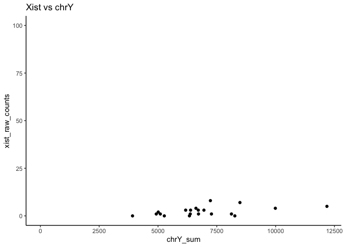

Yes, all these are males.

Is Deaf1 expressed?

``` r
deaf1_gene <- "ENSMUSG00000058886"

df_counts[grep(deaf1_gene, rownames(df_counts), ignore.case = TRUE), ]
```

|                    | X3M_CTRL_rep1 | X3M_CTRL_rep2 | X3M_CTRL_rep3 | X3M_CTRL_rep4 | X3M_CTRL_rep5 | X3M_TSCmKO_rep1 | X3M_TSCmKO_rep2 | X3M_TSCmKO_rep3 | X3M_TSCmKO_rep4 | X3M_TSCmKO_rep5 | X9M_CTRL_rep1 | X9M_CTRL_rep2 | X9M_CTRL_rep3 | X9M_CTRL_rep4 | X9M_CTRL_rep5 | X9M_TSCmKO_rep1 | X9M_TSCmKO_rep2 | X9M_TSCmKO_rep3 | X9M_TSCmKO_rep4 | X9M_TSCmKO_rep5 |
|:-------------------|--------------:|--------------:|--------------:|--------------:|--------------:|----------------:|----------------:|----------------:|----------------:|----------------:|--------------:|--------------:|--------------:|--------------:|--------------:|----------------:|----------------:|----------------:|----------------:|----------------:|
| ENSMUSG00000058886 |           230 |           149 |           329 |           536 |           173 |             165 |             210 |             237 |             384 |             304 |           224 |           199 |           141 |           234 |           247 |             213 |             147 |             150 |             149 |             218 |

Yes, it is.

### Creating the datamatrix

``` r
data_mat = as.matrix(df_counts)
rownames(data_mat) = rownames(df_counts)

data_mat = apply(round(data_mat), c(1,2), as.integer) # Round to integer
data_mat_nonzero = data_mat[rowSums(data_mat) > 0, ] # Rm non-zero rows

sum(duplicated(rownames(data_mat_nonzero)))# Check that we have no duplicates
```

    [1] 0

## Create DESeq object

``` r
# Create DESeq object
dds = DESeqDataSetFromMatrix(data_mat_nonzero, experimental_metadata, 
                             ~ condition + age)
colnames(dds) = colnames(data_mat)

#Estimates the size factors using the "median ratio method" described by Equation 5 in Anders and Huber (2010)
dds <- estimateSizeFactors(dds) 
#This function obtains dispersion estimates for a count data set
dds <- estimateDispersions(dds)
```

    gene-wise dispersion estimates

    mean-dispersion relationship

    final dispersion estimates

``` r
#This function transforms the count data to the log2 scale in a way which minimizes differences between samples for rows with small counts
vst <- vst(dds, blind = TRUE) # use blind = TRUE for QC
```

## How many non-zero rows?

How many genes are there in the mouse genome?

``` r
nrow(data_mat)
```

    [1] 22844

How many genes are expressed (at least 1 read in at least 1 sample)?

``` r
nrow(data_mat_nonzero)
```

    [1] 22028

What percentage is this?

``` r
nrow(data_mat_nonzero)/nrow(data_mat) * 100
```

    [1] 96.42795

96% of all rows are nonzero.

# DESeq QC

## Dispersion estimates

``` r
## Plot dispersion estimates
plotDispEsts(dds, main = "Dispersion estimates, before filtering")
```

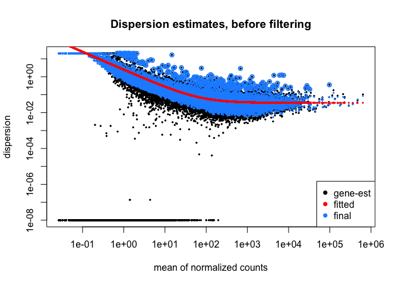

## QC - number of detected genes

``` r
dds
```

    class: DESeqDataSet 
    dim: 22028 20 
    metadata(1): version
    assays(2): counts mu
    rownames(22028): ENSMUSG00000000001 ENSMUSG00000000003 ...
      ENSMUSG00000116378 ENSMUSG00000116461
    rowData names(10): baseMean baseVar ... dispOutlier dispMAP
    colnames(20): X3M_CTRL_rep1 X3M_CTRL_rep2 ... X9M_TSCmKO_rep4
      X9M_TSCmKO_rep5
    colData names(6): sample_id age_condition ... rep sizeFactor

We plot a few key metrics to check our data quality:

``` r
plt_title = "Before Filtering"
```

<div class="panel-tabset">

### Read counts per sample

``` r
total_counts <- as.data.frame(colSums(counts(dds)))
colnames(total_counts) <- "total_counts"
total_counts$name = rownames(total_counts)
```

``` r
# Plot
ggplot(total_counts, aes(x = name, y = total_counts)) +
    geom_bar(stat = "identity") +
    scale_y_continuous("Read counts", 
                       limits = c(0, 4e7),
                       expand = c(0, 0),
                       breaks = seq(0, 4e7, 1e7)) +
    geom_hline(yintercept = 2e7, color = "blue", linetype = "dashed") +
    labs(title = "Read counts per sample",
         x = element_blank()) +
    theme_minimal() +
    coord_flip()
```

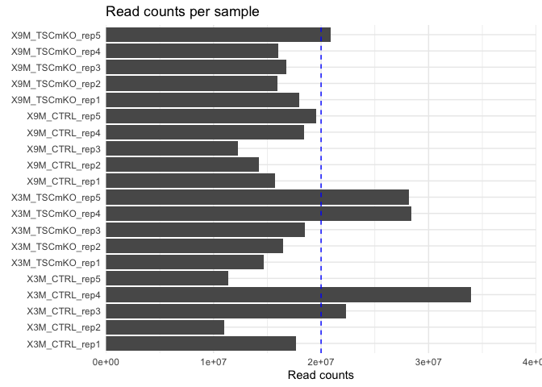

### Number of genes detected per sample

``` r
detected = apply(counts(dds), 2, function(col) sum(col > 0 ))
detected = as.data.frame(detected)
detected$name = row.names(detected)
                 
ggplot(detected, aes(x=name, y=detected)) + 
                 geom_bar(stat="identity") + 
                 theme_minimal() + 
                 coord_flip() + 
                 scale_y_continuous("Number of Genes detected", expand=c(0,0),
                                    limits = c(0, 20000)
                                    ) + 
                 scale_x_discrete("Sample") +
                 labs(title = "# of genes detected", 
                     subtitle = plt_title) +
                 geom_hline(yintercept = 17000, color = "blue", linetype = "dashed") 
```

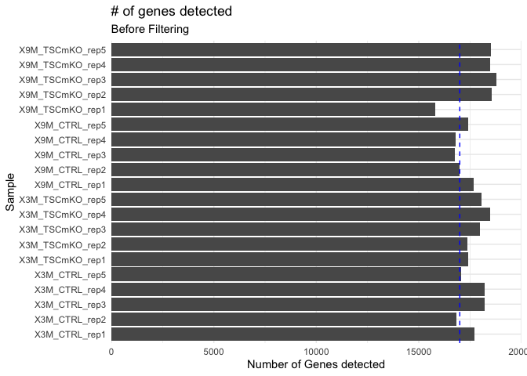

### Size factors

``` r
df = data.frame(sample_id = names(sizeFactors(dds)), 
                sizeFactors = sizeFactors(dds))

ggplot(df, aes(x = sample_id, y=sizeFactors)) + 
    geom_bar(stat="identity") + 
    scale_y_continuous(limits=c(0,2), expand=c(0,0)) + 
    labs(title = "Size factors for each sample",
         subtitle = plt_title, 
         x = element_blank()) +
    theme_minimal() + 
    theme(axis.text.x = element_text(angle = 90, hjust=1, 
                                     colour="black", size= 10))
```

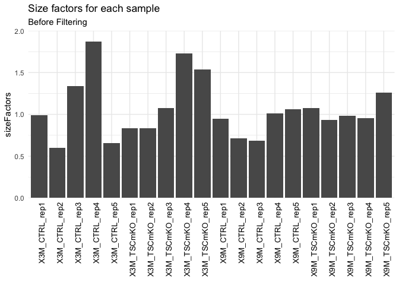

### Normalized counts (boxplot)

``` r
nc = counts(dds, normalized=TRUE)
nc.melt = melt(nc)

ggplot(nc.melt, aes(x=Var2, y=value)) + 
    geom_boxplot() + 
    theme_classic() + 
    theme(axis.text.x = element_text(angle = 90, colour="black", hjust = 1,
                                     size = 12)) + 
    scale_x_discrete("Sample") + 
    scale_y_continuous("Normalised counts") +
    labs(title = "Normalized counts",
        subtitle = plt_title) 
```

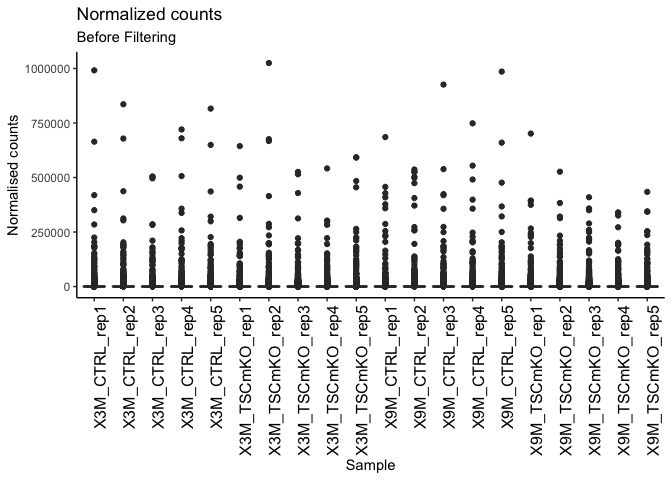

``` r
nc.threshold = 500000
test = apply(nc, 1, function(x){ any(x > nc.threshold) })
```

The genes with normalized counts greater than 5^{5} are:

``` r
highly_expressed <- ensembl.genes[test, c("gene_biotype", "external_gene_name")]

unique(highly_expressed$gene_biotype)
```

    [1] "protein_coding"       "miRNA"                "snRNA"               
    [4] NA                     "processed_pseudogene" "lncRNA"              

``` r
highly_expressed
```

    GRanges object with 15 ranges and 2 metadata columns:
                         seqnames              ranges strand |         gene_biotype
                            <Rle>           <IRanges>  <Rle> |          <character>
      ENSMUSG00000030103        6 108660629-108666925      + |       protein_coding
      ENSMUSG00000030385        7   12512517-12556323      + |       protein_coding
      ENSMUSG00000031372        X   73433705-73435344      - |       protein_coding
      ENSMUSG00000049939        6   28661831-28831747      - |       protein_coding
      ENSMUSG00000052382       14   51038459-51041869      - |       protein_coding
                     ...      ...                 ...    ... .                  ...
      ENSMUSG00000098959        9   72395974-72404510      + |               lncRNA
      ENSMUSG00000103698        3     9971188-9972001      - | processed_pseudogene
      ENSMUSG00000114230       14   12374585-12384729      + |               lncRNA
      ENSMUSG00000114397       14   30402002-30402988      + | processed_pseudogene
      ENSMUSG00000114899       13 106042124-106042481      + | processed_pseudogene
                         external_gene_name
                                <character>
      ENSMUSG00000030103            Bhlhe40
      ENSMUSG00000030385      2900092C05Rik
      ENSMUSG00000031372              Trex2
      ENSMUSG00000049939              Lrrc4
      ENSMUSG00000052382             Rnase9
                     ...                ...
      ENSMUSG00000098959            Gm27230
      ENSMUSG00000103698            Gm17877
      ENSMUSG00000114230            Gm48239
      ENSMUSG00000114397             Gm7621
      ENSMUSG00000114899            Gm48214
      -------
      seqinfo: 22 sequences (1 circular) from an unspecified genome; no seqlengths

Some pseudogenes, lncRNA and protein-coding genes.

Plotting the rRNA graph:

``` r
rrna.genes = ensembl.genes$external_gene_name[ensembl.genes$gene_biotype %in% c("Mt_rRNA", "rRNA")]

percentage.of.rrna = (colSums(counts(dds[ rownames(counts(dds)) %in% rrna.genes])) / colSums(counts(dds))) * 100

percentage.of.rrna = as.data.frame(percentage.of.rrna)
percentage.of.rrna$name = row.names(percentage.of.rrna)
#percentage.of.rrna$name = factor(percentage.of.rrna$name,rev(experimental_metadata$sample_id))
ggplot(percentage.of.rrna, 
       aes(x=name, y=percentage.of.rrna)) + 
        geom_hline(yintercept = 5, color = "blue", linetype = "dashed") +
        geom_bar(stat="identity") + 
        theme_classic() + 
        coord_flip() + 
        scale_y_continuous("% rRNA", expand=c(0,0), limits = c(0, 30)) +
        labs(title = "% rRNA") 
```

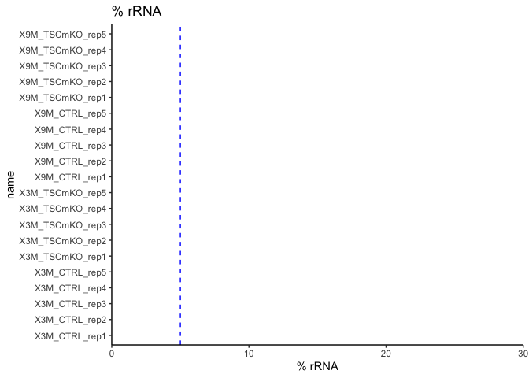

Checking summary statistics for rRNA:

``` r
summary(percentage.of.rrna$percentage.of.rrna)
```

       Min. 1st Qu.  Median    Mean 3rd Qu.    Max. 
          0       0       0       0       0       0 

No rRNA present.

### Proportions of gene biotypes

``` r
pc = ensembl.genes$gene_id[ensembl.genes$gene_biotype == "protein_coding"]
pg = ensembl.genes$gene_id[ensembl.genes$gene_biotype %in% unique(ensembl.genes$gene_biotype)[grep("pseudogene", unique(ensembl.genes$gene_biotype))]]
lc = ensembl.genes$gene_id[ensembl.genes$gene_biotype == "lncRNA"]

totalcounts.pc = colSums(counts(dds)[rownames(counts(dds)) %in% pc,])
totalcounts.pg = colSums(counts(dds)[rownames(counts(dds)) %in% pg,])
totalcounts.lc = colSums(counts(dds)[rownames(counts(dds)) %in% lc,])

totalcounts.other = colSums(counts(dds)[!(rownames(counts(dds)) %in% c(lc,pc,pg)),])

counts.by.biotype = data.frame(name = names(totalcounts.pc),
                         protein_coding = totalcounts.pc,
                         pseudogene = totalcounts.pg,
                         lincRNA = totalcounts.lc,
                         other = totalcounts.other
                         
                         )

#counts.by.biotype$name = factor(counts.by.biotype$name, experimental_metadata$sample_id)

counts.by.biotype = as.data.frame(t(apply(counts.by.biotype[,2:5], 1, function(x){ 100 * (x / sum(x)) }) ))
counts.by.biotype$name = names(totalcounts.pc)
#counts.by.biotype$name = factor(counts.by.biotype$name, #experimental_metadata$sample_id)

counts.by.biotype.melt = melt(counts.by.biotype)
```

    Using name as id variables

``` r
ggplot(counts.by.biotype.melt, aes(x=name, y=value, fill=variable)) +  
    geom_bar(stat="identity") + 
    theme_classic() + 
    scale_y_continuous("% reads", labels = dollar_format(suffix = "%", prefix = ""),  
                       expand=c(0,0)) + scale_x_discrete("Sample") + 
    theme(axis.text.x = element_text(angle = 90, colour="black", #family="Arial", 
                                     hjust = 1, size = 12)) +
    labs(title = "Proportions of gene biotypes", 
        subtitle = plt_title) 
```

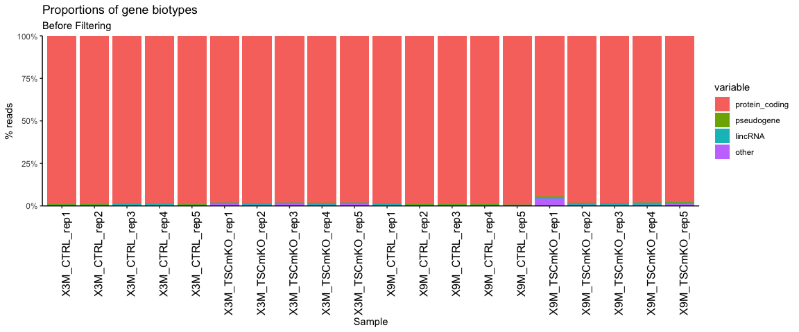

Most genes are protein-coding, as expected.

</div>

## QC - clustering

We perform 3 types of Quality Control to assess our DESeq dataset:

- Correlation matrix heatmap
- Hierarchical clustering
- PCA

<div class="panel-tabset">

### Correlation matrix heatmap

``` r
### Extract the vst matrix from the object
vst_mat <- assay(vst)  
### Compute pairwise correlation values
vst_cor <- cor(vst_mat)
### Plot heatmap
pheatmap(vst_cor, main = "Correlation heatmap, before filtering")
```

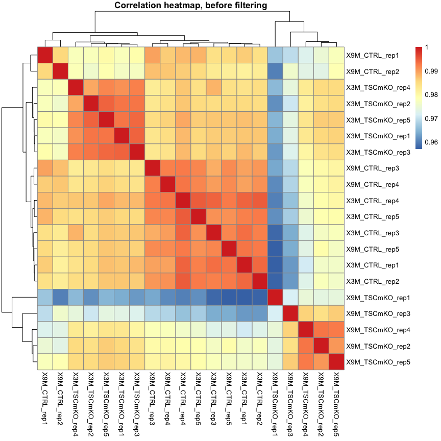

### Hierarchical clustering

``` r
sampleDists <- dist(t(assay(vst)))
plot(hclust(sampleDists), main = paste0("Cluster Dendrogram, ", plt_title))
```

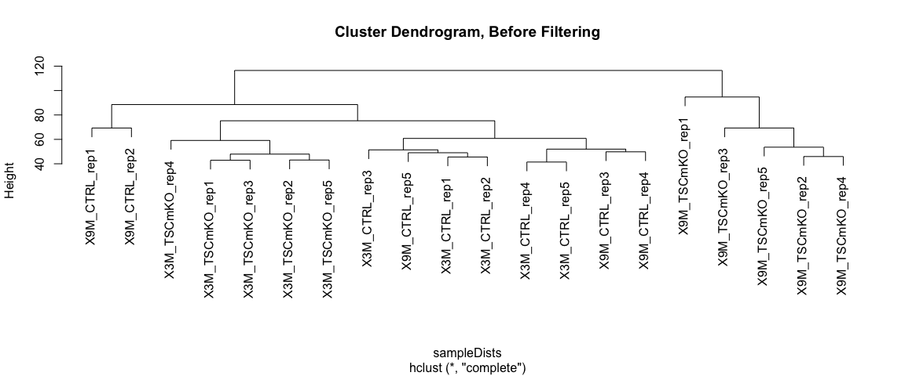

### PCA, by condition

``` r
pca_xlim <- c(-30, 30)
pca_ylim <- c(-20, 20)
```

``` r
make_pca(vst, intgroup = "condition",
         title = "PCA, before filtering", 
         xlimits = pca_xlim,
         ylimits = pca_ylim)
```

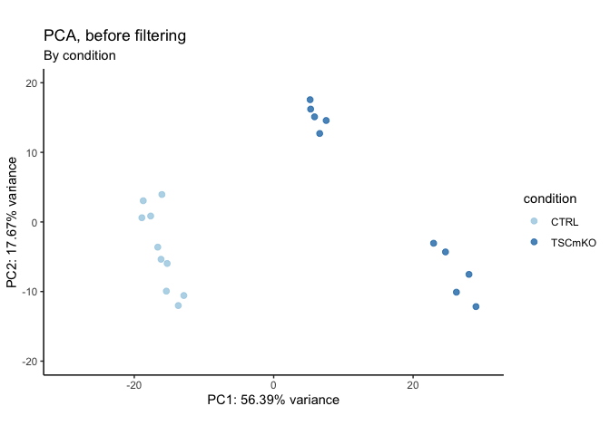

### PCA, by age

``` r
make_pca(vst, intgroup = "age",
         title = "PCA, before filtering", 
         xlimits = c(-30, 30),
         ylimits = c(-20, 20)) +
  scale_color_brewer(palette = "Set1")
```

    Scale for colour is already present.
    Adding another scale for colour, which will replace the existing scale.

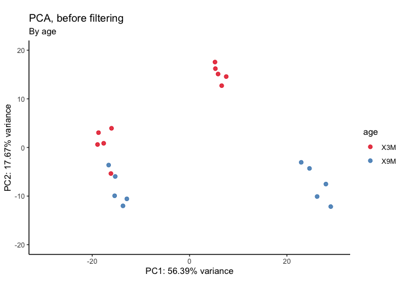

### PCA, by age and condition

``` r
make_pca_shape(vst, color_by = "age", 
               shape_by = "condition",
               title = "PCA plot",
               subtitle = "Before removing chrM and rRNA",
               xlimits = pca_xlim, 
               ylimits = pca_ylim)
```


### PCA, by size factor

``` r
make_pca(vst, intgroup = "sizeFactor",
         title = "PCA plot, before filtering",
          xlimits = c(-30, 30),
         ylimits = c(-20, 20)) +
  scale_color_viridis(option = "A")
```

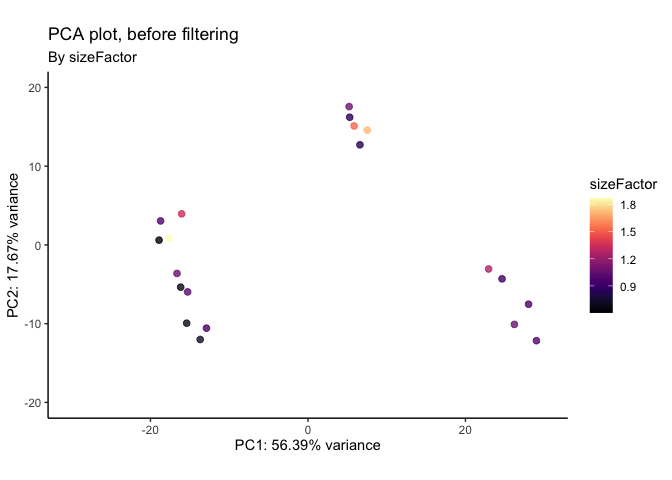

</div>

PC1 separates ctrl from TSCmKO, as expected. PC2 separates by age.

# Remove rRNA and mitochondrial genome

We remove all genes that map to rRNA, as well as the mitochondrial
chromosome before we proceed with downstream analysis.

``` r
plt_title = "after removing rRNA and mitochondrial genome"
```

Checking MT chromosome intact:

``` r
in_dds = ensembl.genes[na.omit(match(rownames(counts(dds)), ensembl.genes$gene_id)), ]
table(seqnames(in_dds))
```


       1    2    3    4    5    6    7    8    9   10   11   12   13   14   15   16 
    1382 1753 1144 1353 1393 1213 1773 1135 1287 1093 1705  817  816  747  775  622 
      17   18   19    X    Y   MT 
     965  489  648  760  134    0 

Remove MT chromosome, rerun DESeq:

``` r
# Remove mitochondrial genome
mit_genes <- ensembl.genes[seqnames(ensembl.genes) %in% "MT", ]$gene_id
dds_rm_mit <- dds[!rownames(counts(dds)) %in% mit_genes, ]

# Remove rRNA
dds_filt = dds_rm_mit[!(row.names(counts(dds_rm_mit)) %in% 
                   ensembl.genes$gene_id[ensembl.genes$gene_biotype %in% 
                                           c("rRNA", "snoRNA", "snRNA", "Mt_rRNA")]), ]
dds_filt = dds_filt[rowSums(counts(dds_filt)) > 0, ]

# Re-estimate dispersions
dds_filt <- estimateSizeFactors(dds_filt) 
dds_filt <- estimateDispersions(dds_filt)
```

    found already estimated dispersions, replacing these

    gene-wise dispersion estimates

    mean-dispersion relationship

    final dispersion estimates

``` r
vst_filt <- vst(dds, blind = TRUE) # use blind = TRUE for QC
```

Check that mitochondrial genome has been removed:

``` r
in_dds = ensembl.genes[na.omit(match(rownames(counts(dds_filt)), 
                                     ensembl.genes$gene_id)), ]
table(seqnames(in_dds))
```


       1    2    3    4    5    6    7    8    9   10   11   12   13   14   15   16 
    1382 1753 1144 1353 1393 1213 1773 1135 1287 1093 1705  817  816  747  775  622 
      17   18   19    X    Y   MT 
     965  489  648  760  134    0 

## Check rRNA removed

``` r
rrna.genes = names(ensembl.genes[ensembl.genes$gene_biotype %in% c("Mt_rRNA", "rRNA", 
                                                                   "snoRNA", "snRNA")])

percentage.of.rrna = (colSums(counts(dds_filt[rownames(counts(dds_filt)) %in% rrna.genes])) / colSums(counts(dds_filt))) * 100
percentage.of.rrna = as.data.frame(percentage.of.rrna)
percentage.of.rrna$name = row.names(percentage.of.rrna)
#percentage.of.rrna$name = factor(percentage.of.rrna$name, rev(experimental_metadata$sample_id))


ggplot(percentage.of.rrna, aes(x=name, y=percentage.of.rrna)) +
  geom_bar(stat="identity") + theme_classic() + coord_flip() + scale_y_continuous("% rRNA", expand=c(0,0)) +
  scale_x_discrete("Sample") +
  ggtitle(paste0("% rRNA, ", plt_title))
```

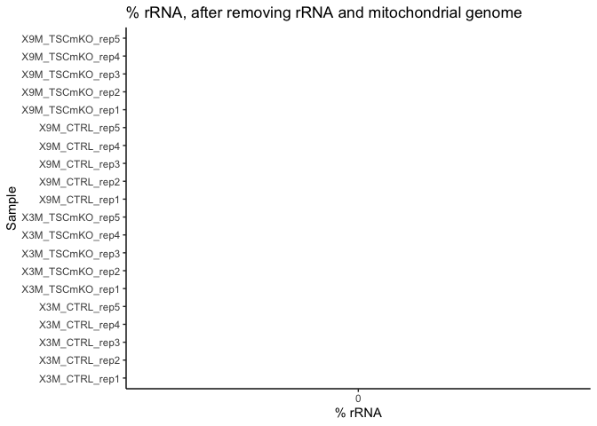

Checking that rRNA percentage is now zero:

``` r
summary(percentage.of.rrna$percentage.of.rrna)
```

       Min. 1st Qu.  Median    Mean 3rd Qu.    Max. 
          0       0       0       0       0       0 

## QC - number of genes

<div class="panel-tabset">

### Size Factors after rRNA removal

``` r
df = data.frame(sample_id = names(sizeFactors(dds_filt)), sizeFactors = sizeFactors(dds_filt))

ggplot(df, aes(x = sample_id, y=sizeFactors)) + 
  geom_bar(stat="identity") + 
  scale_y_continuous(limits=c(0,2), expand=c(0,0)) + 
  theme_classic() + 
  theme(axis.text.x = element_text(angle = 90, hjust=1, colour="black", size=12)) +
  geom_hline(yintercept = 1, color = "blue", linetype = "dashed") +
  ggtitle(paste0("Size Factors, ", plt_title))
```

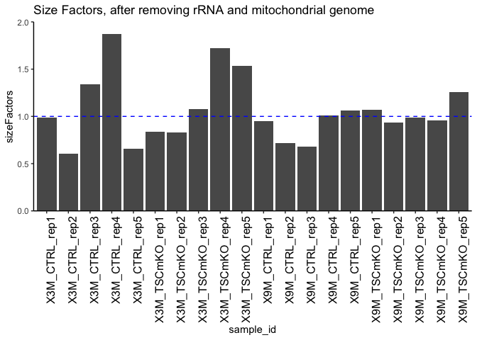

Summary of size factors:

``` r
summary(sizeFactors(dds_filt))
```

       Min. 1st Qu.  Median    Mean 3rd Qu.    Max. 
     0.6025  0.8353  0.9862  1.0545  1.1222  1.8741 

Size factors for each sample:

``` r
print(sizeFactors(dds_filt))
```

      X3M_CTRL_rep1   X3M_CTRL_rep2   X3M_CTRL_rep3   X3M_CTRL_rep4   X3M_CTRL_rep5 
          0.9886037       0.6024983       1.3412182       1.8740503       0.6543574 
    X3M_TSCmKO_rep1 X3M_TSCmKO_rep2 X3M_TSCmKO_rep3 X3M_TSCmKO_rep4 X3M_TSCmKO_rep5 
          0.8358188       0.8336544       1.0761652       1.7252180       1.5365743 
      X9M_CTRL_rep1   X9M_CTRL_rep2   X9M_CTRL_rep3   X9M_CTRL_rep4   X9M_CTRL_rep5 
          0.9477521       0.7159204       0.6830803       1.0092466       1.0596096 
    X9M_TSCmKO_rep1 X9M_TSCmKO_rep2 X9M_TSCmKO_rep3 X9M_TSCmKO_rep4 X9M_TSCmKO_rep5 
          1.0718514       0.9352970       0.9837055       0.9552174       1.2604372 

### Read counts per sample after rRNA and chrM removal

``` r
total_counts <- as.data.frame(colSums(counts(dds_filt)))
colnames(total_counts) <- "total_counts"
total_counts$name = rownames(total_counts)
```

``` r
# Plot
ggplot(total_counts, aes(x = name, y = total_counts)) +
    geom_bar(stat = "identity") +
    scale_y_continuous("Read counts", 
                       limits = c(0, 4e7),
                       expand = c(0, 0),
                       breaks = seq(0, 4e7, 1e7)) +
    geom_hline(yintercept = 2.5e7, color = "blue", linetype = "dashed") +
    labs(title = "Read counts per sample",
         subtitle = "after removing chrM and rRNA",
         x = element_blank()) +
    theme_minimal() +
    coord_flip()
```

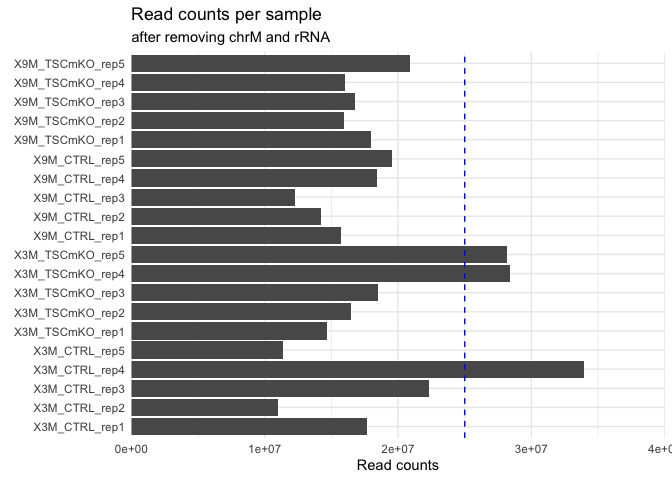

### Number of genes detected per sample after rRNA and chrM removal

``` r
detected = apply(counts(dds_filt), 2, function(col) sum(col > 0 ))
detected = as.data.frame(detected)
detected$name = row.names(detected)
#detected$name = factor(detected$name, rev(experimental_metadata$sample_id))
                 
ggplot(detected, aes(x=name, y=detected)) + 
                 geom_bar(stat="identity") + 
                 theme_minimal() + 
                 coord_flip() + 
                 scale_y_continuous("Number of Genes detected", expand=c(0,0),
                                    limits = c(0, 30000)) + 
                 scale_x_discrete("Sample") +
                 labs(title = "# of genes detected", 
                     subtitle = plt_title) +
                 geom_hline(yintercept = 20000, color = "blue", linetype = "dashed") 
```

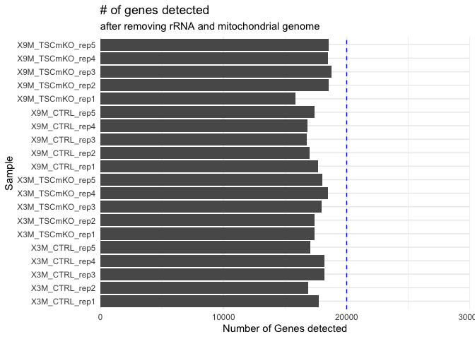

</div>

## QC- clustering

<div class="panel-tabset">

### Heatmap after rRNA removal

``` r
### Extract the vst matrix from the object
vst_mat <- assay(vst_filt)  

### Compute pairwise correlation values
vst_cor <- cor(vst_mat)

### Plot heatmap
pheatmap(vst_cor, main = "Correlation heatmap, after rRNA removal")
```


### Clustering after rRNA removal

``` r
sampleDists <- dist(t(assay(vst_filt)))
plot(hclust(sampleDists), main = paste0("Cluster Dendrogram, ", plt_title))
```

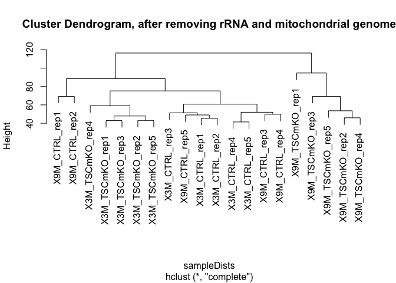

### PCA by condition

``` r
make_pca(vst_filt, intgroup = "condition",
         title = "PCA plot, after removing rRNA and chrM",
         xlimits = pca_xlim,
         ylimits = pca_ylim) 
```

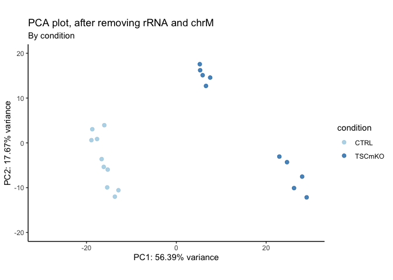

### PCA by age

``` r
make_pca(vst_filt, intgroup = "age",
         title = "PCA plot, after removing rRNA and chrM",
         xlimits = pca_xlim,
         ylimits = pca_ylim) 
```

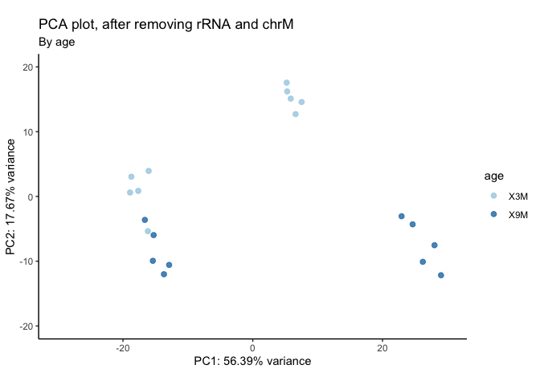

### PCA, by age and condition

``` r
make_pca_shape(vst_filt, color_by = "age", 
               shape_by = "condition",
               title = "PCA plot",
               subtitle = "after removing chrM and rRNA",
               xlimits = pca_xlim, 
               ylimits = pca_ylim)
```

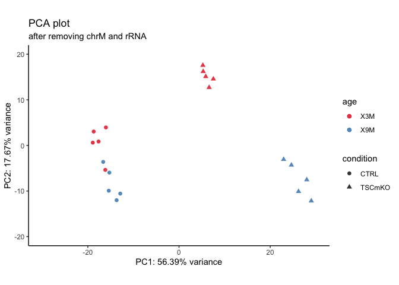

### PCA, labelled

``` r
make_pca(vst_filt, intgroup = "age", label = TRUE, 
         title = "PCA plot, after removing rRNA and chrM",
         xlimits = pca_xlim, 
         ylimits = pca_ylim) 
```

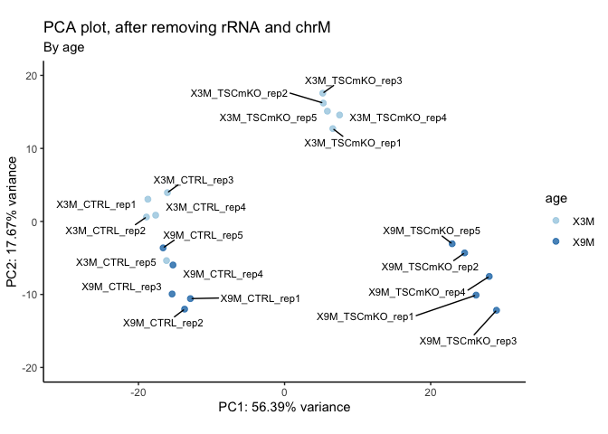

### PCA, by size factor

``` r
make_pca(vst_filt, intgroup = "sizeFactor", 
         title = "PCA plot, after removing rRNA and chrM") +
  scale_color_viridis(option = "A")
```

    Scale for colour is already present.
    Adding another scale for colour, which will replace the existing scale.

    Warning: Removed 20 rows containing missing values (`geom_point()`).

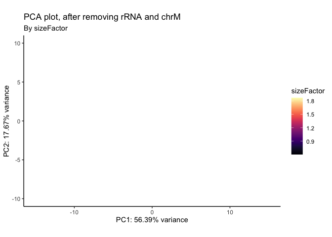

</div>

# Check Deaf1 levels

<div class="panel-tabset">

## Normalized counts

We plot the normalized counts of Deaf1 in each sample:

``` r
# The normalized counts
deaf1_norm <- as.data.frame(counts(dds_filt, normalized = TRUE)[deaf1_gene, ])

deaf1_norm$sample <- rownames(deaf1_norm)
colnames(deaf1_norm) <- c("counts", "sample_id")
head(deaf1_norm)
```

|                 |   counts | sample_id       |
|:----------------|---------:|:----------------|
| X3M_CTRL_rep1   | 232.6514 | X3M_CTRL_rep1   |
| X3M_CTRL_rep2   | 247.3036 | X3M_CTRL_rep2   |
| X3M_CTRL_rep3   | 245.2994 | X3M_CTRL_rep3   |
| X3M_CTRL_rep4   | 286.0115 | X3M_CTRL_rep4   |
| X3M_CTRL_rep5   | 264.3815 | X3M_CTRL_rep5   |
| X3M_TSCmKO_rep1 | 197.4112 | X3M_TSCmKO_rep1 |

``` r
ggplot(deaf1_norm, aes(x = sample_id, y = counts)) +
  geom_col() +
  labs(title = "Deaf1 counts, normalized") +
  theme_minimal() +
  theme(axis.text.x = element_text(angle = 90)) 
```

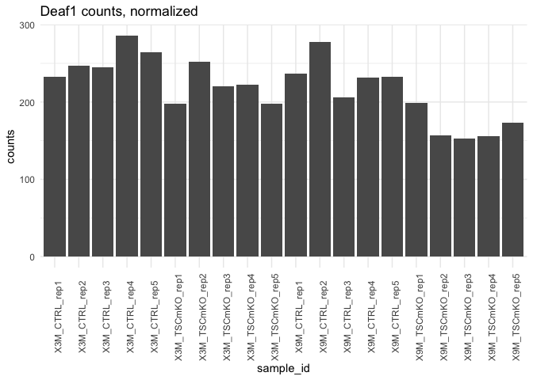

## Boxplot, controls

``` r
deaf1_all <- deaf1_norm %>% 
  separate(sample_id, into = c("age", "condition", "rep"))

deaf1_ctrl <- deaf1_all[deaf1_all$condition == "CTRL", ]
deaf1_tsc <- deaf1_all[deaf1_all$condition == "TSCmKO", ]
rownames(deaf1_ctrl)
```

     [1] "X3M_CTRL_rep1" "X3M_CTRL_rep2" "X3M_CTRL_rep3" "X3M_CTRL_rep4"
     [5] "X3M_CTRL_rep5" "X9M_CTRL_rep1" "X9M_CTRL_rep2" "X9M_CTRL_rep3"
     [9] "X9M_CTRL_rep4" "X9M_CTRL_rep5"

``` r
rownames(deaf1_tsc)
```

     [1] "X3M_TSCmKO_rep1" "X3M_TSCmKO_rep2" "X3M_TSCmKO_rep3" "X3M_TSCmKO_rep4"
     [5] "X3M_TSCmKO_rep5" "X9M_TSCmKO_rep1" "X9M_TSCmKO_rep2" "X9M_TSCmKO_rep3"
     [9] "X9M_TSCmKO_rep4" "X9M_TSCmKO_rep5"

Export this:

``` r
write.csv(deaf1_norm, file = paste0(output_dir, 
                                    "sarcoatlas_tscmko_deaf1_normcounts.csv"))
```

## Deaf1 boxplots

``` r
deaf1_plot <- deaf1_all %>% 
  unite(condition_age, age:condition, remove = FALSE)

deaf1_plot$condition_age = factor(deaf1_plot$condition_age, 
                                  levels = c("X3M_CTRL", "X9M_CTRL",
                                             "X3M_TSCmKO", "X9M_TSCmKO"))

ggplot(deaf1_plot, aes(x = condition_age, y = counts,
                       color = age)) +
  geom_boxplot() +
  theme_classic() +
  scale_color_brewer(palette = "Set1") +
  expand_limits(y = 0) +
  labs(title = "Deaf1 counts, normalized",
       subtitle = "sarcoatlas - TSCmKO")
```

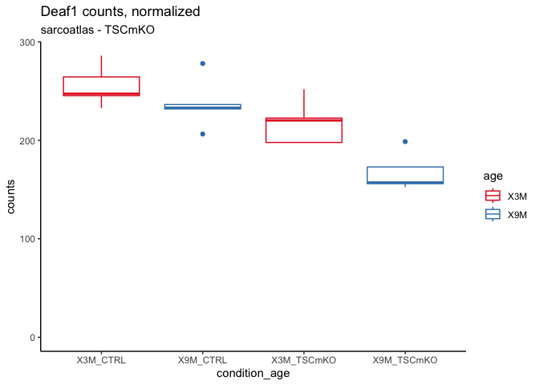

# Deaf1 Wald tests

``` r
# Check that age is a factor variable
class(colData(dds_filt)$age) == "factor"
```

    [1] TRUE

``` r
head(colData(dds_filt))
```

    DataFrame with 6 rows and 6 columns
                          sample_id age_condition      age condition       rep
                        <character>      <factor> <factor>  <factor> <numeric>
    X3M_CTRL_rep1     X3M_CTRL_rep1    X3M_CTRL        X3M    CTRL           1
    X3M_CTRL_rep2     X3M_CTRL_rep2    X3M_CTRL        X3M    CTRL           2
    X3M_CTRL_rep3     X3M_CTRL_rep3    X3M_CTRL        X3M    CTRL           3
    X3M_CTRL_rep4     X3M_CTRL_rep4    X3M_CTRL        X3M    CTRL           4
    X3M_CTRL_rep5     X3M_CTRL_rep5    X3M_CTRL        X3M    CTRL           5
    X3M_TSCmKO_rep1 X3M_TSCmKO_rep1    X3M_TSCmKO      X3M    TSCmKO         1
                    sizeFactor
                     <numeric>
    X3M_CTRL_rep1     0.988604
    X3M_CTRL_rep2     0.602498
    X3M_CTRL_rep3     1.341218
    X3M_CTRL_rep4     1.874050
    X3M_CTRL_rep5     0.654357
    X3M_TSCmKO_rep1   0.835819

### Wald test, controls

``` r
dds_wald_ctrl <- dds_filt

design(dds_wald_ctrl) <- ~ age_condition

dds_wald_ctrl <- DESeq(dds_wald_ctrl, parallel = TRUE)
```

    using pre-existing size factors

    estimating dispersions

    gene-wise dispersion estimates: 6 workers

    mean-dispersion relationship

    final dispersion estimates, fitting model and testing: 6 workers

``` r
res_ctrl <- results(dds_wald_ctrl, 
                    # format: column, mutant, control
               contrast = c("age_condition", "X9M_CTRL", "X3M_CTRL"))

deaf1_res_ctrl <- res_ctrl[deaf1_gene, ]

deaf1_res_ctrl
```

    log2 fold change (MLE): age_condition X9M_CTRL vs X3M_CTRL 
    Wald test p-value: age condition X9M CTRL vs X3M CTRL 
    DataFrame with 1 row and 6 columns
                        baseMean log2FoldChange     lfcSE      stat    pvalue
                       <numeric>      <numeric> <numeric> <numeric> <numeric>
    ENSMUSG00000058886   219.431      -0.110114  0.117627 -0.936127  0.349208
                            padj
                       <numeric>
    ENSMUSG00000058886  0.704584

Not significant.

### Wald test, TSCmKOs

``` r
dds_wald_tsc <- dds_filt

design(dds_wald_tsc) <- ~ age_condition

# Set X3M_TSCmKO as the reference

colData(dds_wald_tsc)$age_condition <- relevel(colData(dds_wald_tsc)$age_condition, 
                                               ref = "X3M_TSCmKO")

dds_wald_tsc <- DESeq(dds_wald_tsc, parallel = TRUE)
```

    using pre-existing size factors

    estimating dispersions

    gene-wise dispersion estimates: 6 workers

    mean-dispersion relationship

    final dispersion estimates, fitting model and testing: 6 workers

``` r
res_tsc <- results(dds_wald_tsc, 
                    # format: column, mutant, control
               contrast = c("age_condition", "X9M_TSCmKO", "X3M_TSCmKO"))

deaf1_res_tsc <- res_tsc[deaf1_gene, ]

deaf1_res_tsc
```

    log2 fold change (MLE): age_condition X9M_TSCmKO vs X3M_TSCmKO 
    Wald test p-value: age condition X9M TSCmKO vs X3M TSCmKO 
    DataFrame with 1 row and 6 columns
                        baseMean log2FoldChange     lfcSE      stat     pvalue
                       <numeric>      <numeric> <numeric> <numeric>  <numeric>
    ENSMUSG00000058886   219.431      -0.374887  0.119172  -3.14576 0.00165657
                            padj
                       <numeric>
    ENSMUSG00000058886 0.0101846

### Exporting both

``` r
# Add the log2fc and padj info 

deaf1_ctrl_export <- add_res_info(deaf1_res_ctrl)

deaf1_tsc_export <- add_res_info(deaf1_res_tsc)

# Combine

deaf1_res_export <- rbind(deaf1_ctrl_export, deaf1_tsc_export) %>% 
  dplyr::select(gene_name, everything())

deaf1_res_export
```

| gene_name          | baseMean | log2FoldChange |     lfcSE |       stat |    pvalue |      padj | log2fc_info                                                    | pval_info                                                 |
|:-------------------|---------:|---------------:|----------:|-----------:|----------:|----------:|:---------------------------------------------------------------|:----------------------------------------------------------|
| ENSMUSG00000058886 |  219.431 |     -0.1101141 | 0.1176273 | -0.9361273 | 0.3492077 | 0.7045845 | log2 fold change (MLE): age_condition X9M_CTRL vs X3M_CTRL     | Wald test p-value: age condition X9M CTRL vs X3M CTRL     |
| ENSMUSG00000058886 |  219.431 |     -0.3748867 | 0.1191722 | -3.1457572 | 0.0016566 | 0.0101846 | log2 fold change (MLE): age_condition X9M_TSCmKO vs X3M_TSCmKO | Wald test p-value: age condition X9M TSCmKO vs X3M TSCmKO |

``` r
write.csv(deaf1_res_export, file = paste0(output_dir, "sarcoatlas_tscmko_deaf1_stats.csv"))
```

## Ctrl boxplot

``` r
ggplot(deaf1_ctrl, aes(x = age, y = counts, color = condition)) +
  geom_boxplot() +
  geom_point() +
  theme_classic() +
  expand_limits(y = 0) +
  labs(title = "Deaf1",
       subtitle = "GSE139213",
       y = "normalized counts")
```

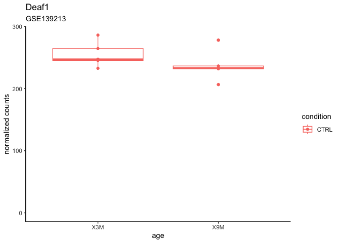

## TSCmKO

``` r
ggplot(deaf1_tsc, aes(x = age, y = counts, color = condition)) +
  geom_boxplot() +
  geom_point() +
  theme_classic() +
  expand_limits(y = 0) +
  labs(title = "Deaf1",
       subtitle = "GSE139213",
       y = "normalized counts")
```

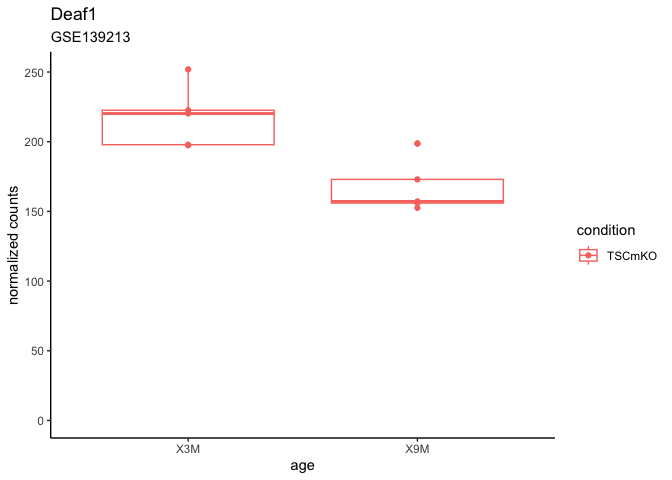

</div>

# Summary

- Deaf1 does not change significantly in young vs old control mice.
- Deaf1 is significantly decreased in old mice in TSCmKO subset.

# Sessioninfo

``` r
sessionInfo()
```

    R version 4.2.2 (2022-10-31)
    Platform: aarch64-apple-darwin20 (64-bit)
    Running under: macOS Ventura 13.1

    Matrix products: default
    BLAS:   /Library/Frameworks/R.framework/Versions/4.2-arm64/Resources/lib/libRblas.0.dylib
    LAPACK: /Library/Frameworks/R.framework/Versions/4.2-arm64/Resources/lib/libRlapack.dylib

    locale:
    [1] en_US.UTF-8/en_US.UTF-8/en_US.UTF-8/C/en_US.UTF-8/en_US.UTF-8

    attached base packages:
    [1] stats4    stats     graphics  grDevices utils     datasets  methods  
    [8] base     

    other attached packages:
     [1] DT_0.27                     lubridate_1.9.1            
     [3] viridis_0.6.2               viridisLite_0.4.1          
     [5] pheatmap_1.0.12             ggrepel_0.9.3              
     [7] scales_1.2.1                GenomicFeatures_1.50.4     
     [9] AnnotationDbi_1.60.2        biomaRt_2.54.0             
    [11] reshape2_1.4.4              DESeq2_1.38.3              
    [13] SummarizedExperiment_1.28.0 MatrixGenerics_1.10.0      
    [15] matrixStats_0.63.0          GenomicRanges_1.50.2       
    [17] GenomeInfoDb_1.34.9         IRanges_2.32.0             
    [19] S4Vectors_0.36.2            GEOquery_2.66.0            
    [21] Biobase_2.58.0              BiocGenerics_0.44.0        
    [23] janitor_2.2.0               ggplot2_3.4.2              
    [25] tidyr_1.3.0                 readr_2.1.3                
    [27] dplyr_1.1.1                

    loaded via a namespace (and not attached):
     [1] colorspace_2.1-0         rjson_0.2.21             ellipsis_0.3.2          
     [4] snakecase_0.11.0         XVector_0.38.0           rstudioapi_0.14         
     [7] farver_2.1.1             bit64_4.0.5              fansi_1.0.4             
    [10] xml2_1.3.3               codetools_0.2-19         cachem_1.0.7            
    [13] geneplotter_1.76.0       knitr_1.42               jsonlite_1.8.4          
    [16] Rsamtools_2.14.0         annotate_1.76.0          dbplyr_2.3.0            
    [19] png_0.1-8                compiler_4.2.2           httr_1.4.5              
    [22] assertthat_0.2.1         Matrix_1.5-3             fastmap_1.1.1           
    [25] limma_3.54.1             cli_3.6.1                htmltools_0.5.4         
    [28] prettyunits_1.1.1        tools_4.2.2              gtable_0.3.3            
    [31] glue_1.6.2               GenomeInfoDbData_1.2.9   rappdirs_0.3.3          
    [34] Rcpp_1.0.10              vctrs_0.6.1              Biostrings_2.66.0       
    [37] rtracklayer_1.58.0       xfun_0.37                stringr_1.5.0           
    [40] timechange_0.2.0         lifecycle_1.0.3          restfulr_0.0.15         
    [43] XML_3.99-0.13            zlibbioc_1.44.0          vroom_1.6.1             
    [46] hms_1.1.2                parallel_4.2.2           RColorBrewer_1.1-3      
    [49] yaml_2.3.7               curl_5.0.0               memoise_2.0.1           
    [52] gridExtra_2.3            stringi_1.7.12           RSQLite_2.3.1           
    [55] BiocIO_1.8.0             filelock_1.0.2           BiocParallel_1.32.6     
    [58] rlang_1.1.0              pkgconfig_2.0.3          bitops_1.0-7            
    [61] evaluate_0.20            lattice_0.20-45          purrr_1.0.1             
    [64] labeling_0.4.2           htmlwidgets_1.6.1        GenomicAlignments_1.34.0
    [67] bit_4.0.5                tidyselect_1.2.0         plyr_1.8.8              
    [70] magrittr_2.0.3           R6_2.5.1                 generics_0.1.3          
    [73] DelayedArray_0.24.0      DBI_1.1.3                pillar_1.9.0            
    [76] withr_2.5.0              KEGGREST_1.38.0          RCurl_1.98-1.12         
    [79] tibble_3.2.1             crayon_1.5.2             utf8_1.2.3              
    [82] BiocFileCache_2.6.0      tzdb_0.3.0               rmarkdown_2.20          
    [85] progress_1.2.2           locfit_1.5-9.7           grid_4.2.2              
    [88] data.table_1.14.8        blob_1.2.4               digest_0.6.31           
    [91] xtable_1.8-4             munsell_0.5.0           
