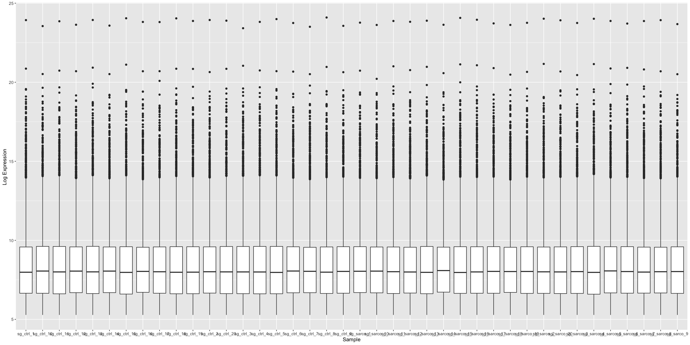
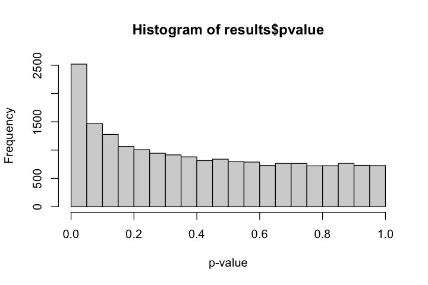
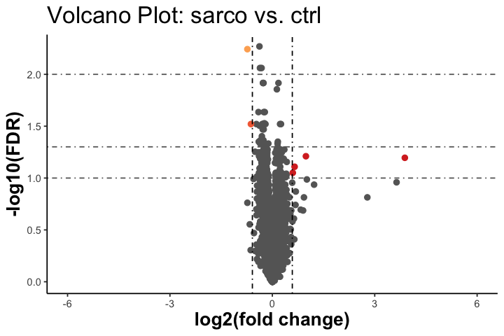
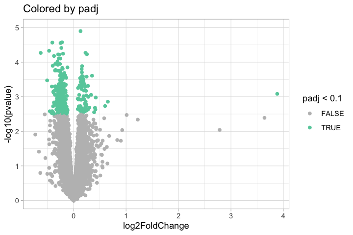
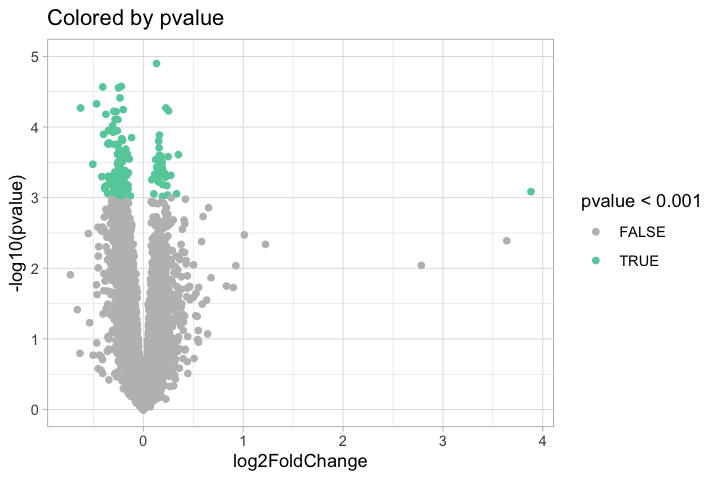
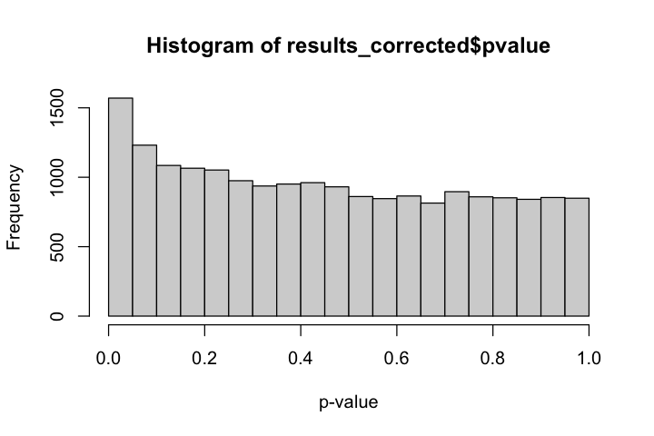
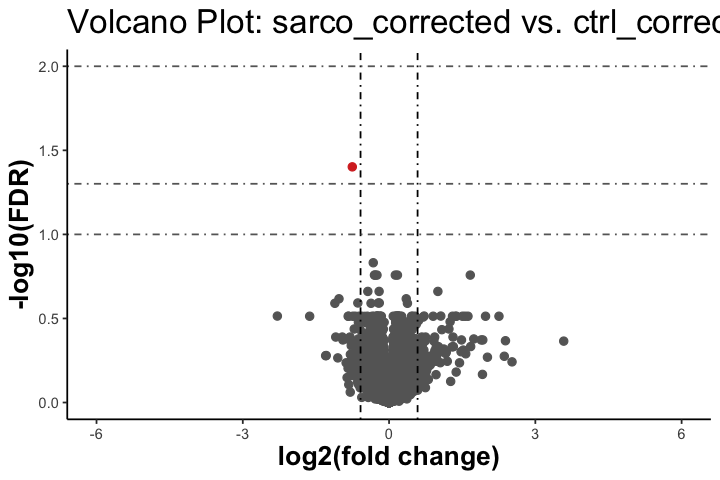
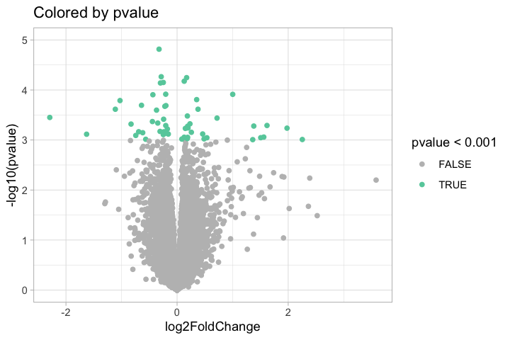
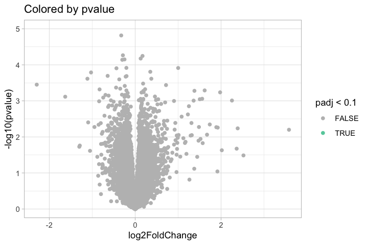

Differential Expression
================

- <a href="#b_de_sg" id="toc-b_de_sg"><span
  class="toc-section-number">1</span> 01b_DE_sg</a>
- <a href="#setup" id="toc-setup"><span
  class="toc-section-number">2</span> Setup</a>
  - <a href="#load-data" id="toc-load-data"><span
    class="toc-section-number">2.1</span> Load data</a>
- <a href="#non-corrected" id="toc-non-corrected"><span
  class="toc-section-number">3</span> Non-corrected</a>
  - <a href="#rld-plot" id="toc-rld-plot"><span
    class="toc-section-number">3.1</span> RLD plot</a>
  - <a href="#wald-test" id="toc-wald-test"><span
    class="toc-section-number">3.2</span> Wald test</a>
  - <a href="#number-of-significant-genes"
    id="toc-number-of-significant-genes"><span
    class="toc-section-number">3.3</span> Number of significant genes</a>
  - <a href="#replicating-the-pvalue-plot-in-the-figure"
    id="toc-replicating-the-pvalue-plot-in-the-figure"><span
    class="toc-section-number">3.4</span> Replicating the pvalue plot in the
    figure</a>
  - <a href="#deaf1" id="toc-deaf1"><span
    class="toc-section-number">3.5</span> Deaf1</a>
- <a href="#batch-corrected" id="toc-batch-corrected"><span
  class="toc-section-number">4</span> Batch-corrected</a>
  - <a href="#rld-plot-1" id="toc-rld-plot-1"><span
    class="toc-section-number">4.1</span> Rld plot</a>
  - <a href="#wald-test-1" id="toc-wald-test-1"><span
    class="toc-section-number">4.2</span> Wald test</a>
  - <a href="#number-of-significant-genes-1"
    id="toc-number-of-significant-genes-1"><span
    class="toc-section-number">4.3</span> Number of significant genes</a>
  - <a href="#deaf1-1" id="toc-deaf1-1"><span
    class="toc-section-number">4.4</span> Deaf1</a>
  - <a href="#nampt" id="toc-nampt"><span
    class="toc-section-number">4.5</span> Nampt</a>
- <a href="#session-info" id="toc-session-info"><span
  class="toc-section-number">5</span> Session Info</a>

# 01b_DE_sg

In this notebook, we continue with differential expression of sarcopenia
vs normal tissue for the Singapore-only cohort.

Some questions: - Do we see a separation of control vs sarcopenia in the
PCA/hierarchical clustering?

- Does the number of significantly changing genes change?

- Is Deaf1 significantly differentially expressed?

- check against nampt because this is the gene that is shown as
  differentially expressed in the paper

# Setup

``` r
suppressPackageStartupMessages({
  library(DESeq2)
    library(knitr)
    library(GenomicFeatures)
    library(RColorBrewer)
    library(gplots)
    library(biomaRt)
    library(grid)
    library(gridExtra)
    library(ggplot2)
    library(lattice)
    library(reshape)
    library(geneplotter)
    library(limma)
    library(tidyverse)  
    
})
```

``` r
## This function is to write out the files of differentially expressed genes
## It takes in a DESeqResults object, and two strings -- the numerator and denominator used in the analysis -- and writes out csv files

write_files <- function(results, numerator, denominator){
    # these are all the genes that are differentially expressed between the two conditions, not just the significant ones
    write.csv(results, paste0(output_dir,numerator,"_",denominator,"_all.csv"), row.names = TRUE, col.names = TRUE)

    # these are the genes that are significantly differentially expressed by FDR 10% and abs(log2fc) > log2(1.5)
    sig_padj_genes <- results[!is.na(results$padj),]
    sig_padj_genes <- sig_padj_genes[sig_padj_genes$padj < 0.1,]
    sig_padj_fc_genes <- sig_padj_genes[abs(sig_padj_genes$log2FoldChange) > lfc.threshold,]
    write.csv(sig_padj_fc_genes, paste0(output_dir,numerator,"_",denominator,"_significant.csv"), row.names = TRUE, col.names = TRUE)  
}

## This function plots the volcano plot
## It takes in a data frame and two strings which are used for the title of the plot
generate_volcano <- function(data_frame, numerator, denominator){
lfc.threshold = log2(1.5)
tmp = as.data.frame(data_frame)
tmp$signif = ifelse(tmp$log2FoldChange > lfc.threshold & tmp$padj< 0.01, "U1", 
                                    ifelse(tmp$log2FoldChange > lfc.threshold & tmp$padj< 0.05, "U2",
                                      ifelse(tmp$log2FoldChange > lfc.threshold & tmp$padj< 0.1, "U3",
                                        ifelse(tmp$log2FoldChange < -1*lfc.threshold & tmp$padj< 0.01, "D1", 
                                         ifelse(tmp$log2FoldChange < -1*lfc.threshold & tmp$padj< 0.05, "D2",
                                          ifelse(tmp$log2FoldChange < -1*lfc.threshold & tmp$padj< 0.1, "D3",                                                  "N"))))))
tmp$signif = factor(tmp$signif, c("N", "U1", "U2", "U3", "D3", "D2", "D1"))
    
x = ggplot(data=tmp, aes(x=log2FoldChange, y=-log10(padj), colour= signif)) + geom_point(alpha=1.0, size=2.00) +
      ggtitle(paste("Volcano Plot:", numerator, "vs.", denominator)) + 
      scale_x_continuous("log2(fold change)", limits=c(-6, 6)) +    
      scale_y_continuous("-log10(FDR)") + 
      geom_vline(xintercept = lfc.threshold, linetype="dotdash") +
      geom_vline(xintercept = -1*(lfc.threshold), linetype="dotdash") +
      geom_hline(yintercept = -log10(0.1), colour="gray40", linetype="dotdash") +   
      geom_hline(yintercept = -log10(0.05), colour="gray40", linetype="dotdash") + 
      geom_hline(yintercept = -log10(0.01), colour="gray40", linetype="dotdash") + 
      scale_colour_manual("", values=c("#666666", "#d73027", "#f46d43", "#fdae61", "#abd9e9", "#74add1", "#4575b4" ), labels = c("N", "U1", "U2", "U3", "D3", "D2", "D1")) + theme_classic() + theme(legend.position = "none", plot.title = element_text(size = 20), axis.title=element_text(size=16,face="bold"))
print(x)
}

## This function generates the MA plots with significant changes above the threshold coloured in red and significant changes below the threshold coloured in blue
## It takes in a DESeqResults object, uses the plotMA function from DESeq2 to obtain the necessary data frame to plot

generate_ma <- function(results, numerator, denominator){
  df <- DESeq2::plotMA(results, ylim = c(-10,10), colSig = "red", returnData = TRUE)
  plot <- df %>%
  mutate(signif = ifelse(lfc > lfc.threshold & isDE == TRUE, "U", 
                         ifelse(lfc < -lfc.threshold & isDE == TRUE, "D", "N"))) %>%
  ggplot(aes(x=mean, y=lfc, colour = signif)) + 
  geom_point(size = 1.5, alpha = 0.8) + 
  theme_classic() + 
  geom_hline(yintercept=0, colour="grey40", lwd = 1) + 
  #stat_smooth(se = FALSE, method = "loess", color = "red3") + 
  theme_classic() + 
  scale_colour_manual(values=c("#4575b4","#a3a3a3","#d73027"), labels = c("D", "N", "U")) +
  ylim(c(-10,10)) +
  theme(legend.position = "none") +
  labs(title = paste("Volcano Plot:", numerator, "vs.", denominator)) +
  ylab("Log fold change") +
  xlab("Mean of normalized counts") +
  scale_x_log10()
  return(plot)
}

```

## Load data

``` r
dds = readRDS("../output/01a_QC_sg/dds_quality_control.RDS")
dds_corrected = readRDS("../output/01a_QC_sg/dds_corrected.RDS")
ensembl.genes= readRDS("../../data/annotation/ensembl_genes.rds")
lfc.threshold = log2(1.5)

## Creating the output dir
if(!dir.exists("../output/01b_DE_sg")){
  dir.create("../output/01b_DE_sg")
}

output_dir <- "../output/01b_DE_sg/"
```

``` r
filter = apply(counts(dds, normalized=TRUE), 1, function(x){ mean(x) >= 10 })
dds = dds[filter, ]
```

``` r
filter_2 = apply(counts(dds_corrected, normalized=TRUE), 1, function(x){ mean(x) >= 10 })
dds_corrected = dds_corrected[filter_2, ]
```

# Non-corrected

## RLD plot

``` r
rld <- vst(dds)

options(repr.plot.height = 10, repr.plot.width = 20)
assay(rld) %>%
  as.data.frame() %>%
  gather() %>%
  ggplot(aes(x=key, y=value)) + 
  geom_boxplot() + ylab("Log Expression ") + xlab("Sample")
```



## Wald test

``` r
dds = nbinomWaldTest(dds)
```

``` r
results = results(dds, 
                  contrast = c("condition", "sarco", "ctrl"),  
                  filter=rowMeans(counts(dds, normalized=TRUE)), 
                  test="Wald", alpha=0.1, independentFiltering=TRUE)
```

``` r
options(repr.plot.height = 4, repr.plot.width = 6)
results$gene_biotype= ensembl.genes$gene_biotype[match(row.names(results), ensembl.genes$gene_id)]
results$external_gene_name= ensembl.genes$external_gene_name[match(row.names(results), ensembl.genes$gene_id)]

hist(results$pvalue, xlab = "p-value", ylab = "Frequency")
```



## Number of significant genes

``` r
sum(results$padj < 0.1 & abs(results$log2FoldChange) > lfc.threshold, na.rm = T)
```

6

``` r
write_files(results, "sarco", "ctrl")
```

    Warning message in write.csv(results, paste0(output_dir, numerator, "_", denominator, :
    “attempt to set 'col.names' ignored”
    Warning message in write.csv(sig_padj_fc_genes, paste0(output_dir, numerator, "_", :
    “attempt to set 'col.names' ignored”

``` r
options(repr.plot.height = 4, repr.plot.width = 6)

generate_volcano(results,"sarco","ctrl")
```

    Warning message:
    “Removed 9393 rows containing missing values (geom_point).”



``` r
summary(results$log2FoldChange)
```

         Min.   1st Qu.    Median      Mean   3rd Qu.      Max. 
    -3.238119 -0.073385  0.002488  0.014813  0.083967  4.190781 

## Replicating the pvalue plot in the figure

I strongly suspect that the pvalue plot in Supplementary Figure 1 has
not been corrected for multiple testing. Let’s confirm our suspicions:

``` r
res_plot <- as.data.frame(results)
```

``` r
ggplot(na.omit(res_plot), 
      aes(x = log2FoldChange, y = -log10(pvalue), 
          color = padj < 0.1
      )
       )+
    scale_y_continuous(limits = c(0, 5)) +
    geom_point() +
    labs(title = "Colored by padj") +
    scale_color_manual(values = c("grey", "aquamarine3")) +
    theme_light()
```

    Warning message:
    “Removed 8 rows containing missing values (geom_point).”



Nope, that’s not it.

``` r
ggplot(na.omit(res_plot), 
      aes(x = log2FoldChange, y = -log10(pvalue), 
          color = pvalue < 0.001
      )
       )+
    scale_y_continuous(limits = c(0, 5)) +
    geom_point() +
    labs(title = "Colored by pvalue") +
    scale_color_manual(values = c("grey", "aquamarine3")) +
    theme_light()
```

    Warning message:
    “Removed 8 rows containing missing values (geom_point).”



Yup, that’s it.

## Deaf1

``` r
deaf1 <- "ENSG00000177030"

results[rownames(results) == deaf1, ]
```

    log2 fold change (MLE): condition sarco vs ctrl 
    Wald test p-value: condition sarco vs ctrl 
    DataFrame with 1 row and 8 columns
                     baseMean log2FoldChange     lfcSE      stat    pvalue
                    <numeric>      <numeric> <numeric> <numeric> <numeric>
    ENSG00000177030   329.485       0.060022 0.0529592   1.13336  0.257061
                         padj   gene_biotype external_gene_name
                    <numeric>    <character>        <character>
    ENSG00000177030  0.596697 protein_coding              DEAF1

``` r
nampt <- "ENSG00000105835"

results[rownames(results) == nampt, ]
```

    log2 fold change (MLE): condition sarco vs ctrl 
    Wald test p-value: condition sarco vs ctrl 
    DataFrame with 1 row and 8 columns
                     baseMean log2FoldChange     lfcSE      stat     pvalue
                    <numeric>      <numeric> <numeric> <numeric>  <numeric>
    ENSG00000105835    1623.9      -0.243547 0.0887752  -2.74341 0.00608046
                         padj   gene_biotype external_gene_name
                    <numeric>    <character>        <character>
    ENSG00000105835  0.130239 protein_coding              NAMPT

# Batch-corrected

## Rld plot

``` r
rld_corrected <- vst(dds_corrected)

options(repr.plot.height = 10, repr.plot.width = 20)
assay(rld_corrected) %>%
  as.data.frame() %>%
  gather() %>%
  ggplot(aes(x=key, y=value)) + 
  geom_boxplot() + ylab("Log Expression ") + xlab("Sample")
```


## Wald test

``` r
dds_corrected = nbinomWaldTest(dds_corrected)

results_corrected = results(dds_corrected, 
                  contrast = c("condition", "sarco", "ctrl"),  
                  filter=rowMeans(counts(dds, normalized=TRUE)), 
                  test="Wald", alpha=0.1, independentFiltering=TRUE)
```

    found results columns, replacing these

``` r
options(repr.plot.height = 4, repr.plot.width = 6)
results_corrected$gene_biotype= ensembl.genes$gene_biotype[match(row.names(results_corrected), ensembl.genes$gene_id)]
results_corrected$external_gene_name= ensembl.genes$external_gene_name[match(row.names(results_corrected), ensembl.genes$gene_id)]

hist(results_corrected$pvalue, xlab = "p-value", ylab = "Frequency")
```



## Number of significant genes

``` r
sum(results_corrected$padj < 0.1 & abs(results_corrected$log2FoldChange) > lfc.threshold, na.rm = T)
```

1

``` r
write_files(results_corrected, "sarco_corrected", "ctrl_corrected")
```

    Warning message in write.csv(results, paste0(output_dir, numerator, "_", denominator, :
    “attempt to set 'col.names' ignored”
    Warning message in write.csv(sig_padj_fc_genes, paste0(output_dir, numerator, "_", :
    “attempt to set 'col.names' ignored”

``` r
options(repr.plot.height = 4, repr.plot.width = 6)

generate_volcano(results_corrected,"sarco_corrected","ctrl_corrected")
```

    Warning message:
    “Removed 47 rows containing missing values (geom_point).”



``` r
ggplot(na.omit(as.data.frame(results_corrected)), 
      aes(x = log2FoldChange, y = -log10(pvalue), 
          color = pvalue < 0.001
      )
       )+
    scale_y_continuous(limits = c(0, 5)) +
    geom_point() +
    labs(title = "Colored by pvalue") +
    scale_color_manual(values = c("grey", "aquamarine3")) +
    theme_light()
```

    Warning message:
    “Removed 1 rows containing missing values (geom_point).”



``` r
ggplot(na.omit(as.data.frame(results_corrected)), 
      aes(x = log2FoldChange, y = -log10(pvalue), 
          color = padj < 0.1
      )
       )+
    scale_y_continuous(limits = c(0, 5)) +
    geom_point() +
    labs(title = "Colored by pvalue") +
    scale_color_manual(values = c("grey", "aquamarine3")) +
    theme_light()
```

    Warning message:
    “Removed 1 rows containing missing values (geom_point).”



## Deaf1

``` r
deaf1 <- "ENSG00000177030"

results_corrected[rownames(results_corrected) == deaf1, ]
```

    log2 fold change (MLE): condition sarco vs ctrl 
    Wald test p-value: condition sarco vs ctrl 
    DataFrame with 1 row and 8 columns
                     baseMean log2FoldChange     lfcSE      stat    pvalue
                    <numeric>      <numeric> <numeric> <numeric> <numeric>
    ENSG00000177030   329.485       0.039675 0.0554479  0.715538  0.474277
                         padj   gene_biotype external_gene_name
                    <numeric>    <character>        <character>
    ENSG00000177030   0.88831 protein_coding              DEAF1

## Nampt

``` r
results_corrected[rownames(results_corrected) == nampt, ]
```

    log2 fold change (MLE): condition sarco vs ctrl 
    Wald test p-value: condition sarco vs ctrl 
    DataFrame with 1 row and 8 columns
                     baseMean log2FoldChange     lfcSE      stat    pvalue
                    <numeric>      <numeric> <numeric> <numeric> <numeric>
    ENSG00000105835    1623.9      -0.214041  0.093115  -2.29868 0.0215233
                         padj   gene_biotype external_gene_name
                    <numeric>    <character>        <character>
    ENSG00000105835  0.530757 protein_coding              NAMPT

# Session Info

``` r
sessionInfo()
```

    R version 4.2.1 (2022-06-23)
    Platform: x86_64-apple-darwin17.0 (64-bit)
    Running under: macOS Big Sur ... 10.16

    Matrix products: default
    BLAS:   /Library/Frameworks/R.framework/Versions/4.2/Resources/lib/libRblas.0.dylib
    LAPACK: /Library/Frameworks/R.framework/Versions/4.2/Resources/lib/libRlapack.dylib

    locale:
    [1] C/UTF-8/C/C/C/C

    attached base packages:
    [1] grid      stats4    stats     graphics  grDevices utils     datasets 
    [8] methods   base     

    other attached packages:
     [1] forcats_0.5.2               stringr_1.4.1              
     [3] dplyr_1.0.10                purrr_0.3.4                
     [5] readr_2.1.2                 tidyr_1.2.1                
     [7] tibble_3.1.8                tidyverse_1.3.2            
     [9] limma_3.52.4                geneplotter_1.74.0         
    [11] annotate_1.74.0             XML_3.99-0.10              
    [13] reshape_0.8.9               lattice_0.20-45            
    [15] ggplot2_3.3.6               gridExtra_2.3              
    [17] biomaRt_2.52.0              gplots_3.1.3               
    [19] RColorBrewer_1.1-3          GenomicFeatures_1.48.4     
    [21] AnnotationDbi_1.58.0        knitr_1.40                 
    [23] DESeq2_1.36.0               SummarizedExperiment_1.26.1
    [25] Biobase_2.56.0              MatrixGenerics_1.8.1       
    [27] matrixStats_0.62.0          GenomicRanges_1.48.0       
    [29] GenomeInfoDb_1.32.4         IRanges_2.30.1             
    [31] S4Vectors_0.34.0            BiocGenerics_0.42.0        

    loaded via a namespace (and not attached):
     [1] googledrive_2.0.0        colorspace_2.0-3         rjson_0.2.21            
     [4] ellipsis_0.3.2           IRdisplay_1.1            XVector_0.36.0          
     [7] fs_1.5.2                 base64enc_0.1-3          farver_2.1.1            
    [10] bit64_4.0.5              lubridate_1.8.0          fansi_1.0.3             
    [13] xml2_1.3.3               codetools_0.2-18         splines_4.2.1           
    [16] cachem_1.0.6             IRkernel_1.3             jsonlite_1.8.0          
    [19] Rsamtools_2.12.0         broom_1.0.1              dbplyr_2.2.1            
    [22] png_0.1-7                compiler_4.2.1           httr_1.4.4              
    [25] backports_1.4.1          assertthat_0.2.1         Matrix_1.5-1            
    [28] fastmap_1.1.0            gargle_1.2.1             cli_3.4.1               
    [31] htmltools_0.5.3          prettyunits_1.1.1        tools_4.2.1             
    [34] gtable_0.3.1             glue_1.6.2               GenomeInfoDbData_1.2.8  
    [37] rappdirs_0.3.3           Rcpp_1.0.9               cellranger_1.1.0        
    [40] vctrs_0.5.1              Biostrings_2.64.1        rtracklayer_1.56.1      
    [43] xfun_0.33                rvest_1.0.3              lifecycle_1.0.3         
    [46] restfulr_0.0.15          gtools_3.9.4             googlesheets4_1.0.1     
    [49] zlibbioc_1.42.0          scales_1.2.1             hms_1.1.2               
    [52] parallel_4.2.1           yaml_2.3.5               curl_4.3.2              
    [55] memoise_2.0.1            stringi_1.7.8            RSQLite_2.2.17          
    [58] genefilter_1.78.0        BiocIO_1.6.0             caTools_1.18.2          
    [61] filelock_1.0.2           BiocParallel_1.30.3      repr_1.1.4              
    [64] rlang_1.0.6              pkgconfig_2.0.3          bitops_1.0-7            
    [67] evaluate_0.16            labeling_0.4.2           GenomicAlignments_1.32.1
    [70] bit_4.0.4                tidyselect_1.2.0         plyr_1.8.7              
    [73] magrittr_2.0.3           R6_2.5.1                 generics_0.1.3          
    [76] pbdZMQ_0.3-7             DelayedArray_0.22.0      DBI_1.1.3               
    [79] haven_2.5.1              pillar_1.8.1             withr_2.5.0             
    [82] survival_3.4-0           KEGGREST_1.36.3          RCurl_1.98-1.8          
    [85] modelr_0.1.9             crayon_1.5.2             uuid_1.1-0              
    [88] KernSmooth_2.23-20       utf8_1.2.2               BiocFileCache_2.4.0     
    [91] tzdb_0.3.0               progress_1.2.2           readxl_1.4.1            
    [94] locfit_1.5-9.6           blob_1.2.3               reprex_2.0.2            
    [97] digest_0.6.29            xtable_1.8-4             munsell_0.5.0           
