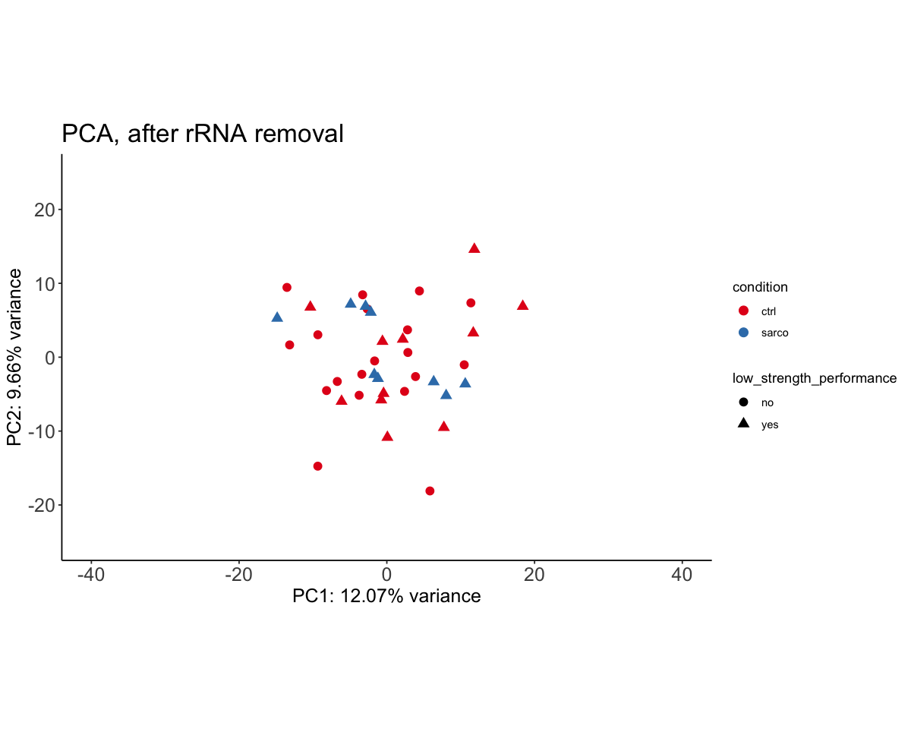

Quality Control
================

- <a href="#qc_jm" id="toc-qc_jm"><span
  class="toc-section-number">1</span> QC_jm</a>
  - <a href="#read-in-files" id="toc-read-in-files"><span
    class="toc-section-number">1.1</span> Read in files</a>
  - <a href="#global-theme-options" id="toc-global-theme-options"><span
    class="toc-section-number">1.2</span> Global theme options</a>
  - <a href="#analysis" id="toc-analysis"><span
    class="toc-section-number">1.3</span> Analysis</a>
    - <a href="#sample-clustering" id="toc-sample-clustering"><span
      class="toc-section-number">1.3.1</span> Sample clustering</a>
    - <a href="#pca" id="toc-pca"><span
      class="toc-section-number">1.3.2</span> PCA</a>
    - <a href="#number-of-genes-detected"
      id="toc-number-of-genes-detected"><span
      class="toc-section-number">1.3.3</span> Number of genes detected</a>
    - <a href="#normalised-counts-boxplot"
      id="toc-normalised-counts-boxplot"><span
      class="toc-section-number">1.3.4</span> Normalised counts (boxplot)</a>
    - <a href="#normalised-counts-transcripts-per-million-tpm"
      id="toc-normalised-counts-transcripts-per-million-tpm"><span
      class="toc-section-number">1.3.5</span> Normalised counts (Transcripts
      per million (TPM))</a>
    - <a href="#rrna-percentage" id="toc-rrna-percentage"><span
      class="toc-section-number">1.3.6</span> rRNA percentage</a>
    - <a href="#proportions-of-gene-biotypes"
      id="toc-proportions-of-gene-biotypes"><span
      class="toc-section-number">1.3.7</span> Proportions of gene biotypes</a>
    - <a href="#remove-rrna-from-the-analysis"
      id="toc-remove-rrna-from-the-analysis"><span
      class="toc-section-number">1.3.8</span> Remove rRNA from the
      analysis</a>
    - <a href="#check-rrna-removed" id="toc-check-rrna-removed"><span
      class="toc-section-number">1.3.9</span> Check rRNA removed</a>
    - <a href="#check-chrm-intact" id="toc-check-chrm-intact"><span
      class="toc-section-number">1.3.10</span> Check chrM intact</a>
    - <a href="#clustering-after-rrna-removal"
      id="toc-clustering-after-rrna-removal"><span
      class="toc-section-number">1.3.11</span> Clustering after rRNA
      removal</a>
    - <a href="#pca-after-rrna-removal" id="toc-pca-after-rrna-removal"><span
      class="toc-section-number">1.3.12</span> PCA after rRNA removal</a>
    - <a href="#size-factors" id="toc-size-factors"><span
      class="toc-section-number">1.3.13</span> Size Factors</a>
    - <a href="#ma-plots" id="toc-ma-plots"><span
      class="toc-section-number">1.3.14</span> MA Plots</a>
    - <a href="#normalised-counts-after-removal-of-rrna-boxplot"
      id="toc-normalised-counts-after-removal-of-rrna-boxplot"><span
      class="toc-section-number">1.3.15</span> Normalised counts after removal
      of rRNA (boxplot)</a>
    - <a
      href="#normalised-counts-after-removal-of-rrna-transcripts-per-million-tpm"
      id="toc-normalised-counts-after-removal-of-rrna-transcripts-per-million-tpm"><span
      class="toc-section-number">1.3.16</span> Normalised counts after removal
      of rRNA (Transcripts per million (TPM))</a>
- <a href="#batch-correction" id="toc-batch-correction"><span
  class="toc-section-number">2</span> Batch correction</a>
- <a href="#deseq" id="toc-deseq"><span
  class="toc-section-number">3</span> DESeq</a>
  - <a href="#pca-1" id="toc-pca-1"><span
    class="toc-section-number">3.1</span> PCA</a>
  - <a href="#hierarchical-clustering"
    id="toc-hierarchical-clustering"><span
    class="toc-section-number">3.2</span> Hierarchical clustering</a>
    - <a href="#session-info" id="toc-session-info"><span
      class="toc-section-number">3.2.1</span> Session Info</a>

``` r
#knitr::opts_chunk$set(echo = TRUE)
```

# QC_jm

In this notebook, we perform QC for the Jamaican population only.
Samples: sarcopenia vs healthy controls.

``` r
suppressPackageStartupMessages({
    library(DESeq2)
    library(ggrepel)
    library(genefilter)
    library(GenomicFeatures)
    library(biomaRt)
    library(reshape2)
    library(scales)
    library(Biostrings)
    library(tidyverse)
    library(janitor)
    library(DT)
    library(pheatmap)
    library(clusterProfiler)
    library("org.Hs.eg.db")
    library(GEOquery)
    library(limma)
    library(sva)
})
```

``` r
### --- Get gene-level annotations (run once) --- ###

#hs.gtf.db <- makeTxDbFromGFF("../../data/annotation/Homo_sapiens.GRCh38.94.chr.gtf", 
#                             format="gtf" )

#ensembl.genes = genes(hs.gtf.db)
#human = useEnsembl(biomart="ENSEMBL_MART_ENSEMBL", 
#                      dataset="hsapiens_gene_ensembl", mirror = "useast")
#bm.annotations = getBM(attributes=c("ensembl_gene_id", "entrezgene_id", "gene_biotype", "external_gene_name"), 
#                       mart=human, 
#                       filters="ensembl_gene_id", 
#                       values=ensembl.genes$gene_id, uniqueRows=TRUE)
#ensembl.genes$gene_biotype = bm.annotations$gene_biotype[match(ensembl.genes$gene_id, bm.annotations$ensembl_gene_id) ]
#ensembl.genes$entrezgene_id = bm.annotations$entrezgene_id[match(ensembl.genes$gene_id, bm.annotations$ensembl_gene_id) ]
#ensembl.genes$external_gene_name = bm.annotations$external_gene_name[match(ensembl.genes$gene_id, bm.annotations$ensembl_gene_id) ]

# save this as RDS so we don't have to keep running it
#saveRDS(bm.annotations, file = "../../output/bm_annotations.RDS")
#saveRDS(ensembl.genes, file = "../../output/ensembl.genes.RDS")
```

``` r
### -- Get metadata (run once) --- ###  

#Get series matrix files that contain the metadata
#jm_geo <- GEOquery::getGEO(filename = "../../data/metadata/GSE111016_series_matrix.txt")
#jm_geo <- GEOquery::getGEO(filename = "../../data/metadata/GSE111010_series_matrix.txt")

# Extract the metadata
#jm_geo_md <- pData(phenoData(jm_geo)) %>% clean_names()
#jm_geo_md <- pData(phenoData(jm_geo)) %>% clean_names()

#write_delim(jm_geo_md, file = "../../data/metadata/jm_geo_md.txt")
#write_delim(jm_geo_md, file = "../../data/metadata/jm_geo_md.txt")
```

## Read in files

``` r
bm.annotations <- readRDS("../output/bm_annotations.RDS")
ensembl.genes <- readRDS("../output/ensembl.genes.RDS")

jm_geo_md <- read_delim(file = "../../data/metadata/jm_geo_md.txt")
```

    Rows: 39 Columns: 52
    ── Column specification ────────────────────────────────────────────────────────
    Delimiter: " "
    chr (47): title, geo_accession, status, submission_date, last_update_date, t...
    dbl  (5): channel_count, taxid_ch1, contact_zip_postal_code, data_row_count,...

    ℹ Use `spec()` to retrieve the full column specification for this data.
    ℹ Specify the column types or set `show_col_types = FALSE` to quiet this message.

``` r
### --- Clean and combine metadata --- ### 

# Subset columns of interest
jm_md <- jm_geo_md %>% 
    dplyr::select(title, sex_ch1, age_yr_ch1, low_muscle_mass_ch1, 
                  low_muscle_strength_and_or_low_physical_performance_ch1, 
                  population_ch1, sarcopenia_status_ch1, tissue_ch1) %>% 
    # rename stuff 
    rename(sample_id = title,
          low_strength_performance = low_muscle_strength_and_or_low_physical_performance_ch1)
colnames(jm_md) <- gsub("_ch1", "", colnames(jm_md))

# Change Sample 1 [sss] to sample_1j
jm_md$sample_id <- gsub(" \\[jss]", "", jm_md$sample_id)
jm_md$sample_id <- gsub(" ", "_", jm_md$sample_id)
jm_md$sample_id <- gsub("Sample", "jm_sample", jm_md$sample_id)
jm_md$country <- "jm"

# Combine the jamaica and jm metadata
metadata <- jm_md
# get sarco and control
metadata$condition = ifelse(metadata$sarcopenia_status == "yes", "sarco", "ctrl")
# Change jm_sample_1 to jm_sarco_1, number it according to group
metadata <- metadata %>% 
    group_by(sarcopenia_status, country) %>% 
    mutate(sample_no = 1:n()) %>% 
    arrange(condition) %>% 
    unite("sample_id_new", country:sample_no, sep = "_", remove = FALSE)

metadata$country <- as.factor(metadata$country)
metadata$condition <- factor(metadata$condition, levels = c("ctrl", "sarco"))

dim(metadata)
head(metadata)
```

1.  39
2.  12

A grouped_df: 6 × 12

| sample_id \<chr\> | sex \<chr\> | age_yr \<dbl\> | low_muscle_mass \<chr\> | low_strength_performance \<chr\> | population \<chr\>     | sarcopenia_status \<chr\> | tissue \<chr\>          | sample_id_new \<chr\> | country \<fct\> | condition \<fct\> | sample_no \<int\> |
|-------------------|-------------|----------------|-------------------------|----------------------------------|------------------------|---------------------------|-------------------------|-----------------------|-----------------|-------------------|-------------------|
| jm_sample_1       | male        | 86             | no                      | no                               | Afro-Caribbean descent | no                        | vastus lateralis muscle | jm_ctrl_1             | jm              | ctrl              | 1                 |
| jm_sample_2       | male        | 80             | no                      | no                               | Afro-Caribbean descent | no                        | vastus lateralis muscle | jm_ctrl_2             | jm              | ctrl              | 2                 |
| jm_sample_3       | male        | 65             | no                      | no                               | Afro-Caribbean descent | no                        | vastus lateralis muscle | jm_ctrl_3             | jm              | ctrl              | 3                 |
| jm_sample_4       | male        | 64             | no                      | no                               | Afro-Caribbean descent | no                        | vastus lateralis muscle | jm_ctrl_4             | jm              | ctrl              | 4                 |
| jm_sample_5       | male        | 74             | yes                     | no                               | Afro-Caribbean descent | no                        | vastus lateralis muscle | jm_ctrl_5             | jm              | ctrl              | 5                 |
| jm_sample_6       | male        | 89             | no                      | no                               | Afro-Caribbean descent | no                        | vastus lateralis muscle | jm_ctrl_6             | jm              | ctrl              | 6                 |

``` r
table(metadata$sarcopenia_status, metadata$low_muscle_mass)
```

         
          no yes
      no  25   5
      yes  0   9

``` r
### --- Create data matrix --- ###

jm <- read.csv(
    file = "../../data/data_raw/GSE111010_allSamplesCounts_htseqcov1_jss_forGEO.csv") %>% 
    janitor::clean_names()
# Add gene names to rownames
rownames(jm) <- jm$x
# Remove the x column (ensembl gene id)
jm <- jm[ ,!colnames(jm) == "x"]
# Add prefix, rename colnames
colnames(jm) <- paste0("jm_", colnames(jm))
colnames(jm) <- metadata$sample_id_new[match(colnames(jm), metadata$sample_id)]
jm$ensembl_gene_id = rownames(jm)

# Join the counts matrix, remove ensembl_gene_id column
counts <- jm  %>% 
            dplyr::select("ensembl_gene_id", metadata$sample_id_new)
counts[is.na(counts)] <- 0
remove = "ensembl_gene_id"
data_mat = as.matrix(counts[, !colnames(counts) %in% remove])
rownames(data_mat) = counts$ensembl_gene_id

# Keep only rows that start with ENSG (remove the __nofeature rows)
#data_mat <- data_mat[rownames(data_mat)[grep("^ENSG", rownames(data_mat))], ]
data_mat = apply(round(data_mat), c(1,2), as.integer) # Round to integer
data_mat_nonzero = data_mat[rowSums(data_mat) > 0, ] # Rm non-zero rows


sum(duplicated(rownames(data_mat_nonzero)))# Check that we have no duplicates
```

0

``` r
# Check that all rows start with ENSG; that is, no rows do not start with ENSG:
data_mat[rownames(data_mat)[grep("^ENSG", rownames(data_mat), invert = TRUE)], ]
```

A matrix: 5 × 39 of type int

| <!--/-->                 | jm_ctrl_1 | jm_ctrl_2 | jm_ctrl_3 | jm_ctrl_4 | jm_ctrl_5 | jm_ctrl_6 | jm_ctrl_7 | jm_ctrl_8 | jm_ctrl_9 | jm_ctrl_10 | ⋯   | jm_ctrl_30 | jm_sarco_1 | jm_sarco_2 | jm_sarco_3 | jm_sarco_4 | jm_sarco_5 | jm_sarco_6 | jm_sarco_7 | jm_sarco_8 | jm_sarco_9 |
|--------------------------|-----------|-----------|-----------|-----------|-----------|-----------|-----------|-----------|-----------|------------|-----|------------|------------|------------|------------|------------|------------|------------|------------|------------|------------|
| \_\_no_feature           | 20906015  | 29318854  | 19161110  | 15811482  | 20930870  | 16369348  | 30073635  | 19923667  | 26889109  | 17285176   | ⋯   | 14710849   | 20879286   | 15811007   | 22244639   | 28936216   | 19643624   | 15176100   | 19379160   | 17813913   | 12793056   |
| \_\_ambiguous            | 2255114   | 1931244   | 1902749   | 1805806   | 1870131   | 1111512   | 2516202   | 2286068   | 1833698   | 2405085    | ⋯   | 1991566    | 2121057    | 2003982    | 2136570    | 1789443    | 2565383    | 2421723    | 2392052    | 1692511    | 1533593    |
| \_\_too_low_aQual        | 0         | 0         | 0         | 0         | 0         | 0         | 0         | 0         | 0         | 0          | ⋯   | 0          | 0          | 0          | 0          | 0          | 0          | 0          | 0          | 0          | 0          |
| \_\_not_aligned          | 0         | 0         | 0         | 0         | 0         | 0         | 0         | 0         | 0         | 0          | ⋯   | 0          | 0          | 0          | 0          | 0          | 0          | 0          | 0          | 0          | 0          |
| \_\_alignment_not_unique | 35193533  | 28666271  | 31415994  | 27786150  | 25618233  | 21738365  | 36651249  | 29316600  | 27519985  | 44694691   | ⋯   | 28818843   | 28058630   | 28642278   | 31231653   | 24661187   | 28975693   | 41514440   | 28188551   | 26404983   | 24507153   |

``` r
# Keep only rows that start with ENSG (remove the __nofeature rows)
data_mat <- data_mat[rownames(data_mat)[grep("^ENSG", rownames(data_mat))], ]
data_mat = apply(round(data_mat), c(1,2), as.integer) # Round to integer
data_mat_nonzero = data_mat[rowSums(data_mat) > 0, ] # Rm non-zero rows
```

``` r
nrow(data_mat)
```

65217

``` r
nrow(data_mat_nonzero)
```

56301

``` r
nrow(data_mat_nonzero)/nrow(data_mat) * 100
```

86.3287179723078

``` r
#Creates the DESeq2 object
# Run it first without controlling for age
dds = DESeqDataSetFromMatrix(data_mat_nonzero, metadata, 
                             ~ condition)
colnames(dds) = colnames(data_mat)

#Estimates the size factors using the "median ratio method" described by Equation 5 in Anders and Huber (2010)
dds <- estimateSizeFactors(dds) 

#This function obtains dispersion estimates for a count data set
dds <- estimateDispersions(dds)

#This function transforms the count data to the log2 scale in a way which minimizes differences between samples for rows with small counts
rld <- vst(dds)
```

    gene-wise dispersion estimates

    mean-dispersion relationship

    final dispersion estimates

## Global theme options

``` r
# Generic theme
th <- theme(axis.text.x = element_text(size = 15),
          axis.text.y = element_text(size = 15),
         plot.title = element_text(size = 20),
         plot.subtitle = element_text(size = 15),
         axis.title.x = element_blank(),
         axis.title.y = element_blank())
```

``` r
# pca theme
pca_th <- theme(plot.title = element_text(size = 20),
         axis.title.x = element_text(size = 15), 
         axis.title.y = element_text(size = 15),
         axis.text.x = element_text(size = 15),
         axis.text.y = element_text(size = 15))
```

## Analysis

### Sample clustering

``` r
options(repr.plot.height = 8, repr.plot.width = 18)

sampleDists <- dist(t(assay(rld)))
plot(hclust(sampleDists), main = "Cluster Dendrogram, before rRNA removal")
```


### PCA

``` r
ntop = 500
rv <- rowVars(assay(rld))
select <- order(rv, decreasing = TRUE)[seq_len(min(ntop, length(rv)))]
pca = prcomp(t(assay(rld)[select,]))
percentVar <- pca$sdev^2/sum(pca$sdev^2)

set.seed(1)
pca_data <- plotPCA(rld, 
                    intgroup = c("condition", "low_muscle_mass", 
                                 "low_strength_performance", "age_yr"), 
                    returnData=TRUE)
percentVar <- round(100 * attr(pca_data, "percentVar"), digits=2)
```

``` r
options(repr.plot.height = 8, repr.plot.width = 12)

ggplot(pca_data, aes(PC1, PC2, color=condition, shape = low_muscle_mass)) + geom_point(size=5) +
  scale_x_continuous(paste0("PC1: ",percentVar[1],"% variance"),
                    limits = c(-40, 40)) +
  scale_y_continuous(paste0("PC2: ",percentVar[2],"% variance"),
                    limits = c(-25, 25)) + 
  coord_fixed() + 
  theme_classic() + 
    scale_color_brewer(palette = "Set1") +
  #geom_text_repel(data = pca_data, aes(PC1,PC2, label = name), 
  #                hjust = 1.2, box.padding = 0.5, size = 5.5) +
  expand_limits(x = c(-50, 50), y = c(-30, 30)) +
  labs(title = "PCA, before rRNA removal") +
  pca_th
```


``` r
options(repr.plot.height = 8, repr.plot.width = 12)

ggplot(pca_data, aes(PC1, PC2, color=condition, shape = low_strength_performance)) + 
  geom_point(size=5) +
  scale_color_brewer(palette = "Set1") +
  scale_x_continuous(paste0("PC1: ",percentVar[1],"% variance"),
                    limits = c(-40, 40)) +
  scale_y_continuous(paste0("PC2: ",percentVar[2],"% variance"),
                    limits = c(-25, 25)) + 
  coord_fixed() + 
  theme_classic() + 
  #geom_text_repel(data = pca_data, aes(PC1,PC2, label = name), 
  #                hjust = 1.2, box.padding = 0.5, size = 5.5) +
  expand_limits(x = c(-50, 50), y = c(-30, 30)) +
  labs(title = "PCA, before rRNA removal") +
  pca_th
```


``` r
options(repr.plot.height = 8, repr.plot.width = 12)

ggplot(pca_data, aes(PC1, PC2, color=age_yr)) + 
  geom_point(size=5) +
  scale_x_continuous(paste0("PC1: ",percentVar[1],"% variance"),
                    limits = c(-40, 40)) +
  scale_y_continuous(paste0("PC2: ",percentVar[2],"% variance"),
                    limits = c(-25, 25)) + 
  coord_fixed() + 
  theme_classic() + 
  #geom_text_repel(data = pca_data, aes(PC1,PC2, label = name), 
  #                hjust = 1.2, box.padding = 0.5, size = 5.5) +
  expand_limits(x = c(-50, 50), y = c(-30, 30)) +
  labs(title = "PCA, before rRNA removal") +
  pca_th
```


PC1 does not separate by condition, low_muscle_mass,
low_strength_performance or age_year.

### Number of genes detected

``` r
options(repr.plot.height = 18, repr.plot.width = 10)

detected = apply(counts(dds), 2, function(col) sum(col > 0 ))
detected = as.data.frame(detected)
detected$name = row.names(detected)
detected$name = factor(detected$name, rev(metadata$sample_id_new))
                 
ggplot(detected, aes(x=name, y=detected)) + 
                 geom_bar(stat="identity") + 
                 theme_classic() + 
                 coord_flip() + 
                 scale_y_continuous("Number of Genes detected", expand=c(0,0)) + 
                 scale_x_discrete("Sample") +
                 labs(title = "# of genes detected", 
                     subtitle = "Before rRNA removal") +
                 th
```


### Normalised counts (boxplot)

``` r
options(repr.plot.height = 8, repr.plot.width = 10)

nc = counts(dds, normalized=TRUE)
nc.melt = melt(nc)

ggplot(nc.melt, aes(x=Var2, y=value)) + 
    geom_boxplot() + 
    theme_classic() + 
    theme(axis.text.x = element_text(angle = 90, colour="black", hjust = 1)) + 
    scale_x_discrete("Sample") + 
    scale_y_continuous("Normalised counts") +
    labs(title = "Normalized counts",
        subtitle = "Before rRNA removal") +
    th
```


``` r
nc.threshold = 1e6
test = apply(nc, 1, function(x){ any(x > nc.threshold) })

as.data.frame(ensembl.genes[names(test[test])])
 
#as.data.frame(ensembl.genes[names(test[test])]) %>%
#  kable %>% kable_styling("striped", full_width = F) %>% scroll_box(width = "800px", height = "500px")
```

A data.frame: 5 × 9

| <!--/-->        | seqnames \<fct\> | start \<int\> | end \<int\> | width \<int\> | strand \<fct\> | gene_id \<chr\> | gene_biotype \<chr\> | entrezgene_id \<int\> | external_gene_name \<chr\> |
|-----------------|------------------|---------------|-------------|---------------|----------------|-----------------|----------------------|-----------------------|----------------------------|
| ENSG00000092054 | chr14            | 23412738      | 23435718    | 22981         | \-             | ENSG00000092054 | protein_coding       | 4625                  | MYH7                       |
| ENSG00000125414 | chr17            | 10521148      | 10549957    | 28810         | \-             | ENSG00000125414 | protein_coding       | 4620                  | MYH2                       |
| ENSG00000143632 | chr1             | 229431245     | 229434098   | 2854          | \-             | ENSG00000143632 | protein_coding       | 58                    | ACTA1                      |
| ENSG00000155657 | chr2             | 178525989     | 178830802   | 304814        | \-             | ENSG00000155657 | protein_coding       | 7273                  | TTN                        |
| ENSG00000183091 | chr2             | 151485336     | 151734487   | 249152        | \-             | ENSG00000183091 | protein_coding       | 4703                  | NEB                        |

These are all protein-coding genes involved in muscle.

### Normalised counts (Transcripts per million (TPM))

``` r
#options(repr.plot.height = 8, repr.plot.width = 10)

#effective_lengths = matrix(0, ncol=length(experimental_metadata$sample_id), nrow=17714)
#colnames(effective_lengths)= experimental_metadata$sample_id
#for( i in experimental_metadata$sample_id){
#  effective_lengths[,i] = read.table(paste("../data/aligned_data/", i, ".genes.results",sep=""), sep="\t", header=TRUE)$effective_length
#}
#row.names(effective_lengths) = read.table(paste("../data/aligned_data/", i, ".genes.results",sep=""), sep="\t", header=TRUE)$gene_id

#effective_lengths = rowMeans(effective_lengths[row.names(counts(dds)),])
#ncrpk = counts(dds) / (effective_lengths / 1000)
#ncrpk = apply(ncrpk, c(1,2), function(x){if(is.nan(x)){0}else{x}})
#ncrpk = apply(ncrpk, c(1,2), function(x){if(is.infinite(x)){0}else{x}})
#ncscalingfactor = colSums(ncrpk) / 1e6
#nctpm = sweep(ncrpk, 2, ncscalingfactor, "/")

#nctpm.melt = melt(nctpm)
#ggplot(nctpm.melt, aes(x=Var2, y=value)) + 
#    geom_boxplot() + 
#    theme_classic() + 
#    theme(axis.text.x = element_text(angle = 90, colour="black", hjust = 1)) + 
#    labs(title = "Normalized counts (TPM)", 
#        subtitle = "Before rRNA removal") +
#    th
```

``` r
#tpm.threshold = 20000
#test.tpm = apply(nctpm, 1, function(x){ any(x> tpm.threshold) })

#as.data.frame(ensembl.genes[names(test.tpm[test.tpm])]) #%>%
  #kable %>% kable_styling("striped", full_width = F) %>% scroll_box(width = "800px", height = "500px")
```

### rRNA percentage

``` r
options(repr.plot.height = 18, repr.plot.width = 8)

rrna.genes = names(ensembl.genes[ensembl.genes$gene_biotype %in% c("Mt_rRNA", "rRNA")])
percentage.of.rrna = (colSums(counts(dds[ rownames(counts(dds)) %in% rrna.genes])) / colSums(counts(dds))) * 100

percentage.of.rrna = as.data.frame(percentage.of.rrna)
percentage.of.rrna$name = row.names(percentage.of.rrna)
percentage.of.rrna$name = factor(percentage.of.rrna$name,rev(metadata$sample_id_new))
ggplot(percentage.of.rrna, 
       aes(x=name, y=percentage.of.rrna)) + 
        geom_bar(stat="identity") + 
        theme_classic() + 
        coord_flip() + 
        th +
        scale_y_continuous("% rRNA", expand=c(0,0), limits = c(0, 10)) +
        labs(title = "% rRNA")
```


``` r
summary(percentage.of.rrna$percentage.of.rrna)
```

       Min. 1st Qu.  Median    Mean 3rd Qu.    Max. 
     0.3673  0.5054  0.6405  0.6682  0.7660  1.4197 

Our samples have relatively low rRNA % - all of them are below 2%, which
is reassuring. Still, these should be removed.

### Proportions of gene biotypes

``` r
options(repr.plot.height = 6, repr.plot.width = 20)

pc = ensembl.genes$gene_id[ensembl.genes$gene_biotype == "protein_coding"]
pg = ensembl.genes$gene_id[ensembl.genes$gene_biotype %in% unique(ensembl.genes$gene_biotype)[grep("pseudogene", unique(ensembl.genes$gene_biotype))]]
lc = ensembl.genes$gene_id[ensembl.genes$gene_biotype == "lincRNA"]

totalcounts.pc = colSums(counts(dds)[rownames(counts(dds)) %in% pc,])
totalcounts.pg = colSums(counts(dds)[rownames(counts(dds)) %in% pg,])
totalcounts.lc = colSums(counts(dds)[rownames(counts(dds)) %in% lc,])

totalcounts.other = colSums(counts(dds)[!(rownames(counts(dds)) %in% c(lc,pc,pg)),])

counts.by.biotype = data.frame(name = names(totalcounts.pc),
                         protein_coding = totalcounts.pc,
                         pseudogene = totalcounts.pg,
                         lincRNA = totalcounts.lc,
                         other = totalcounts.other
                         
                         )

counts.by.biotype$name = factor(counts.by.biotype$name, metadata$sample_id_new)

counts.by.biotype = as.data.frame(t(apply(counts.by.biotype[,2:5], 1, function(x){ 100 * (x / sum(x)) }) ))
counts.by.biotype$name = names(totalcounts.pc)
counts.by.biotype$name = factor(counts.by.biotype$name, metadata$sample_id_new)

counts.by.biotype.melt = melt(counts.by.biotype)

options(repr.plot.height = 8, repr.plot.width = 10)

ggplot(counts.by.biotype.melt, aes(x=name, y=value, fill=variable)) +  
    geom_bar(stat="identity") + 
    theme_classic() + 
    scale_y_continuous("% reads", labels = dollar_format(suffix = "%", prefix = ""),  
                       expand=c(0,0)) + scale_x_discrete("Sample") + 
    theme(axis.text.x = element_text(angle = 45, colour="black", #family="Arial", 
                                     hjust = 1, size=8)) +
    labs(title = "Proportions of gene biotypes", 
        subtitle = "Before rRNA removal") +
    th
```

    Using name as id variables


### Remove rRNA from the analysis

``` r
dds_filt = dds[!(row.names(counts(dds)) %in% 
            ensembl.genes$gene_id[ensembl.genes$gene_biotype 
                                  %in% c("rRNA", "snoRNA", "snRNA", "Mt_rRNA")]),]
dds_filt = dds_filt[rowSums(counts(dds_filt)) > 0,]
```

``` r
dim(dds)
```

1.  56301
2.  39

``` r
dim(dds_filt)
```

1.  54050
2.  39

### Check rRNA removed

``` r
rrna.genes = names(ensembl.genes[ensembl.genes$gene_biotype %in% c("rRNA", "snoRNA", "snRNA", "Mt_rRNA")])
percentage.of.rrna = (colSums(counts(dds_filt[ rownames(counts(dds_filt)) %in% rrna.genes])) / 
                      colSums(counts(dds_filt))) * 100

percentage.of.rrna = as.data.frame(percentage.of.rrna)
percentage.of.rrna$name = row.names(percentage.of.rrna)
percentage.of.rrna$name = factor(percentage.of.rrna$name, rev(metadata$sample_id_new))
ggplot(percentage.of.rrna, aes(x=name, y=percentage.of.rrna)) + 
    geom_bar(stat="identity") + 
    theme_classic() + 
    coord_flip() + scale_y_continuous("% rRNA", expand=c(0,0)) + 
    scale_x_discrete("Sample") +
    th
```


### Check chrM intact

``` r
in_dds = ensembl.genes[which(rownames(dds_filt) %in% ensembl.genes$gene_id)]
table(seqnames(in_dds))
```


     chr1  chr2  chr3  chr4  chr5  chr6  chr7  chr8  chr9 chr10 chr11 chr12 chr13 
     4770  3590  2781  2290  2559  2583  2562  2141  2007  1973  2940  2594  1107 
    chr14 chr15 chr16 chr17 chr18 chr19 chr20 chr21 chr22  chrX  chrY  chrM 
     1900  1691  2067  2599  1023  2587  1225   682  1122  2125   485    37 

### Clustering after rRNA removal

``` r
dds_filt <- estimateSizeFactors(dds_filt) 
dds_filt <- estimateDispersions(dds_filt)
rld_filt <- vst(dds_filt)

sampleDists <- dist(t(assay(rld_filt)))
plot(hclust(sampleDists), main = "Cluster Dendrogram, after rRNA removal")
```

    found already estimated dispersions, replacing these

    gene-wise dispersion estimates

    mean-dispersion relationship

    final dispersion estimates


### PCA after rRNA removal

``` r
ntop = 500
rv <- rowVars(assay(rld_filt))
select <- order(rv, decreasing = TRUE)[seq_len(min(ntop, length(rv)))]
pca = prcomp(t(assay(rld_filt)[select,]))
percentVar <- pca$sdev^2/sum(pca$sdev^2)

pca_data <- plotPCA(rld_filt, intgroup = c("condition", "low_muscle_mass",
                                          "low_strength_performance", "age_yr"), 
                    returnData=TRUE)
percentVar <- round(100 * attr(pca_data, "percentVar"), digits=2)
```

``` r
options(repr.plot.height = 8, repr.plot.width = 10)

ggplot(pca_data, aes(PC1, PC2, color=condition, shape = low_muscle_mass)) + 
 geom_point(size=3) +
  scale_x_continuous(paste0("PC1: ",percentVar[1],"% variance"),
                    limits = c(-40, 40)) +
  scale_y_continuous(paste0("PC2: ",percentVar[2],"% variance"),
                    limits = c(-25, 25)) + 
  coord_fixed() + theme_classic() + 
  scale_color_brewer(palette = "Set1") +
  #geom_text_repel(data = pca_data, aes(PC1,PC2, label = name), 
  #                hjust = 1.2, size = 5) +
    labs(title = "PCA, after rRNA removal") +
    pca_th
```


``` r
options(repr.plot.height = 8, repr.plot.width = 10)

ggplot(pca_data, aes(PC1, PC2, color = condition, shape = low_strength_performance)) + 
 geom_point(size=3) +
  scale_x_continuous(paste0("PC1: ",percentVar[1],"% variance"),
                    limits = c(-40, 40)) +
  scale_y_continuous(paste0("PC2: ",percentVar[2],"% variance"),
                    limits = c(-25, 25)) + 
  coord_fixed() + theme_classic() + 
  scale_color_brewer(palette = "Set1") +
  #geom_text_repel(data = pca_data, aes(PC1,PC2, label = name), 
  #                hjust = 1.2, size = 5) +
    labs(title = "PCA, after rRNA removal") +
    pca_th
```



``` r
options(repr.plot.height = 8, repr.plot.width = 10)

ggplot(pca_data, aes(PC1, PC2, color=age_yr)) + 
 geom_point(size=3) +
  scale_x_continuous(paste0("PC1: ",percentVar[1],"% variance"),
                    limits = c(-40, 40)) +
  scale_y_continuous(paste0("PC2: ",percentVar[2],"% variance"),
                    limits = c(-25, 25)) + 
  coord_fixed() + theme_classic() + 
  #geom_text_repel(data = pca_data, aes(PC1,PC2, label = name), 
  #                hjust = 1.2, size = 5) +
    labs(title = "PCA, after rRNA removal") +
    pca_th
```


### Size Factors

``` r
summary(sizeFactors(dds_filt))
df = data.frame(sample_id = names(sizeFactors(dds_filt)), 
                sizeFactors = sizeFactors(dds_filt))

ggplot(df, aes(x = sample_id, y=sizeFactors)) + 
    geom_bar(stat="identity") + 
    scale_y_continuous(limits=c(0,2), expand=c(0,0)) + 
    theme_classic() + 
    theme(axis.text.x = element_text(angle = 45, hjust=1, colour="black", 
                                     #family="Arial",
                                     size=12)) +
    th +
    labs(title = "Size Factors, after rRNA removal")
```

       Min. 1st Qu.  Median    Mean 3rd Qu.    Max. 
     0.6606  0.9413  1.0309  1.0153  1.0871  1.2081 


### MA Plots

``` r
#for(cd in unique(experimental_metadata$condition)){
#  samples = experimental_metadata$sample_id[experimental_metadata$condition == cd]
#  for(i in 1:(length(samples)-1)){
#      print(i)
#      for(j in (i+1):(length(samples))){
#        print(j)
        
#        x = counts(dds, normalized=TRUE)[, samples[i]]
#        y = counts(dds, normalized=TRUE)[, samples[j]]
      
#        M = log2(x) - log2(y)
#        A = (log2(x) + log2(y)) / 2
#        df = data.frame(gene_id = names(x), M=M, A=A)
      
#        print(ggplot(df, aes(x=A, y=M)) + geom_point(size = 1.5, alpha = 1/5) + theme_classic() + geom_hline(yintercept=0, colour="blue3", linetype="dashed") + ggtitle(paste(samples[i], "vs", samples[j],  median(abs(x-y)), sep= " ")) + stat_smooth(se = FALSE, method = "loess", color = "red3") + theme_classic())
#    }
#  }
#}
```

### Normalised counts after removal of rRNA (boxplot)

``` r
nc = counts(dds_filt, normalized=TRUE)
nc.melt = melt(nc)

ggplot(nc.melt, aes(x=Var2, y=value)) + 
    geom_boxplot() + theme_classic() + 
    theme(axis.text.x = element_text(angle = 90, colour="black", hjust = 1)) + 
    scale_x_discrete("Sample") + scale_y_continuous("Normalised counts")
```


``` r
nc.threshold = 500000
test = apply(nc, 1, function(x){ any(x > nc.threshold) })
 
as.data.frame(ensembl.genes[names(test[test])]) #%>%
  #kable %>% kable_styling("striped", full_width = F) %>% scroll_box(width = "800px", height = "500px")
```

A data.frame: 11 × 9

| <!--/-->        | seqnames \<fct\> | start \<int\> | end \<int\> | width \<int\> | strand \<fct\> | gene_id \<chr\> | gene_biotype \<chr\> | entrezgene_id \<int\> | external_gene_name \<chr\> |
|-----------------|------------------|---------------|-------------|---------------|----------------|-----------------|----------------------|-----------------------|----------------------------|
| ENSG00000092054 | chr14            | 23412738      | 23435718    | 22981         | \-             | ENSG00000092054 | protein_coding       | 4625                  | MYH7                       |
| ENSG00000104879 | chr19            | 45306414      | 45322977    | 16564         | \-             | ENSG00000104879 | protein_coding       | 1158                  | CKM                        |
| ENSG00000109061 | chr17            | 10492307      | 10518543    | 26237         | \-             | ENSG00000109061 | protein_coding       | 4619                  | MYH1                       |
| ENSG00000125414 | chr17            | 10521148      | 10549957    | 28810         | \-             | ENSG00000125414 | protein_coding       | 4620                  | MYH2                       |
| ENSG00000128591 | chr7             | 128830377     | 128859274   | 28898         | \+             | ENSG00000128591 | protein_coding       | 2318                  | FLNC                       |
| ENSG00000143632 | chr1             | 229431245     | 229434098   | 2854          | \-             | ENSG00000143632 | protein_coding       | 58                    | ACTA1                      |
| ENSG00000155657 | chr2             | 178525989     | 178830802   | 304814        | \-             | ENSG00000155657 | protein_coding       | 7273                  | TTN                        |
| ENSG00000163092 | chr2             | 166888487     | 167259753   | 371267        | \+             | ENSG00000163092 | protein_coding       | 129446                | XIRP2                      |
| ENSG00000183091 | chr2             | 151485336     | 151734487   | 249152        | \-             | ENSG00000183091 | protein_coding       | 4703                  | NEB                        |
| ENSG00000196091 | chr12            | 101568353     | 101686018   | 117666        | \+             | ENSG00000196091 | protein_coding       | 4604                  | MYBPC1                     |
| ENSG00000202198 | chr6             | 52995620      | 52995950    | 331           | \+             | ENSG00000202198 | misc_RNA             | NA                    | 7SK                        |

All of these are protein_coding genes; we can keep them.

### Normalised counts after removal of rRNA (Transcripts per million (TPM))

``` r
#effective_lengths = matrix(0, ncol=length(experimental_metadata$sample_id), nrow=17714)
#colnames(effective_lengths)= experimental_metadata$sample_id
#for( i in experimental_metadata$sample_id){
#  effective_lengths[,i] = read.table(paste("../data/aligned_data/", i, ".genes.results",sep=""), sep="\t", header=TRUE)$effective_length
#}
#row.names(effective_lengths) = read.table(paste("../data/aligned_data/", i, ".genes.results",sep=""), sep="\t", header=TRUE)$gene_id

#effective_lengths = rowMeans(effective_lengths[row.names(counts(dds)),])
#ncrpk = counts(dds) / (effective_lengths / 1000)
#ncrpk = apply(ncrpk, c(1,2), function(x){if(is.nan(x)){0}else{x}})
#ncrpk = apply(ncrpk, c(1,2), function(x){if(is.infinite(x)){0}else{x}})
#ncscalingfactor = colSums(ncrpk) / 1e6
#nctpm = sweep(ncrpk, 2, ncscalingfactor, "/")

#nctpm.melt = melt(nctpm)
#ggplot(nctpm.melt, aes(x=Var2, y=value)) + geom_boxplot() + theme_classic() + theme(axis.text.x = element_text(angle = 90, colour="black", hjust = 1)) + scale_x_discrete("Sample") + scale_y_continuous("TPM")
```

``` r
#tpm.threshold = 10000
#test.tpm = apply(nctpm, 1, function(x){ any(x> tpm.threshold) })

#as.data.frame(ensembl.genes[names(test.tpm[test.tpm])]) #%>%
 # kable %>% kable_styling("striped", full_width = F) %>% scroll_box(width = "800px", height = "500px")
    
```

These all seem to be protein-coding genes, so we will not remove them.

# Batch correction

Next, we perform batch correction to remove the effects of age.

# DESeq

``` r
dds_corrected <- dds_filt 
design(dds_corrected) <- formula(~ age_yr + condition)

dds_corrected <- DESeq(dds_corrected)
```

    using pre-existing size factors

    estimating dispersions

    found already estimated dispersions, replacing these

    gene-wise dispersion estimates

    mean-dispersion relationship

    final dispersion estimates

    fitting model and testing

``` r
rld_corrected <- vst(dds_corrected)

# Remove batch effect from country and year
assay(rld_corrected) <- limma::removeBatchEffect(assay(rld_corrected), 
                                                batch = metadata$age_yr)
```

## PCA

``` r
ntop = 500
rv <- rowVars(assay(rld_corrected))
select <- order(rv, decreasing = TRUE)[seq_len(min(ntop, length(rv)))]
pca = prcomp(t(assay(rld_corrected)[select,]))
percentVar <- pca$sdev^2/sum(pca$sdev^2)

pca_data <- plotPCA(rld_corrected, intgroup = c("age_yr", "condition",
                                               "low_muscle_mass", "low_strength_performance"), returnData=TRUE)
percentVar <- round(100 * attr(pca_data, "percentVar"), digits=2)
```

``` r
options(repr.plot.height = 8, repr.plot.width = 10)

pca_corrected <- ggplot(pca_data, aes(PC1, PC2, color = condition, shape=low_muscle_mass)) + 
 geom_point(size=3) +
  scale_x_continuous(paste0("PC1: ",percentVar[1],"% variance"),
                    limits = c(-40, 40)) +
  scale_y_continuous(paste0("PC2: ",percentVar[2],"% variance"),
                    limits = c(-25, 25)) + 
  coord_fixed() + theme_classic() + 
  scale_color_brewer(palette = "Set1") +
  #geom_text_repel(data = pca_data, aes(PC1,PC2, label = name), 
  #                hjust = 1.2, size = 5) +
    labs(title = "PCA, after batch correction",
        subtitle = "Corrected for age and country") +
    pca_th

pca_corrected
```


``` r
options(repr.plot.height = 8, repr.plot.width = 10)

pca_corrected <- ggplot(pca_data, aes(PC1, PC2, 
                                      color = condition, shape=low_strength_performance)) + 
 geom_point(size=3) +
  scale_x_continuous(paste0("PC1: ",percentVar[1],"% variance"),
                    limits = c(-40, 40)) +
  scale_y_continuous(paste0("PC2: ",percentVar[2],"% variance"),
                    limits = c(-25, 25)) + 
  coord_fixed() + theme_classic() + 
  scale_color_brewer(palette = "Set1") +
  #geom_text_repel(data = pca_data, aes(PC1,PC2, label = name), 
  #                hjust = 1.2, size = 5) +
    labs(title = "PCA, after batch correction",
        subtitle = "Corrected for age and country") +
    pca_th

pca_corrected
```


Well, they’ve all (unsurprisingly) clustered closer together - however,
there is still no clear separatio between controls and sarcopenia.

## Hierarchical clustering

``` r
options(repr.plot.height = 10, repr.plot.width = 20)

sampleDists <- dist(t(assay(rld_corrected)))
plot(hclust(sampleDists), main = "Cluster Dendrogram, after batch correction")
```


This makes absolutely no sense whatsoever.

``` r
## If the directory doesn't exist, create it
if(!dir.exists("../output/")){
  dir.create("../output/")
}

if(!dir.exists("../output/02a_QC_jm/")){
  dir.create("../output/02a_QC_jm/")
}

saveRDS(dds_filt, "../output/02a_QC_jm/dds_quality_control.RDS")
saveRDS(dds_corrected, "../output/02a_QC_jm/dds_corrected.RDS")
#saveRDS(nctpm, "../analysis/output/QC/tpm.RDS")
#saveRDS(ensembl.genes, "../../output/QC/ensembl_genes.RDS")
#saveRDS(hs.gtf.db, "../../output/QC/hs_gtf_db.RDS")
saveRDS(metadata, "../output/02a_QC_jm/metadata.RDS")
```

### Session Info

``` r
sessionInfo()
```

    R version 4.2.1 (2022-06-23)
    Platform: x86_64-apple-darwin17.0 (64-bit)
    Running under: macOS Big Sur ... 10.16

    Matrix products: default
    BLAS:   /Library/Frameworks/R.framework/Versions/4.2/Resources/lib/libRblas.0.dylib
    LAPACK: /Library/Frameworks/R.framework/Versions/4.2/Resources/lib/libRlapack.dylib

    locale:
    [1] C/UTF-8/C/C/C/C

    attached base packages:
    [1] stats4    stats     graphics  grDevices utils     datasets  methods  
    [8] base     

    other attached packages:
     [1] sva_3.44.0                  BiocParallel_1.30.3        
     [3] mgcv_1.8-40                 nlme_3.1-159               
     [5] limma_3.52.4                GEOquery_2.64.2            
     [7] org.Hs.eg.db_3.15.0         clusterProfiler_4.4.4      
     [9] pheatmap_1.0.12             DT_0.26                    
    [11] janitor_2.1.0               forcats_0.5.2              
    [13] stringr_1.4.1               dplyr_1.0.10               
    [15] purrr_0.3.4                 readr_2.1.2                
    [17] tidyr_1.2.1                 tibble_3.1.8               
    [19] tidyverse_1.3.2             Biostrings_2.64.1          
    [21] XVector_0.36.0              scales_1.2.1               
    [23] reshape2_1.4.4              biomaRt_2.52.0             
    [25] GenomicFeatures_1.48.4      AnnotationDbi_1.58.0       
    [27] genefilter_1.78.0           ggrepel_0.9.1              
    [29] ggplot2_3.3.6               DESeq2_1.36.0              
    [31] SummarizedExperiment_1.26.1 Biobase_2.56.0             
    [33] MatrixGenerics_1.8.1        matrixStats_0.62.0         
    [35] GenomicRanges_1.48.0        GenomeInfoDb_1.32.4        
    [37] IRanges_2.30.1              S4Vectors_0.34.0           
    [39] BiocGenerics_0.42.0        

    loaded via a namespace (and not attached):
      [1] utf8_1.2.2               tidyselect_1.2.0         RSQLite_2.2.17          
      [4] htmlwidgets_1.5.4        grid_4.2.1               scatterpie_0.1.8        
      [7] munsell_0.5.0            codetools_0.2-18         pbdZMQ_0.3-7            
     [10] withr_2.5.0              colorspace_2.0-3         GOSemSim_2.22.0         
     [13] filelock_1.0.2           uuid_1.1-0               DOSE_3.22.1             
     [16] labeling_0.4.2           repr_1.1.4               GenomeInfoDbData_1.2.8  
     [19] polyclip_1.10-0          bit64_4.0.5              farver_2.1.1            
     [22] downloader_0.4           vctrs_0.5.1              treeio_1.20.2           
     [25] generics_0.1.3           BiocFileCache_2.4.0      R6_2.5.1                
     [28] graphlayouts_0.8.2       locfit_1.5-9.6           bitops_1.0-7            
     [31] cachem_1.0.6             fgsea_1.22.0             gridGraphics_0.5-1      
     [34] DelayedArray_0.22.0      assertthat_0.2.1         vroom_1.5.7             
     [37] BiocIO_1.6.0             ggraph_2.0.6             enrichplot_1.16.2       
     [40] googlesheets4_1.0.1      gtable_0.3.1             tidygraph_1.2.2         
     [43] rlang_1.0.6              splines_4.2.1            rtracklayer_1.56.1      
     [46] lazyeval_0.2.2           gargle_1.2.1             broom_1.0.1             
     [49] yaml_2.3.5               modelr_0.1.9             backports_1.4.1         
     [52] qvalue_2.28.0            tools_4.2.1              ggplotify_0.1.0         
     [55] ellipsis_0.3.2           RColorBrewer_1.1-3       Rcpp_1.0.9              
     [58] plyr_1.8.7               base64enc_0.1-3          progress_1.2.2          
     [61] zlibbioc_1.42.0          RCurl_1.98-1.8           prettyunits_1.1.1       
     [64] viridis_0.6.2            haven_2.5.1              fs_1.5.2                
     [67] magrittr_2.0.3           data.table_1.14.2        DO.db_2.9               
     [70] reprex_2.0.2             googledrive_2.0.0        hms_1.1.2               
     [73] patchwork_1.1.2          evaluate_0.16            xtable_1.8-4            
     [76] XML_3.99-0.10            readxl_1.4.1             gridExtra_2.3           
     [79] compiler_4.2.1           crayon_1.5.2             shadowtext_0.1.2        
     [82] htmltools_0.5.3          ggfun_0.0.7              tzdb_0.3.0              
     [85] geneplotter_1.74.0       aplot_0.1.7              lubridate_1.8.0         
     [88] DBI_1.1.3                tweenr_2.0.2             dbplyr_2.2.1            
     [91] MASS_7.3-58.1            rappdirs_0.3.3           Matrix_1.5-1            
     [94] cli_3.4.1                parallel_4.2.1           igraph_1.3.5            
     [97] pkgconfig_2.0.3          GenomicAlignments_1.32.1 IRdisplay_1.1           
    [100] xml2_1.3.3               ggtree_3.4.4             annotate_1.74.0         
    [103] rvest_1.0.3              snakecase_0.11.0         yulab.utils_0.0.5       
    [106] digest_0.6.29            cellranger_1.1.0         fastmatch_1.1-3         
    [109] tidytree_0.4.1           edgeR_3.38.4             restfulr_0.0.15         
    [112] curl_4.3.2               Rsamtools_2.12.0         rjson_0.2.21            
    [115] lifecycle_1.0.3          jsonlite_1.8.0           viridisLite_0.4.1       
    [118] fansi_1.0.3              pillar_1.8.1             lattice_0.20-45         
    [121] KEGGREST_1.36.3          fastmap_1.1.0            httr_1.4.4              
    [124] survival_3.4-0           GO.db_3.15.0             glue_1.6.2              
    [127] png_0.1-7                bit_4.0.4                ggforce_0.4.0           
    [130] stringi_1.7.8            blob_1.2.3               memoise_2.0.1           
    [133] IRkernel_1.3             ape_5.6-2               
